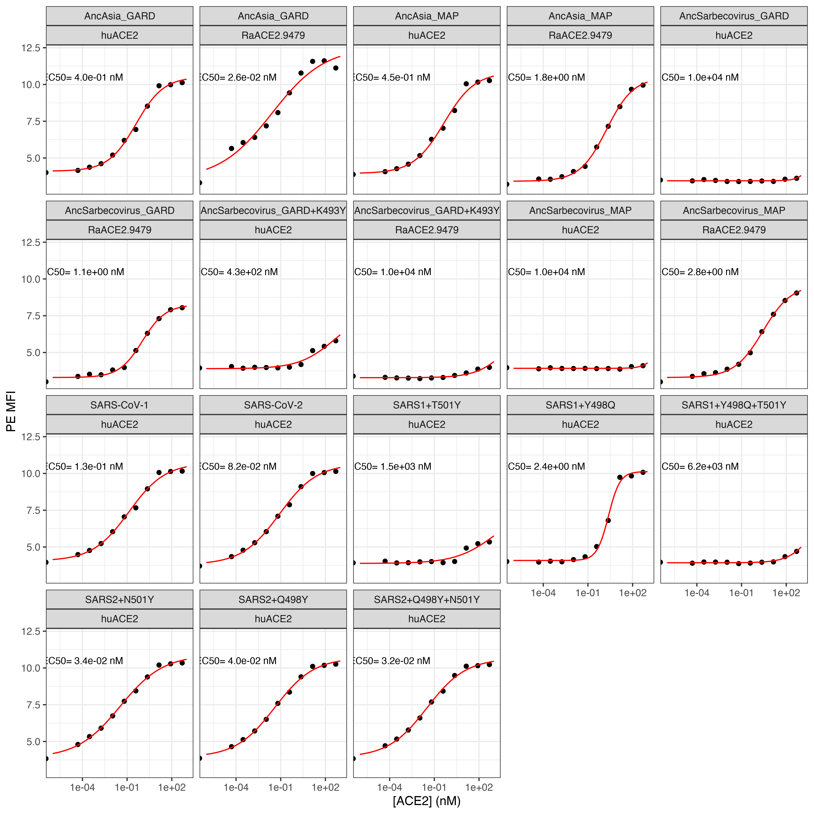

Isogenic ACE2 titration experiments for predictions and validations
================

``` r
require("knitr")
knitr::opts_chunk$set(echo = T)
knitr::opts_chunk$set(dev.args = list(png = list(type = "cairo")))

#list of packages to install/load
packages = c("ggplot2", "data.table", "tidyverse", "dplyr", "broom", "gridExtra")
#install any packages not already installed
installed_packages <- packages %in% rownames(installed.packages())
if(any(installed_packages == F)){
  install.packages(packages[!installed_packages])
}
#load packages
invisible(lapply(packages, library, character.only=T))

#make results directory
if(!file.exists("results")){
 dir.create(file.path("results"))
}
```

### Define colorblind-friendly palette

``` r
# The palette with grey:
cbPalette <- c("#999999", "#E69F00", "#56B4E9", "#009E73", "#F0E442", 
               "#0072B2", "#D55E00", "#CC79A7")
# The palette with black
cbbPalette <- c("#000000", "#E69F00", "#56B4E9", "#009E73", "#F0E442", 
                "#0072B2", "#D55E00", "#CC79A7")
```

## Experiment: isogenic binding curves for new RBD genotypes and select ACE2s

### Read in data table with mean bin at each concentration

``` r
dt <- read.csv(file="data_input_isogenics1.csv", stringsAsFactors=F)
```

### Convert from geomean to log-mean, and use nM concentrations

``` r
dt$mean_PE <- log(dt$geomean_PE)
dt$conc_nM <- 10^9 * dt$conc_M

head(dt, n=5)
```

    ##     genotype protein geomean_FITC geomean_PE   conc_M  X X.VALUE.  mean_PE
    ## 1 SARS-CoV-2  huACE2     6359.479   40.72891 0.00e+00 NA       NA 3.706938
    ## 2 SARS-CoV-2  huACE2     6133.930   77.29765 4.96e-14 NA       NA 4.347664
    ## 3 SARS-CoV-2  huACE2     6340.851  119.39117 2.98e-13 NA       NA 4.782405
    ## 4 SARS-CoV-2  huACE2     6397.846  198.63037 1.79e-12 NA       NA 5.291446
    ## 5 SARS-CoV-2  huACE2     6351.269  421.89813 1.07e-11 NA       NA 6.044764
    ##    conc_nM
    ## 1 0.00e+00
    ## 2 4.96e-05
    ## 3 2.98e-04
    ## 4 1.79e-03
    ## 5 1.07e-02

### Use `broom` to get the results from fitting `nls` model by group. Fit EC50 and hill coefficient

``` r
nls_broom <- dt %>%
  group_by(protein, genotype) %>%
  do(tidy(nls(mean_PE ~ (a/(1+(EC50/conc_nM)^n))+b,
              data=.,
              start=list(a=6,b=3.5,EC50=1,n=1),
              lower=list(a=4,b=2,EC50=1e-6,n=0.2),
              upper=list(a=9,b=5,EC50=1e4,n=5),
              algorithm="port"
              )
          )
  )

dt <- dt %>%
  merge(nls_broom %>%
          filter(term=="EC50") %>%
          select(estimate, std.error) %>%
          rename(EC50="estimate",
                 EC50_SE="std.error"), by=c("protein","genotype"), sort=F)
```

    ## Adding missing grouping variables: `protein`, `genotype`

``` r
dt <- dt %>%
  merge(nls_broom %>%
          filter(term=="n") %>%
          select(estimate, std.error) %>%
          rename(hill="estimate",
                 hill_SE="std.error"), by=c("protein","genotype"), sort=F)
```

    ## Adding missing grouping variables: `protein`, `genotype`

``` r
write.csv(nls_broom,"./results/nls_fits_isogenics1.csv", row.names = FALSE)

head(dt, n=5)
```

    ##   protein   genotype geomean_FITC geomean_PE   conc_M  X X.VALUE.  mean_PE
    ## 1  huACE2 SARS-CoV-2     6359.479   40.72891 0.00e+00 NA       NA 3.706938
    ## 2  huACE2 SARS-CoV-2     6133.930   77.29765 4.96e-14 NA       NA 4.347664
    ## 3  huACE2 SARS-CoV-2     6340.851  119.39117 2.98e-13 NA       NA 4.782405
    ## 4  huACE2 SARS-CoV-2     6397.846  198.63037 1.79e-12 NA       NA 5.291446
    ## 5  huACE2 SARS-CoV-2     6351.269  421.89813 1.07e-11 NA       NA 6.044764
    ##    conc_nM      EC50    EC50_SE      hill    hill_SE
    ## 1 0.00e+00 0.0817504 0.02665719 0.3433012 0.03417863
    ## 2 4.96e-05 0.0817504 0.02665719 0.3433012 0.03417863
    ## 3 2.98e-04 0.0817504 0.02665719 0.3433012 0.03417863
    ## 4 1.79e-03 0.0817504 0.02665719 0.3433012 0.03417863
    ## 5 1.07e-02 0.0817504 0.02665719 0.3433012 0.03417863

### Write summary table to CSV file

``` r
summary <- dt %>%
  select(protein, genotype, EC50, EC50_SE, hill, hill_SE) %>%
  unique()

summary
```

    ##         protein                   genotype         EC50      EC50_SE      hill
    ## 1        huACE2                 SARS-CoV-2 8.175040e-02 2.665719e-02 0.3433012
    ## 13       huACE2                SARS2+Q498Y 4.019385e-02 1.042260e-02 0.3313402
    ## 25       huACE2                SARS2+N501Y 3.398884e-02 1.023731e-02 0.3004864
    ## 37       huACE2          SARS2+Q498Y+N501Y 3.191520e-02 8.711982e-03 0.3320779
    ## 49       huACE2                 SARS-CoV-1 1.312050e-01 5.210476e-02 0.3567774
    ## 61       huACE2                SARS1+Y498Q 2.382614e+00 3.253064e-01 1.1197593
    ## 73       huACE2                SARS1+T501Y 1.476412e+03 1.825920e+04 0.3235477
    ## 85       huACE2          SARS1+Y498Q+T501Y 6.189038e+03 8.026781e+04 0.5550726
    ## 97       huACE2        AncSarbecovirus_MAP 1.000000e+04 2.700476e+06 0.9885488
    ## 109      huACE2       AncSarbecovirus_GARD 1.000000e+04 3.909970e+06 1.0090634
    ## 121      huACE2 AncSarbecovirus_GARD+K493Y 4.296594e+02 2.451158e+03 0.3646806
    ## 133      huACE2                AncAsia_MAP 4.518862e-01 1.839518e-01 0.4208038
    ## 145      huACE2               AncAsia_GARD 3.954329e-01 1.232757e-01 0.4674293
    ## 157 RaACE2.9479        AncSarbecovirus_MAP 2.752465e+00 8.218893e-01 0.4556275
    ## 169 RaACE2.9479       AncSarbecovirus_GARD 1.059173e+00 2.572706e-01 0.5572722
    ## 181 RaACE2.9479 AncSarbecovirus_GARD+K493Y 1.000000e+04 1.961525e+05 0.4252485
    ## 193 RaACE2.9479                AncAsia_MAP 1.812703e+00 3.579613e-01 0.4826582
    ## 205 RaACE2.9479               AncAsia_GARD 2.573800e-02 2.895745e-02 0.2451443
    ##        hill_SE
    ## 1   0.03417863
    ## 13  0.02509373
    ## 25  0.02345910
    ## 37  0.02652387
    ## 49  0.04527169
    ## 61  0.15931204
    ## 73  0.28074406
    ## 85  0.38446727
    ## 97  5.59813249
    ## 109 7.89929132
    ## 121 0.20964719
    ## 133 0.06450649
    ## 145 0.06197678
    ## 157 0.04850535
    ## 169 0.06626023
    ## 181 0.38935075
    ## 193 0.03819906
    ## 205 0.05571974

``` r
write.csv(summary,"./results/summary_isogenics1.csv", row.names = FALSE)
```

### Now predict `mean_PE` using the models, to plot

``` r
conc_nM = c(1:20 %o% 10^(-6:3)) # this should only generate ~200 estimates per titration (faster!)

nls_predictions <- dt %>%
  select(protein, genotype) %>%
  merge(nls_broom %>%
          select(-statistic, -p.value, -std.error) %>%
          spread(term, estimate),
        by=c("protein","genotype"),sort=F) %>%
  unique() %>%
  merge(dt %>% select(protein, genotype, EC50_SE) %>% unique(), by=c("protein","genotype"),sort=F) %>%
  merge(as.data.frame(conc_nM), all=TRUE,sort=F) %>%
  mutate(mean_PE = (a/(1+(EC50/conc_nM)^n))+b)

head(nls_predictions, n=5)
```

    ##   protein          genotype        a        b       EC50         n     EC50_SE
    ## 1  huACE2        SARS-CoV-2 6.860771 3.804306 0.08175040 0.3433012 0.026657188
    ## 2  huACE2       SARS2+Q498Y 6.775771 3.928134 0.04019385 0.3313402 0.010422598
    ## 3  huACE2       SARS2+N501Y 7.005268 3.886396 0.03398884 0.3004864 0.010237313
    ## 4  huACE2 SARS2+Q498Y+N501Y 6.741562 3.915999 0.03191520 0.3320779 0.008711982
    ## 5  huACE2        SARS-CoV-1 6.669842 4.048849 0.13120497 0.3567774 0.052104764
    ##   conc_nM  mean_PE
    ## 1   1e-06 3.942682
    ## 2   1e-06 4.124314
    ## 3   1e-06 4.178362
    ## 4   1e-06 4.124654
    ## 5   1e-06 4.146959

### Make plots for titration curves

``` r
annotations <- dt %>%
  select(protein, genotype, EC50) %>%
  unique() %>%
  remove_rownames()

ggplot(dt, aes(conc_nM, mean_PE)) +
  geom_point() +
  geom_line(data = nls_predictions,
            aes(conc_nM, mean_PE),
            color="red") + 
  scale_x_log10(lim=c(1e-6,1e3)) +
  xlab("[ACE2] (nM)") +
  ylab("PE MFI") +
  facet_wrap(~ genotype+protein) +
  geom_text(
    data    = annotations,
    mapping = aes(x = 1e-4,
                  y = 10.5,
                  label = c(paste(
                    "EC50=", format(EC50, digits=2),
                    "nM"))),
    size=3) +
  theme_bw()
```



``` r
ggsave(
  "./results/isogenics1.pdf",
  scale = 1,
  width = NA,
  height = NA,
  useDingbats=F
)
```

Make individual subpanels with desired overlapping curves

SARS2/1 epistasis fail:

``` r
p1 <- ggplot(dt %>% filter(genotype %in% c("SARS-CoV-2","SARS2+Q498Y","SARS2+N501Y","SARS2+Q498Y+N501Y")), aes(conc_nM, mean_PE)) +
  geom_point(aes(color=genotype)) +
  geom_line(data = nls_predictions %>% filter(genotype %in% c("SARS-CoV-2","SARS2+Q498Y","SARS2+N501Y","SARS2+Q498Y+N501Y")),
            aes(conc_nM, mean_PE, color=genotype),
            ) +  
  ggtitle("SARS2 dbl mut cycle") +
  scale_x_log10(lim=c(1e-6,1e3)) +
  scale_y_continuous(lim=c(2.75,12)) +
  xlab("[human ACE2] (nM)") +
  ylab("PE MFI") +
  scale_color_manual(values=cbPalette) +
  theme_bw()

p2 <- ggplot(dt %>% filter(genotype %in% c("SARS-CoV-1","SARS1+Y498Q","SARS1+T501Y","SARS1+Y498Q+T501Y")), aes(conc_nM, mean_PE)) +
  geom_point(aes(color=genotype)) +
  geom_line(data = nls_predictions %>% filter(genotype %in% c("SARS-CoV-1","SARS1+Y498Q","SARS1+T501Y","SARS1+Y498Q+T501Y")),
            aes(conc_nM, mean_PE, color=genotype),
            ) +  
  ggtitle("SARS1 dbl mut cycle") +
  scale_x_log10(lim=c(1e-6,1e3)) +
  scale_y_continuous(lim=c(2.75,12)) +
  xlab("[human ACE2] (nM)") +
  ylab("PE MFI") +
  scale_color_manual(values=cbPalette[5:8]) +
  theme_bw()

g <- arrangeGrob(p1, p2, ncol=2, widths=c(4.5,4.5), heights=c(2.5))

ggsave(
  "./results/isogenics1_multi1.pdf",
  g,
  scale = 1,
  width = 9,
  height = 2.5,
  useDingbats=F
)
```

AncSarb comparisons:

``` r
p1 <- ggplot(dt %>% filter(genotype %in% c("AncSarbecovirus_GARD","AncSarbecovirus_MAP","AncSarbecovirus_GARD+K493Y") & protein=="huACE2"), aes(conc_nM, mean_PE)) +
  geom_point(aes(color=genotype)) +
  geom_line(data = nls_predictions %>% filter(genotype %in% c("AncSarbecovirus_GARD","AncSarbecovirus_MAP","AncSarbecovirus_GARD+K493Y") & protein=="huACE2"),
            aes(conc_nM, mean_PE, color=genotype),
            ) +   
  ggtitle("AncSarb constructs, human ACE2") +
  scale_x_log10(lim=c(1e-6,1e3)) +
  scale_y_continuous(lim=c(2.75,12)) +
  xlab("[human ACE2] (nM)") +
  ylab("PE MFI") +
  scale_color_manual(values=cbPalette) +
  theme_bw()

p2 <- ggplot(dt %>% filter(genotype %in% c("AncSarbecovirus_GARD","AncSarbecovirus_MAP","AncSarbecovirus_GARD+K493Y") & protein=="RaACE2.9479"), aes(conc_nM, mean_PE)) +
  geom_point(aes(color=genotype)) +
  geom_line(data = nls_predictions %>% filter(genotype %in% c("AncSarbecovirus_GARD","AncSarbecovirus_MAP","AncSarbecovirus_GARD+K493Y") & protein=="RaACE2.9479"),
            aes(conc_nM, mean_PE, color=genotype),
            ) +   
  ggtitle("AncSarb constructs, R. affinis 9479 ACE2") +
  scale_x_log10(lim=c(1e-6,1e3)) +
  scale_y_continuous(lim=c(2.75,12)) +
  xlab("[R. affinis 9479 ACE2] (nM)") +
  ylab("PE MFI") +
  scale_color_manual(values=cbPalette) +
  theme_bw()

g <- arrangeGrob(p1, p2, ncol=2, widths=c(4.75,4.75), heights=c(2.5))

ggsave(
  "./results/isogenics1_multi2.pdf",
  g,
  scale = 1,
  width = 9.5,
  height = 2.5,
  useDingbats=F
)
```

AncAsia comparisons:

``` r
p1 <- ggplot(dt %>% filter(genotype %in% c("AncAsia_GARD","AncAsia_MAP") & protein=="huACE2"), aes(conc_nM, mean_PE)) +
  geom_point(aes(color=genotype)) +
  geom_line(data = nls_predictions %>% filter(genotype %in% c("AncAsia_GARD","AncAsia_MAP") & protein=="huACE2"),
            aes(conc_nM, mean_PE, color=genotype),
            ) +   
  ggtitle("AncAsia constructs, human ACE2") +
  scale_x_log10(lim=c(1e-6,1e3)) +
  scale_y_continuous(lim=c(2.75,12)) +
  xlab("[human ACE2] (nM)") +
  ylab("PE MFI") +
  scale_color_manual(values=cbPalette[6:7]) +
  theme_bw()

p2 <- ggplot(dt %>% filter(genotype %in% c("AncAsia_GARD","AncAsia_MAP") & protein=="RaACE2.9479"), aes(conc_nM, mean_PE)) +
  geom_point(aes(color=genotype)) +
  geom_line(data = nls_predictions %>% filter(genotype %in% c("AncAsia_GARD","AncAsia_MAP") & protein=="RaACE2.9479"),
            aes(conc_nM, mean_PE, color=genotype),
            ) +   
  ggtitle("AncAsia constructs, R. affinis 9479 ACE2") +
  scale_x_log10(lim=c(1e-6,1e3)) +
  scale_y_continuous(lim=c(2.75,12)) +
  xlab("[R. affinis 9479 ACE2] (nM)") +
  ylab("PE MFI") +
  scale_color_manual(values=cbPalette[6:7]) +
  theme_bw()

g <- arrangeGrob(p1, p2, ncol=2, widths=c(4,4), heights=c(2.5))

ggsave(
  "./results/isogenics1_multi3.pdf",
  g,
  scale = 1,
  width = 8,
  height = 2.5,
  useDingbats=F
)
```
