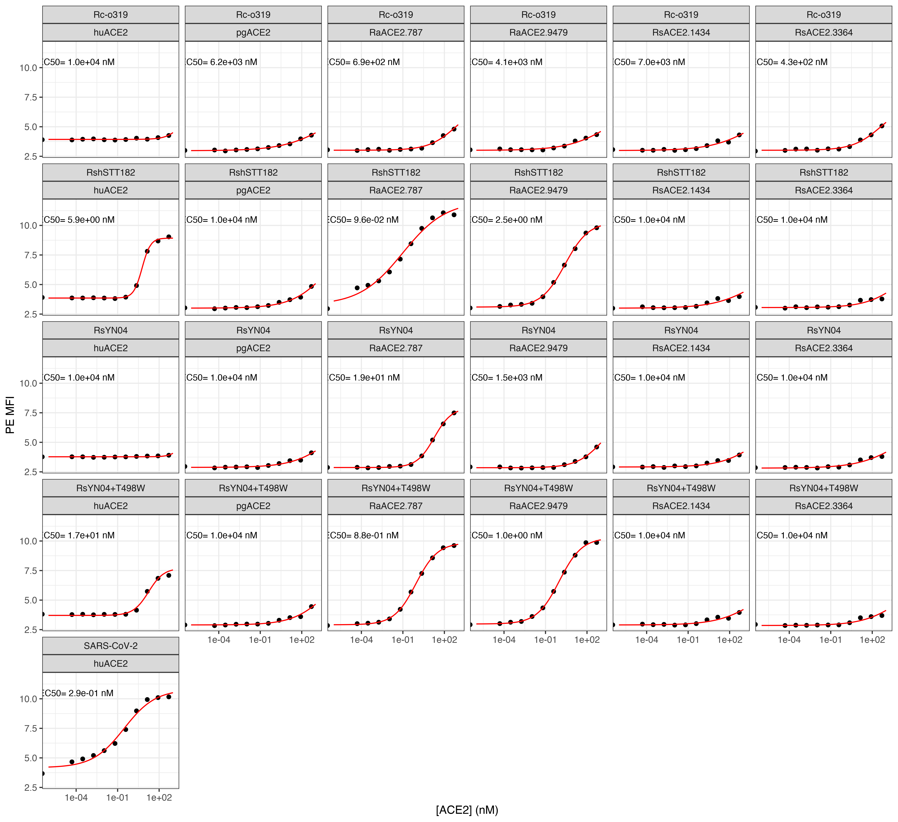

Isogenic ACE2 titration experiments for predictions and validations
================

``` r
require("knitr")
knitr::opts_chunk$set(echo = T)
knitr::opts_chunk$set(dev.args = list(png = list(type = "cairo")))

#list of packages to install/load
packages = c("ggplot2", "data.table", "tidyverse", "dplyr", "broom", "gridExtra")
#install any packages not already installed
installed_packages <- packages %in% rownames(installed.packages())
if(any(installed_packages == F)){
  install.packages(packages[!installed_packages])
}
#load packages
invisible(lapply(packages, library, character.only=T))

#make results directory
if(!file.exists("results")){
 dir.create(file.path("results"))
}
```

### Define colorblind-friendly palette

``` r
# The palette with grey:
cbPalette <- c("#999999", "#E69F00", "#56B4E9", "#009E73", "#F0E442", 
               "#0072B2", "#D55E00", "#CC79A7")
# The palette with black
cbbPalette <- c("#000000", "#E69F00", "#56B4E9", "#009E73", "#F0E442", 
                "#0072B2", "#D55E00", "#CC79A7")
```

## Experiment: isogenic binding curves for new RBD genotypes and select ACE2s

### Read in data table with mean bin at each concentration

``` r
dt <- read.csv(file="data_input_isogenics2.csv", stringsAsFactors=F)
```

### Convert from geomean to log-mean, and use nM concentrations

``` r
dt$mean_PE <- log(dt$geomean_PE)
dt$conc_nM <- 10^9 * dt$conc_M

head(dt, n=5)
```

    ##   genotype protein geomean_FITC geomean_PE   conc_M  mean_PE  conc_nM
    ## 1  Rc-o319  huACE2     9404.767   49.50653 0.00e+00 3.902105 0.00e+00
    ## 2  Rc-o319  huACE2     9446.673   48.64746 4.96e-14 3.884600 4.96e-05
    ## 3  Rc-o319  huACE2     9610.990   51.60827 2.98e-13 3.943682 2.98e-04
    ## 4  Rc-o319  huACE2     9467.165   53.15758 1.79e-12 3.973261 1.79e-03
    ## 5  Rc-o319  huACE2     9496.432   49.40247 1.07e-11 3.900000 1.07e-02

### Use `broom` to get the results from fitting `nls` model by group. Fit EC50 and hill coefficient

``` r
nls_broom <- dt %>%
  group_by(protein, genotype) %>%
  do(tidy(nls(mean_PE ~ (a/(1+(EC50/conc_nM)^n))+b,
              data=.,
              start=list(a=6,b=3.5,EC50=1,n=1),
              lower=list(a=4,b=2,EC50=1e-6,n=0.2),
              upper=list(a=9,b=5,EC50=1e4,n=5),
              algorithm="port"
              )
          )
  )

dt <- dt %>%
  merge(nls_broom %>%
          filter(term=="EC50") %>%
          select(estimate, std.error) %>%
          rename(EC50="estimate",
                 EC50_SE="std.error"), by=c("protein","genotype"), sort=F)
```

    ## Adding missing grouping variables: `protein`, `genotype`

``` r
dt <- dt %>%
  merge(nls_broom %>%
          filter(term=="n") %>%
          select(estimate, std.error) %>%
          rename(hill="estimate",
                 hill_SE="std.error"), by=c("protein","genotype"), sort=F)
```

    ## Adding missing grouping variables: `protein`, `genotype`

``` r
write.csv(nls_broom,"./results/nls_fits_isogenics1.csv", row.names = FALSE)

head(dt, n=5)
```

    ##   protein genotype geomean_FITC geomean_PE   conc_M  mean_PE  conc_nM  EC50
    ## 1  huACE2  Rc-o319     9404.767   49.50653 0.00e+00 3.902105 0.00e+00 10000
    ## 2  huACE2  Rc-o319     9446.673   48.64746 4.96e-14 3.884600 4.96e-05 10000
    ## 3  huACE2  Rc-o319     9610.990   51.60827 2.98e-13 3.943682 2.98e-04 10000
    ## 4  huACE2  Rc-o319     9467.165   53.15758 1.79e-12 3.973261 1.79e-03 10000
    ## 5  huACE2  Rc-o319     9496.432   49.40247 1.07e-11 3.900000 1.07e-02 10000
    ##   EC50_SE      hill  hill_SE
    ## 1  678763 0.7729733 1.696293
    ## 2  678763 0.7729733 1.696293
    ## 3  678763 0.7729733 1.696293
    ## 4  678763 0.7729733 1.696293
    ## 5  678763 0.7729733 1.696293

### Write summary table to CSV file

``` r
summary <- dt %>%
  select(protein, genotype, EC50, EC50_SE, hill, hill_SE) %>%
  unique()

summary
```

    ##         protein     genotype         EC50      EC50_SE      hill    hill_SE
    ## 1        huACE2      Rc-o319 1.000000e+04 6.787630e+05 0.7729733 1.69629343
    ## 13       pgACE2      Rc-o319 6.196724e+03 2.851920e+04 0.2746790 0.06123609
    ## 25   RaACE2.787      Rc-o319 6.948979e+02 1.860796e+03 0.4425907 0.12486717
    ## 37  RaACE2.9479      Rc-o319 4.075479e+03 3.517468e+04 0.2920695 0.13588621
    ## 49  RsACE2.3364      Rc-o319 4.261520e+02 9.444872e+02 0.4290951 0.11144080
    ## 61  RsACE2.1434      Rc-o319 6.953445e+03 9.938932e+04 0.2827333 0.19355724
    ## 73       huACE2   SARS-CoV-2 2.915240e-01 1.761554e-01 0.3828945 0.07925120
    ## 85       huACE2    RshSTT182 5.855363e+00 2.988924e-01 1.4285738 0.07312831
    ## 97       pgACE2    RshSTT182 1.000000e+04 8.072085e+04 0.3328820 0.12406938
    ## 109  RaACE2.787    RshSTT182 9.642037e-02 7.023503e-02 0.2785592 0.04605966
    ## 121 RaACE2.9479    RshSTT182 2.538579e+00 3.544530e-01 0.5100214 0.02957442
    ## 133 RsACE2.3364    RshSTT182 1.000000e+04 2.398207e+05 0.3555291 0.39696697
    ## 145 RsACE2.1434    RshSTT182 1.000000e+04 2.162013e+05 0.2895736 0.28094639
    ## 157      huACE2       RsYN04 1.000000e+04 5.161225e+06 1.0926659 9.28214469
    ## 169      pgACE2       RsYN04 1.000000e+04 1.176425e+05 0.3264827 0.17679356
    ## 181  RaACE2.787       RsYN04 1.852955e+01 1.692628e+00 0.6894534 0.03075252
    ## 193 RaACE2.9479       RsYN04 1.469950e+03 4.059521e+03 0.4645577 0.11187754
    ## 205 RsACE2.3364       RsYN04 1.000000e+04 1.645732e+05 0.2931155 0.21713639
    ## 217 RsACE2.1434       RsYN04 1.000000e+04 1.327589e+05 0.3344692 0.20517238
    ## 229      huACE2 RsYN04+T498W 1.736085e+01 6.147187e+00 0.7940547 0.17026591
    ## 241      pgACE2 RsYN04+T498W 1.000000e+04 1.072723e+05 0.3474855 0.17311579
    ## 253  RaACE2.787 RsYN04+T498W 8.766764e-01 6.452512e-02 0.5529899 0.01993746
    ## 265 RaACE2.9479 RsYN04+T498W 1.010343e+00 1.172848e-01 0.5331099 0.02897624
    ## 277 RsACE2.3364 RsYN04+T498W 1.000000e+04 2.008212e+05 0.3288824 0.30437922
    ## 289 RsACE2.1434 RsYN04+T498W 1.000000e+04 1.786471e+05 0.3116093 0.25404347

``` r
write.csv(summary,"./results/summary_isogenics2.csv", row.names = FALSE)
```

### Now predict `mean_PE` using the models, to plot

``` r
conc_nM = c(1:20 %o% 10^(-6:3)) # this should only generate ~200 estimates per titration (faster!)

nls_predictions <- dt %>%
  select(protein, genotype) %>%
  merge(nls_broom %>%
          select(-statistic, -p.value, -std.error) %>%
          spread(term, estimate),
        by=c("protein","genotype"),sort=F) %>%
  unique() %>%
  merge(dt %>% select(protein, genotype, EC50_SE) %>% unique(), by=c("protein","genotype"),sort=F) %>%
  merge(as.data.frame(conc_nM), all=TRUE,sort=F) %>%
  mutate(mean_PE = (a/(1+(EC50/conc_nM)^n))+b)

head(nls_predictions, n=5)
```

    ##       protein genotype a        b       EC50         n     EC50_SE conc_nM
    ## 1      huACE2  Rc-o319 4 3.929625 10000.0000 0.7729733 678762.9718   1e-06
    ## 2      pgACE2  Rc-o319 4 2.975119  6196.7237 0.2746790  28519.2000   1e-06
    ## 3  RaACE2.787  Rc-o319 4 3.014988   694.8979 0.4425907   1860.7960   1e-06
    ## 4 RaACE2.9479  Rc-o319 4 3.007265  4075.4785 0.2920695  35174.6761   1e-06
    ## 5 RsACE2.3364  Rc-o319 4 3.011935   426.1520 0.4290951    944.4872   1e-06
    ##    mean_PE
    ## 1 3.929625
    ## 2 2.983274
    ## 3 3.015476
    ## 4 3.013496
    ## 5 3.012728

### Make plots for titration curves

``` r
annotations <- dt %>%
  select(protein, genotype, EC50) %>%
  unique() %>%
  remove_rownames()

ggplot(dt, aes(conc_nM, mean_PE)) +
  geom_point() +
  geom_line(data = nls_predictions,
            aes(conc_nM, mean_PE),
            color="red") + 
  scale_x_log10(lim=c(1e-6,1e3)) +
  xlab("[ACE2] (nM)") +
  ylab("PE MFI") +
  facet_wrap(~ genotype+protein,ncol=6) +
  geom_text(
    data    = annotations,
    mapping = aes(x = 1e-4,
                  y = 10.5,
                  label = c(paste(
                    "EC50=", format(EC50, digits=2),
                    "nM"))),
    size=3) +
  theme_bw()
```



``` r
ggsave(
  "./results/isogenics2.pdf",
  scale = 1,
  width = NA,
  height = NA,
  useDingbats=F
)
```

Make individual subpanels with desired overlapping curves for each
genotype across all ACE2s:

``` r
p1 <- ggplot(dt %>% filter(genotype %in% c("Rc-o319")), aes(conc_nM, mean_PE)) +
  geom_point(aes(color=protein)) +
  geom_line(data = nls_predictions %>% filter(genotype %in% c("Rc-o319")),
            aes(conc_nM, mean_PE, color=protein),
            ) + 
  ggtitle("Rc-o319") +
  scale_x_log10(lim=c(1e-6,1e3)) +
  scale_y_continuous(lim=c(2.75,12)) +
  xlab("[ACE2] (nM)") +
  ylab("PE MFI") +
  scale_color_manual(values=cbPalette) +
  theme_bw()

p2 <- ggplot(dt %>% filter(genotype %in% c("RshSTT182")), aes(conc_nM, mean_PE)) +
  geom_point(aes(color=protein)) +
  geom_line(data = nls_predictions %>% filter(genotype %in% c("RshSTT182")),
            aes(conc_nM, mean_PE, color=protein),
            ) +  
  ggtitle("RshSTT182") +
  scale_x_log10(lim=c(1e-6,1e3)) +
  scale_y_continuous(lim=c(2.75,12)) +
  xlab("[ACE2] (nM)") +
  ylab("PE MFI") +
  scale_color_manual(values=cbPalette) +
  theme_bw()

p3 <- ggplot(dt %>% filter(genotype %in% c("RsYN04")), aes(conc_nM, mean_PE)) +
  geom_point(aes(color=protein)) +
  geom_line(data = nls_predictions %>% filter(genotype %in% c("RsYN04")),
            aes(conc_nM, mean_PE, color=protein),
            ) +  
  ggtitle("RsYN04") +
  scale_x_log10(lim=c(1e-6,1e3)) +
  scale_y_continuous(lim=c(2.75,12)) +
  xlab("[ACE2] (nM)") +
  ylab("PE MFI") +
  scale_color_manual(values=cbPalette) +
  theme_bw()

p4 <- ggplot(dt %>% filter(genotype %in% c("RsYN04+T498W")), aes(conc_nM, mean_PE)) +
  geom_point(aes(color=protein)) +
  geom_line(data = nls_predictions %>% filter(genotype %in% c("RsYN04+T498W")),
            aes(conc_nM, mean_PE, color=protein),
            ) +  
  ggtitle("RsYN04+T498W") +
  scale_x_log10(lim=c(1e-6,1e3)) +
  scale_y_continuous(lim=c(2.75,12)) +
  xlab("[ACE2] (nM)") +
  ylab("PE MFI") +
  scale_color_manual(values=cbPalette) +
  theme_bw()

g <- arrangeGrob(p1, p2, p3, p4, ncol=2, widths=c(3.75,3.75), heights=c(2.5,2.5))

ggsave(
  "./results/isogenics2_multi1.pdf",
  g,
  scale = 1,
  width = 7.5,
  height = 5,
  useDingbats=F
)
```
