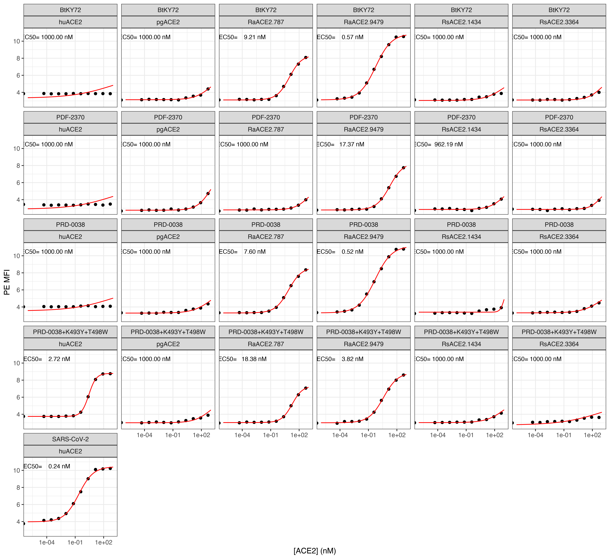

Isogenic ACE2 titration experiments for predictions and validations
================

``` r
require("knitr")
knitr::opts_chunk$set(echo = T)
knitr::opts_chunk$set(dev.args = list(png = list(type = "cairo")))

#list of packages to install/load
packages = c("ggplot2", "data.table", "tidyverse", "dplyr", "broom", "gridExtra")
#install any packages not already installed
installed_packages <- packages %in% rownames(installed.packages())
if(any(installed_packages == F)){
  install.packages(packages[!installed_packages])
}
#load packages
invisible(lapply(packages, library, character.only=T))

#make results directory
if(!file.exists("results")){
 dir.create(file.path("results"))
}
```

### Define colorblind-friendly palette

``` r
# The palette with grey:
cbPalette <- c("#999999", "#E69F00", "#56B4E9", "#009E73", "#F0E442", 
               "#0072B2", "#D55E00", "#CC79A7")
# The palette with black
cbbPalette <- c("#000000", "#E69F00", "#56B4E9", "#009E73", "#F0E442", 
                "#0072B2", "#D55E00", "#CC79A7")
```

## Experiment: isogenic binding curves for new RBD genotypes and select ACE2s

### Read in data table with mean bin at each concentration

``` r
dt <- read.csv(file="data_input_isogenics3.csv", stringsAsFactors=F)
```

### Convert from geomean to log-mean, and use nM concentrations

``` r
dt$mean_PE <- log(dt$geomean_PE)
dt$conc_nM <- 10^9 * dt$conc_M

head(dt, n=5)
```

    ##   genotype protein geomean_FITC geomean_PE   conc_M  mean_PE  conc_nM
    ## 1   BtKY72  huACE2     7270.649   46.78116 0.00e+00 3.845481 0.00e+00
    ## 2   BtKY72  huACE2     7315.724   47.83838 4.96e-14 3.867828 4.96e-05
    ## 3   BtKY72  huACE2     7407.558   46.07956 2.98e-13 3.830369 2.98e-04
    ## 4   BtKY72  huACE2     7145.980   46.29329 1.79e-12 3.834997 1.79e-03
    ## 5   BtKY72  huACE2     7251.680   46.28624 1.07e-11 3.834845 1.07e-02

### Use `broom` to get the results from fitting `nls` model by group. Fit EC50 and hill coefficient

``` r
nls_broom <- dt %>%
  group_by(protein, genotype) %>%
  do(tidy(nls(mean_PE ~ (a/(1+(EC50/conc_nM)^n))+b,
              data=.,
              start=list(a=6,b=3.5,EC50=1,n=1),
              lower=list(a=3,b=2,EC50=1e-6,n=0.2),
              upper=list(a=9,b=5,EC50=1e3,n=5),
              algorithm="port"
              )
          )
  )

dt <- dt %>%
  merge(nls_broom %>%
          filter(term=="EC50") %>%
          select(estimate, std.error) %>%
          rename(EC50="estimate",
                 EC50_SE="std.error"), by=c("protein","genotype"), sort=F)
```

    ## Adding missing grouping variables: `protein`, `genotype`

``` r
dt <- dt %>%
  merge(nls_broom %>%
          filter(term=="n") %>%
          select(estimate, std.error) %>%
          rename(hill="estimate",
                 hill_SE="std.error"), by=c("protein","genotype"), sort=F)
```

    ## Adding missing grouping variables: `protein`, `genotype`

``` r
write.csv(nls_broom,"./results/nls_fits_isogenics1.csv", row.names = FALSE)

head(dt, n=5)
```

    ##   protein genotype geomean_FITC geomean_PE   conc_M  mean_PE  conc_nM EC50
    ## 1  huACE2   BtKY72     7270.649   46.78116 0.00e+00 3.845481 0.00e+00 1000
    ## 2  huACE2   BtKY72     7315.724   47.83838 4.96e-14 3.867828 4.96e-05 1000
    ## 3  huACE2   BtKY72     7407.558   46.07956 2.98e-13 3.830369 2.98e-04 1000
    ## 4  huACE2   BtKY72     7145.980   46.29329 1.79e-12 3.834997 1.79e-03 1000
    ## 5  huACE2   BtKY72     7251.680   46.28624 1.07e-11 3.834845 1.07e-02 1000
    ##    EC50_SE hill   hill_SE
    ## 1 44150.29  0.2 0.4591344
    ## 2 44150.29  0.2 0.4591344
    ## 3 44150.29  0.2 0.4591344
    ## 4 44150.29  0.2 0.4591344
    ## 5 44150.29  0.2 0.4591344

### Write summary table to CSV file

``` r
summary <- dt %>%
  select(protein, genotype, EC50, EC50_SE, hill, hill_SE) %>%
  unique()

summary
```

    ##         protein             genotype         EC50      EC50_SE      hill
    ## 1        huACE2               BtKY72 1000.0000000 4.415029e+04 0.2000000
    ## 13       pgACE2               BtKY72 1000.0000000 4.225720e+03 0.5078837
    ## 25   RaACE2.787               BtKY72    9.2135757 1.105210e+00 0.6680332
    ## 37  RaACE2.9479               BtKY72    0.5698470 6.338821e-02 0.5116616
    ## 49  RsACE2.3364               BtKY72 1000.0000000 7.108262e+03 0.5849003
    ## 61  RsACE2.1434               BtKY72 1000.0000000 1.071714e+04 0.4259201
    ## 73       huACE2           SARS-CoV-2    0.2416043 3.807112e-02 0.5644244
    ## 85       huACE2             PRD-0038 1000.0000000 4.246554e+04 0.2000000
    ## 97       pgACE2             PRD-0038 1000.0000000 6.185121e+03 0.4542121
    ## 109  RaACE2.787             PRD-0038    7.6016270 7.425286e-01 0.6276313
    ## 121 RaACE2.9479             PRD-0038    0.5212777 6.647504e-02 0.4950845
    ## 133 RsACE2.3364             PRD-0038 1000.0000000 3.599680e+03 0.4219260
    ## 145 RsACE2.1434             PRD-0038 1000.0000000 1.704688e+06 2.1108927
    ## 157      huACE2             PDF-2370 1000.0000000 4.226437e+04 0.2000000
    ## 169      pgACE2             PDF-2370 1000.0000000 2.174657e+03 0.5977525
    ## 181  RaACE2.787             PDF-2370 1000.0000000 3.919864e+03 0.5921612
    ## 193 RaACE2.9479             PDF-2370   17.3674264 2.206062e+00 0.6148369
    ## 205 RsACE2.3364             PDF-2370 1000.0000000 4.586900e+03 0.7060804
    ## 217 RsACE2.1434             PDF-2370  962.1910189 4.967282e+03 0.5468081
    ## 229      huACE2 PRD-0038+K493Y+T498W    2.7171735 4.623794e-02 1.1243427
    ## 241      pgACE2 PRD-0038+K493Y+T498W 1000.0000000 9.031207e+03 0.5058294
    ## 253  RaACE2.787 PRD-0038+K493Y+T498W   18.3792357 1.558074e+00 0.7858599
    ## 265 RaACE2.9479 PRD-0038+K493Y+T498W    3.8225391 4.670414e-01 0.5704281
    ## 277 RsACE2.3364 PRD-0038+K493Y+T498W 1000.0000000 2.243944e+04 0.2000000
    ## 289 RsACE2.1434 PRD-0038+K493Y+T498W 1000.0000000 4.486883e+03 0.4609119
    ##          hill_SE
    ## 1     0.45913436
    ## 13    0.22381358
    ## 25    0.04113464
    ## 37    0.02621492
    ## 49    0.47395560
    ## 61    0.42207358
    ## 73    0.04585627
    ## 85    0.44161436
    ## 97    0.27163328
    ## 109   0.02958014
    ## 121   0.02821263
    ## 133   0.13951538
    ## 145 344.96963527
    ## 157   0.43952249
    ## 169   0.15008645
    ## 181   0.26654000
    ## 193   0.03250692
    ## 205   0.40739799
    ## 217   0.31316475
    ## 229   0.01981147
    ## 241   0.47512270
    ## 253   0.03943162
    ## 265   0.03196362
    ## 277   0.23335575
    ## 289   0.20198382

``` r
write.csv(summary,"./results/summary_isogenics3.csv", row.names = FALSE)
```

### Now predict `mean_PE` using the models, to plot

``` r
conc_nM = c(1:20 %o% 10^(-6:3)) # this should only generate ~200 estimates per titration (faster!)

nls_predictions <- dt %>%
  select(protein, genotype) %>%
  merge(nls_broom %>%
          select(-statistic, -p.value, -std.error) %>%
          spread(term, estimate),
        by=c("protein","genotype"),sort=F) %>%
  unique() %>%
  merge(dt %>% select(protein, genotype, EC50_SE) %>% unique(), by=c("protein","genotype"),sort=F) %>%
  merge(as.data.frame(conc_nM), all=TRUE,sort=F) %>%
  mutate(mean_PE = (a/(1+(EC50/conc_nM)^n))+b)

head(nls_predictions, n=5)
```

    ##       protein genotype        a        b        EC50         n      EC50_SE
    ## 1      huACE2   BtKY72 3.000000 3.328320 1000.000000 0.2000000 4.415029e+04
    ## 2      pgACE2   BtKY72 3.000000 3.139394 1000.000000 0.5078837 4.225720e+03
    ## 3  RaACE2.787   BtKY72 5.265217 3.111489    9.213576 0.6680332 1.105210e+00
    ## 4 RaACE2.9479   BtKY72 7.755875 3.119426    0.569847 0.5116616 6.338821e-02
    ## 5 RsACE2.3364   BtKY72 3.000000 3.103286 1000.000000 0.5849003 7.108262e+03
    ##   conc_nM  mean_PE
    ## 1   1e-06 3.375125
    ## 2   1e-06 3.139474
    ## 3   1e-06 3.111607
    ## 4   1e-06 3.128219
    ## 5   1e-06 3.103302

### Make plots for titration curves

``` r
annotations <- dt %>%
  select(protein, genotype, EC50) %>%
  unique() %>%
  remove_rownames()

ggplot(dt, aes(conc_nM, mean_PE)) +
  geom_point() +
  geom_line(data = nls_predictions,
            aes(conc_nM, mean_PE),
            color="red") + 
  scale_x_log10(lim=c(1e-6,1e3)) +
  xlab("[ACE2] (nM)") +
  ylab("PE MFI") +
  facet_wrap(~ genotype+protein,ncol=6) +
  geom_text(
    data    = annotations,
    mapping = aes(x = 1e-4,
                  y = 10.5,
                  label = c(paste(
                    "EC50=", format(EC50, digits=2),
                    "nM"))),
    size=3) +
  theme_bw()
```



``` r
ggsave(
  "./results/isogenics3.pdf",
  scale = 1,
  width = NA,
  height = NA,
  useDingbats=F
)
```

Make individual subpanels with desired overlapping curves for each
genotype across all ACE2s:

``` r
p1 <- ggplot(dt %>% filter(genotype %in% c("BtKY72")), aes(conc_nM, mean_PE)) +
  geom_point(aes(color=protein)) +
  geom_line(data = nls_predictions %>% filter(genotype %in% c("BtKY72")),
            aes(conc_nM, mean_PE, color=protein),
            ) + 
  ggtitle("BtKY72") +
  scale_x_log10(lim=c(1e-6,1e3)) +
  scale_y_continuous(lim=c(2.75,12)) +
  xlab("[ACE2] (nM)") +
  ylab("PE MFI") +
  scale_color_manual(values=cbPalette) +
  theme_bw()

p2 <- ggplot(dt %>% filter(genotype %in% c("PRD-0038")), aes(conc_nM, mean_PE)) +
  geom_point(aes(color=protein)) +
  geom_line(data = nls_predictions %>% filter(genotype %in% c("PRD-0038")),
            aes(conc_nM, mean_PE, color=protein),
            ) +  
  ggtitle("PRD-0038") +
  scale_x_log10(lim=c(1e-6,1e3)) +
  scale_y_continuous(lim=c(2.75,12)) +
  xlab("[ACE2] (nM)") +
  ylab("PE MFI") +
  scale_color_manual(values=cbPalette) +
  theme_bw()

p3 <- ggplot(dt %>% filter(genotype %in% c("PDF-2370")), aes(conc_nM, mean_PE)) +
  geom_point(aes(color=protein)) +
  geom_line(data = nls_predictions %>% filter(genotype %in% c("PDF-2370")),
            aes(conc_nM, mean_PE, color=protein),
            ) +  
  ggtitle("PDF-2370") +
  scale_x_log10(lim=c(1e-6,1e3)) +
  scale_y_continuous(lim=c(2.75,12)) +
  xlab("[ACE2] (nM)") +
  ylab("PE MFI") +
  scale_color_manual(values=cbPalette) +
  theme_bw()

p4 <- ggplot(dt %>% filter(genotype %in% c("PRD-0038+K493Y+T498W")), aes(conc_nM, mean_PE)) +
  geom_point(aes(color=protein)) +
  geom_line(data = nls_predictions %>% filter(genotype %in% c("PRD-0038+K493Y+T498W")),
            aes(conc_nM, mean_PE, color=protein),
            ) +  
  ggtitle("PRD-0038+K493Y+T498W") +
  scale_x_log10(lim=c(1e-6,1e3)) +
  scale_y_continuous(lim=c(2.75,12)) +
  xlab("[ACE2] (nM)") +
  ylab("PE MFI") +
  scale_color_manual(values=cbPalette) +
  theme_bw()

g <- arrangeGrob(p1, p2, p3, p4, ncol=2, widths=c(3.75,3.75), heights=c(2.5,2.5))

ggsave(
  "./results/isogenics3_multi1.pdf",
  g,
  scale = 1,
  width = 7.5,
  height = 5,
  useDingbats=F
)
```
