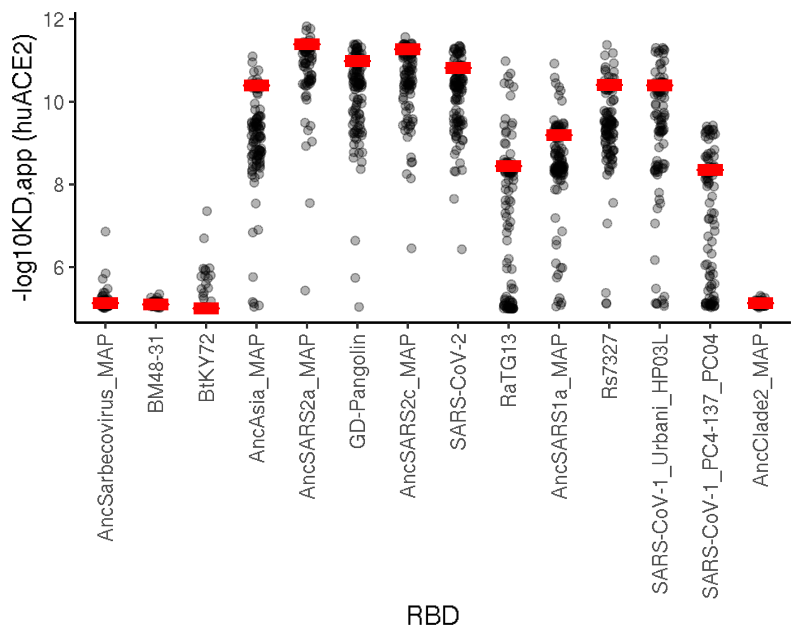
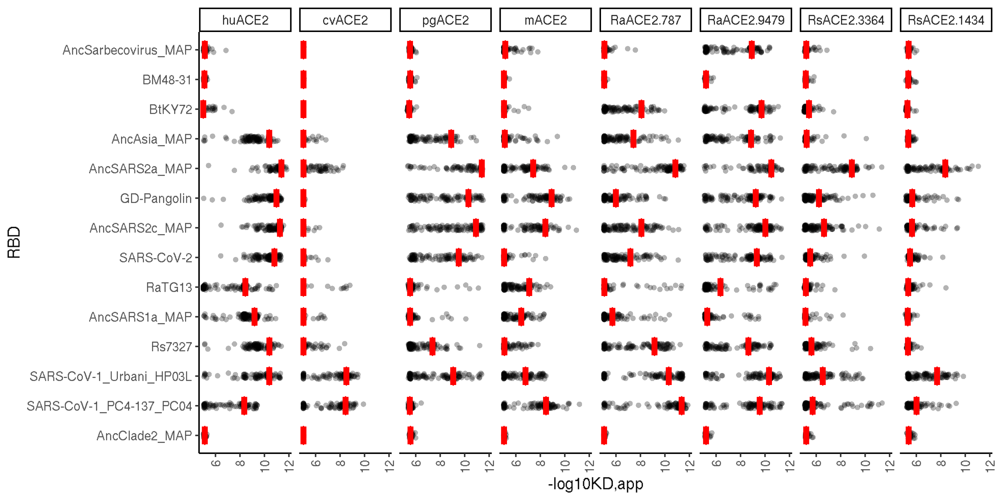
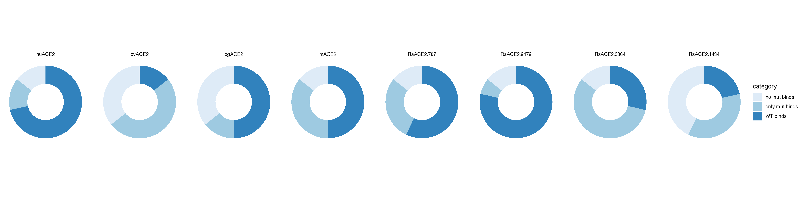

Explore how mutations enable new binding capabilites
================
Tyler Starr
04/15/2021

-   [Setup](#setup)
-   [Mutation effect jitter plots](#mutation-effect-jitter-plots)

``` r
require("knitr")
knitr::opts_chunk$set(echo = T)
knitr::opts_chunk$set(dev.args = list(png = list(type = "cairo")))

#list of packages to install/load
packages = c("yaml","data.table","tidyverse","gridExtra","egg","ggseqlogo")
#install any packages not already installed
installed_packages <- packages %in% rownames(installed.packages())
if(any(installed_packages == F)){
  install.packages(packages[!installed_packages])
}
#load packages
invisible(lapply(packages, library, character.only=T))

#read in config file
config <- read_yaml("config.yaml")

#make output directory
if(!file.exists(config$evolvability_dir)){
  dir.create(file.path(config$evolvability_dir))
}
```

Session info for reproducing environment:

``` r
sessionInfo()
```

    ## R version 3.6.2 (2019-12-12)
    ## Platform: x86_64-pc-linux-gnu (64-bit)
    ## Running under: Ubuntu 18.04.4 LTS
    ## 
    ## Matrix products: default
    ## BLAS/LAPACK: /app/software/OpenBLAS/0.3.7-GCC-8.3.0/lib/libopenblas_haswellp-r0.3.7.so
    ## 
    ## locale:
    ##  [1] LC_CTYPE=en_US.UTF-8       LC_NUMERIC=C              
    ##  [3] LC_TIME=en_US.UTF-8        LC_COLLATE=en_US.UTF-8    
    ##  [5] LC_MONETARY=en_US.UTF-8    LC_MESSAGES=en_US.UTF-8   
    ##  [7] LC_PAPER=en_US.UTF-8       LC_NAME=C                 
    ##  [9] LC_ADDRESS=C               LC_TELEPHONE=C            
    ## [11] LC_MEASUREMENT=en_US.UTF-8 LC_IDENTIFICATION=C       
    ## 
    ## attached base packages:
    ## [1] stats     graphics  grDevices utils     datasets  methods   base     
    ## 
    ## other attached packages:
    ##  [1] ggseqlogo_0.1     egg_0.4.5         gridExtra_2.3     forcats_0.4.0    
    ##  [5] stringr_1.4.0     dplyr_0.8.3       purrr_0.3.3       readr_1.3.1      
    ##  [9] tidyr_1.0.0       tibble_3.0.2      ggplot2_3.3.0     tidyverse_1.3.0  
    ## [13] data.table_1.12.8 yaml_2.2.0        knitr_1.26       
    ## 
    ## loaded via a namespace (and not attached):
    ##  [1] tidyselect_1.1.0 xfun_0.11        haven_2.2.0      colorspace_1.4-1
    ##  [5] vctrs_0.3.1      generics_0.0.2   htmltools_0.4.0  rlang_0.4.7     
    ##  [9] pillar_1.4.5     glue_1.3.1       withr_2.1.2      DBI_1.1.0       
    ## [13] dbplyr_1.4.2     modelr_0.1.5     readxl_1.3.1     lifecycle_0.2.0 
    ## [17] munsell_0.5.0    gtable_0.3.0     cellranger_1.1.0 rvest_0.3.5     
    ## [21] evaluate_0.14    fansi_0.4.0      broom_0.7.0      Rcpp_1.0.3      
    ## [25] scales_1.1.0     backports_1.1.5  jsonlite_1.6     fs_1.3.1        
    ## [29] hms_0.5.2        digest_0.6.23    stringi_1.4.3    grid_3.6.2      
    ## [33] cli_2.0.0        tools_3.6.2      magrittr_1.5     crayon_1.3.4    
    ## [37] pkgconfig_2.0.3  ellipsis_0.3.0   xml2_1.2.2       reprex_0.3.0    
    ## [41] lubridate_1.7.4  assertthat_0.2.1 rmarkdown_2.0    httr_1.4.1      
    ## [45] rstudioapi_0.10  R6_2.4.1         compiler_3.6.2

Setup
-----

Read in tables of per-mutant and per-homolog phenotypes. Set some
factors for ordering backgrounds and sites.

``` r
dt_mutant <- data.table(read.csv(config$final_variant_scores_mut_file),stringsAsFactors=F)
#order target by order given in config
dt_mutant$target <- factor(dt_mutant$target,levels=config$mutated_targets_ordered)
#order mutant as a factor for grouping by rough biochemical grouping
dt_mutant$mutant <- factor(dt_mutant$mutant, levels=c("C","P","G","V","M","L","I","A","F","W","Y","T","S","N","Q","E","D","H","K","R"))
#order sites as a factor variable
dt_mutant$position <- factor(dt_mutant$position,levels=c(455,486,493,494,498,501))

dt_wt <- data.table(read.csv(config$final_variant_scores_wt_file),stringsAsFactors=F)
#assign target as a factor in my desired overall plotting order
dt_wt[,target := factor(dt_wt$target,levels=config$targets_ordered)]
```

Mutation effect jitter plots
----------------------------

Want to make plots that have a bar at the WT binding affinity, and
jitter plot for the binding of single-mutant variants.

``` r
p1 <- ggplot(dt_mutant,aes(x=target,y=huACE2))+
  geom_jitter(width=0.1, alpha=0.3)+
  xlab("RBD")+ylab("-log10KD,app (huACE2)")+
  geom_crossbar(aes(ymin=huACE2,ymax=huACE2,width=0.5,fatten=5), data=dt_mutant[position==493 & wildtype_indicator=="x",],color="red")+
  theme_classic()+
  theme(axis.text.x = element_text(angle=90,vjust=0.5,hjust=1))
```

    ## Warning: Ignoring unknown aesthetics: width, fatten

``` r
p1
```

    ## Warning: Removed 4 rows containing missing values (geom_point).



``` r
invisible(dev.print(pdf, paste(config$evolvability_dir,"/huACE2_mutant-jitter.pdf",sep=""),useDingbats=F))
```

Put all together in one faceted plot

``` r
#mutate to longform
temp <- data.table::melt(dt_mutant[, .(target,position,mutant,huACE2,cvACE2,pgACE2,mACE2,RaACE2.787,RaACE2.9479,RsACE2.3364,RsACE2.1434,wildtype_indicator)],id.vars=c("target","position","mutant","wildtype_indicator"),measure.vars=c("huACE2","cvACE2","pgACE2","mACE2","RaACE2.787","RaACE2.9479","RsACE2.3364","RsACE2.1434"),variable.name="ACE2",value.name="log10Ka")

p1 <- ggplot(temp,aes(x=target,y=log10Ka))+
  geom_jitter(width=0.1, height=0, alpha=0.3, shape=16)+
  xlab("RBD")+ylab("-log10KD,app")+
  geom_crossbar(aes(ymin=log10Ka,ymax=log10Ka,width=0.6,fatten=4), data=temp[position==493 & wildtype_indicator=="x",],color="red")+
  theme_classic()+
  theme(axis.text.x = element_text(angle=90,vjust=0.5,hjust=1))+
  facet_wrap(~ACE2,nrow=1)+coord_flip()+
  scale_x_discrete(limits = rev(levels(temp$target)))
```

    ## Warning: Ignoring unknown aesthetics: width, fatten

``` r
p1
```

    ## Warning: Removed 48 rows containing missing values (geom_point).



``` r
invisible(dev.print(pdf, paste(config$evolvability_dir,"/jitters_facet_by_ACE2.pdf",sep=""),useDingbats=F))
```

Make donut charts to show the fraction of RBDs that bind as WT, bind
only as mutant, or no observed binding

``` r
donut_dt <- data.table(category=c("WT binds","only mut binds","no mut binds"), huACE2=c(10/14,2/14,2/14), cvACE2=c(2/14,7/14,5/14), pgACE2=c(7/14,2/14,5/14), mACE2=c(7/14,5/14,2/14), RaACE2.787=c(8/14,4/14,2/14), RaACE2.9479=c(11/14,1/14,2/14), RsACE2.3364=c(4/14,8/14,2/14), RsACE2.1434=c(3/14,5/14,6/14))

# ACE2x <- "mACE2"
# sum(temp[ACE2==ACE2x & position==493 & wildtype_indicator=="x",.(log10Ka)]>6)
# temp[temp[ACE2==ACE2x & mutant!="C", .I[which.max(log10Ka)], by=.(target)]$V1] #see how many have a mutant >6, subtract # wt above

#mutate to long
donut_dt <- data.table::melt(donut_dt,id.vars=c("category"),measure.vars=c("huACE2","cvACE2","pgACE2","mACE2","RaACE2.787","RaACE2.9479","RsACE2.3364","RsACE2.1434"),variable.name="ACE2",value.name="fraction")

donut_dt[,ymax:=cumsum(fraction),by=.(ACE2)]

donut_dt[,ymin:=0]
for(i in 1:nrow(donut_dt)){
  if(donut_dt[i,category]!="WT binds"){
    donut_dt[i,"ymin"] <- donut_dt[i-1,ymax]
  }
}

ggplot(donut_dt, aes(ymax=ymax, ymin=ymin, xmax=4, xmin=3, fill=category))+
  geom_rect()+
  coord_polar(theta="y")+
  facet_wrap(~ACE2,nrow=1)+
  xlim(c(2,4))+
  theme_void()+
  scale_fill_brewer(palette=1)
```



``` r
invisible(dev.print(pdf, paste(config$evolvability_dir,"/donut_binds_by_ACE2.pdf",sep=""),useDingbats=F))
```
