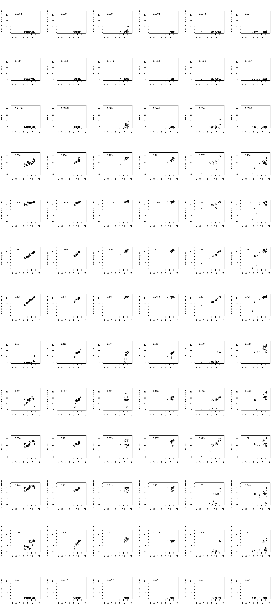
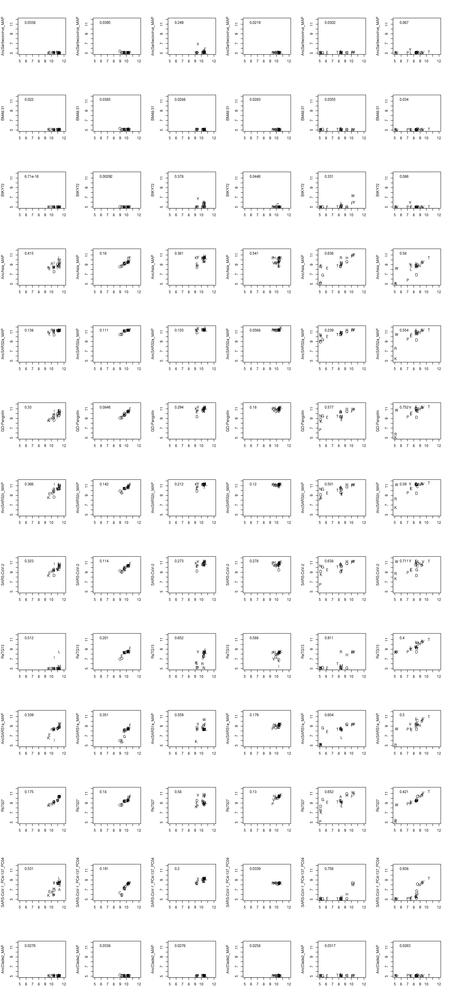
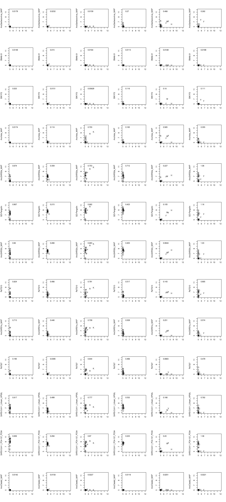
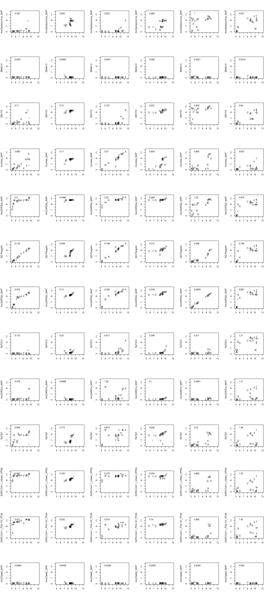
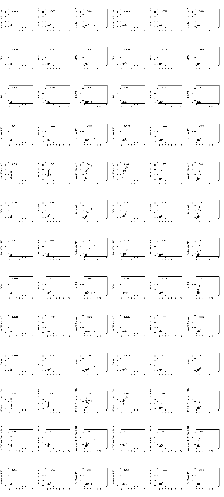
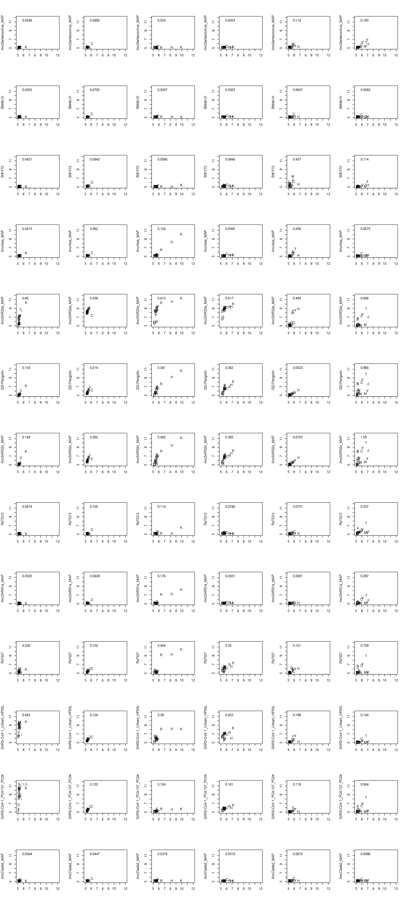

Analyze mutant effects and their epistatic turnover
================
Tyler Starr
10/27/2020

-   [Setup](#setup)
-   [Compute correlations in mutant binding constants between background
    and across
    ACE2s](#compute-correlations-in-mutant-binding-constants-between-background-and-across-ace2s)

``` r
require("knitr")
knitr::opts_chunk$set(echo = T)
knitr::opts_chunk$set(dev.args = list(png = list(type = "cairo")))

#list of packages to install/load
packages = c("yaml","data.table","tidyverse","gridExtra","egg","ggseqlogo","bio3d","viridis")
#install any packages not already installed
installed_packages <- packages %in% rownames(installed.packages())
if(any(installed_packages == F)){
  install.packages(packages[!installed_packages])
}
#load packages
invisible(lapply(packages, library, character.only=T))

#read in config file
config <- read_yaml("config.yaml")

#make output directory
if(!file.exists(config$preferences_dir)){
  dir.create(file.path(config$preferences_dir))
}
```

Session info for reproducing environment:

``` r
sessionInfo()
```

    ## R version 3.6.2 (2019-12-12)
    ## Platform: x86_64-pc-linux-gnu (64-bit)
    ## Running under: Ubuntu 18.04.4 LTS
    ## 
    ## Matrix products: default
    ## BLAS/LAPACK: /app/software/OpenBLAS/0.3.7-GCC-8.3.0/lib/libopenblas_haswellp-r0.3.7.so
    ## 
    ## locale:
    ##  [1] LC_CTYPE=en_US.UTF-8       LC_NUMERIC=C              
    ##  [3] LC_TIME=en_US.UTF-8        LC_COLLATE=en_US.UTF-8    
    ##  [5] LC_MONETARY=en_US.UTF-8    LC_MESSAGES=en_US.UTF-8   
    ##  [7] LC_PAPER=en_US.UTF-8       LC_NAME=C                 
    ##  [9] LC_ADDRESS=C               LC_TELEPHONE=C            
    ## [11] LC_MEASUREMENT=en_US.UTF-8 LC_IDENTIFICATION=C       
    ## 
    ## attached base packages:
    ## [1] stats     graphics  grDevices utils     datasets  methods   base     
    ## 
    ## other attached packages:
    ##  [1] viridis_0.5.1     viridisLite_0.3.0 bio3d_2.4-0       ggseqlogo_0.1    
    ##  [5] egg_0.4.5         gridExtra_2.3     forcats_0.4.0     stringr_1.4.0    
    ##  [9] dplyr_0.8.3       purrr_0.3.3       readr_1.3.1       tidyr_1.0.0      
    ## [13] tibble_3.0.2      ggplot2_3.3.0     tidyverse_1.3.0   data.table_1.12.8
    ## [17] yaml_2.2.0        knitr_1.26       
    ## 
    ## loaded via a namespace (and not attached):
    ##  [1] tidyselect_1.1.0 xfun_0.11        haven_2.2.0      colorspace_1.4-1
    ##  [5] vctrs_0.3.1      generics_0.0.2   htmltools_0.4.0  rlang_0.4.7     
    ##  [9] pillar_1.4.5     glue_1.3.1       withr_2.1.2      DBI_1.1.0       
    ## [13] dbplyr_1.4.2     modelr_0.1.5     readxl_1.3.1     lifecycle_0.2.0 
    ## [17] munsell_0.5.0    gtable_0.3.0     cellranger_1.1.0 rvest_0.3.5     
    ## [21] evaluate_0.14    parallel_3.6.2   fansi_0.4.0      broom_0.7.0     
    ## [25] Rcpp_1.0.3       scales_1.1.0     backports_1.1.5  jsonlite_1.6    
    ## [29] fs_1.3.1         hms_0.5.2        digest_0.6.23    stringi_1.4.3   
    ## [33] grid_3.6.2       cli_2.0.0        tools_3.6.2      magrittr_1.5    
    ## [37] crayon_1.3.4     pkgconfig_2.0.3  ellipsis_0.3.0   xml2_1.2.2      
    ## [41] reprex_0.3.0     lubridate_1.7.4  assertthat_0.2.1 rmarkdown_2.0   
    ## [45] httr_1.4.1       rstudioapi_0.10  R6_2.4.1         compiler_3.6.2

Setup
-----

Read in tables of per-mutant and per-homolog phenotypes. Set some
factors for ordering backgrounds and sites.

``` r
dt_mutant <- data.table(read.csv(config$final_variant_scores_mut_file),stringsAsFactors=F)
#order target by order given in config
dt_mutant$target <- factor(dt_mutant$target,levels=config$mutated_targets_ordered)
#order mutant as a factor for grouping by rough biochemical grouping
dt_mutant$mutant <- factor(dt_mutant$mutant, levels=c("C","P","G","V","M","L","I","A","F","W","Y","T","S","N","Q","E","D","H","K","R"))
#order sites as a factor variable
dt_mutant$position <- factor(dt_mutant$position,levels=c(455,486,493,494,498,501))

dt_wt <- data.table(read.csv(config$final_variant_scores_wt_file),stringsAsFactors=F)
#assign target as a factor in my desired overall plotting order
dt_wt[,target := factor(dt_wt$target,levels=config$targets_ordered)]
```

Compute correlations in mutant binding constants between background and across ACE2s
------------------------------------------------------------------------------------

First, just illustrate correlations with SARS2 for mutations in each
other RBD, for binding to huACE2

``` r
par(mfrow=c(13, 6))
for(RBD2 in levels(dt_mutant$target)[levels(dt_mutant$target)!="SARS-CoV-2"]){
  for(site in c(455, 486, 493, 494, 498, 501)){
    plot(dt_mutant[target=="SARS-CoV-2" & position==site,huACE2],dt_mutant[target==RBD2 & position==site,huACE2], xlim=c(5,12),ylim=c(5,12), pch=as.character(dt_mutant[target=="SARS-CoV-2" & position==site, mutant]), xlab="", ylab=RBD2, main="")
    legend("topleft",bty="n",cex=1,legend=format(cor(dt_mutant[target==RBD2 & position==site,huACE2], dt_mutant[target=="SARS-CoV-2" & position==site,huACE2], use="complete.obs",method="spearman"),digits=3))
  }
}
```

    ## Warning in cor(dt_mutant[target == RBD2 & position == site, huACE2],
    ## dt_mutant[target == : the standard deviation is zero



``` r
invisible(dev.print(pdf, paste(config$preferences_dir,"/correlations-by-site_SARS2_huACE2.pdf",sep="")))
```

RBDs versus SARS1, huACE2

``` r
par(mfrow=c(13, 6))
for(RBD2 in levels(dt_mutant$target)[levels(dt_mutant$target)!="SARS-CoV-1_Urbani_HP03L"]){
  for(site in c(455, 486, 493, 494, 498, 501)){
    plot(dt_mutant[target=="SARS-CoV-1_Urbani_HP03L" & position==site,huACE2],dt_mutant[target==RBD2 & position==site,huACE2], xlim=c(5,12),ylim=c(5,12), pch=as.character(dt_mutant[target=="SARS-CoV-1_Urbani_HP03L" & position==site, mutant]), xlab="", ylab=RBD2, main="")
    legend("topleft",bty="n",cex=1,legend=format(cor(dt_mutant[target==RBD2 & position==site,huACE2], dt_mutant[target=="SARS-CoV-1_Urbani_HP03L" & position==site,huACE2], use="complete.obs",method="spearman"),digits=3))
    
  }
}
```

    ## Warning in cor(dt_mutant[target == RBD2 & position == site, huACE2],
    ## dt_mutant[target == : the standard deviation is zero



``` r
invisible(dev.print(pdf, paste(config$preferences_dir,"/correlations-by-site_SARS1_huACE2.pdf",sep="")))
```

And, vs. SARS2 for the rest of the ACE2s

``` r
par(mfrow=c(13, 6))
for(RBD2 in levels(dt_mutant$target)[levels(dt_mutant$target)!="SARS-CoV-2"]){
  for(site in c(455, 486, 493, 494, 498, 501)){
    plot(dt_mutant[target=="SARS-CoV-2" & position==site,cvACE2],dt_mutant[target==RBD2 & position==site,cvACE2], xlim=c(5,12),ylim=c(5,12), pch=as.character(dt_mutant[target=="SARS-CoV-2" & position==site, mutant]), xlab="", ylab=RBD2, main="")
    legend("topleft",bty="n",cex=1,legend=format(cor(dt_mutant[target==RBD2 & position==site,cvACE2], dt_mutant[target=="SARS-CoV-2" & position==site,cvACE2], use="complete.obs",method="spearman"),digits=3))
  }
}
```


``` r
invisible(dev.print(pdf, paste(config$preferences_dir,"/correlations-by-site_SARS2_cvACE2.pdf",sep="")))
```

``` r
par(mfrow=c(13, 6))
for(RBD2 in levels(dt_mutant$target)[levels(dt_mutant$target)!="SARS-CoV-2"]){
  for(site in c(455, 486, 493, 494, 498, 501)){
    plot(dt_mutant[target=="SARS-CoV-2" & position==site,pgACE2],dt_mutant[target==RBD2 & position==site,pgACE2], xlim=c(5,12),ylim=c(5,12), pch=as.character(dt_mutant[target=="SARS-CoV-2" & position==site, mutant]), xlab="", ylab=RBD2, main="")
    legend("topleft",bty="n",cex=1,legend=format(cor(dt_mutant[target==RBD2 & position==site,pgACE2], dt_mutant[target=="SARS-CoV-2" & position==site,pgACE2], use="complete.obs",method="spearman"),digits=3))
  }
}
```


``` r
invisible(dev.print(pdf, paste(config$preferences_dir,"/correlations-by-site_SARS2_pgACE2.pdf",sep="")))
```

``` r
par(mfrow=c(13, 6))
for(RBD2 in levels(dt_mutant$target)[levels(dt_mutant$target)!="SARS-CoV-2"]){
  for(site in c(455, 486, 493, 494, 498, 501)){
    plot(dt_mutant[target=="SARS-CoV-2" & position==site,mACE2],dt_mutant[target==RBD2 & position==site,mACE2], xlim=c(5,12),ylim=c(5,12), pch=as.character(dt_mutant[target=="SARS-CoV-2" & position==site, mutant]), xlab="", ylab=RBD2, main="")
    legend("topleft",bty="n",cex=1,legend=format(cor(dt_mutant[target==RBD2 & position==site,mACE2], dt_mutant[target=="SARS-CoV-2" & position==site,mACE2], use="complete.obs",method="spearman"),digits=3))
  }
}
```



``` r
invisible(dev.print(pdf, paste(config$preferences_dir,"/correlations-by-site_SARS2_mACE2.pdf",sep="")))
```

``` r
par(mfrow=c(13, 6))
for(RBD2 in levels(dt_mutant$target)[levels(dt_mutant$target)!="SARS-CoV-2"]){
  for(site in c(455, 486, 493, 494, 498, 501)){
    plot(dt_mutant[target=="SARS-CoV-2" & position==site,RaACE2.9479],dt_mutant[target==RBD2 & position==site,RaACE2.9479], xlim=c(5,12),ylim=c(5,12), pch=as.character(dt_mutant[target=="SARS-CoV-2" & position==site, mutant]), xlab="", ylab=RBD2, main="")
    legend("topleft",bty="n",cex=1,legend=format(cor(dt_mutant[target==RBD2 & position==site,RaACE2.9479], dt_mutant[target=="SARS-CoV-2" & position==site,RaACE2.9479], use="complete.obs",method="spearman"),digits=3))
  }
}
```



``` r
invisible(dev.print(pdf, paste(config$preferences_dir,"/correlations-by-site_SARS2_RaACE2.9479.pdf",sep="")))
```

``` r
par(mfrow=c(13, 6))
for(RBD2 in levels(dt_mutant$target)[levels(dt_mutant$target)!="SARS-CoV-2"]){
  for(site in c(455, 486, 493, 494, 498, 501)){
    plot(dt_mutant[target=="SARS-CoV-2" & position==site,RaACE2.787],dt_mutant[target==RBD2 & position==site,RaACE2.787], xlim=c(5,12),ylim=c(5,12), pch=as.character(dt_mutant[target=="SARS-CoV-2" & position==site, mutant]), xlab="", ylab=RBD2, main="")
    legend("topleft",bty="n",cex=1,legend=format(cor(dt_mutant[target==RBD2 & position==site,RaACE2.787], dt_mutant[target=="SARS-CoV-2" & position==site,RaACE2.787], use="complete.obs",method="spearman"),digits=3))
  }
}
```


``` r
invisible(dev.print(pdf, paste(config$preferences_dir,"/correlations-by-site_SARS2_RaACE2.787.pdf",sep="")))
```

``` r
par(mfrow=c(13, 6))
for(RBD2 in levels(dt_mutant$target)[levels(dt_mutant$target)!="SARS-CoV-2"]){
  for(site in c(455, 486, 493, 494, 498, 501)){
    plot(dt_mutant[target=="SARS-CoV-2" & position==site,RsACE2.1434],dt_mutant[target==RBD2 & position==site,RsACE2.1434], xlim=c(5,12),ylim=c(5,12), pch=as.character(dt_mutant[target=="SARS-CoV-2" & position==site, mutant]), xlab="", ylab=RBD2, main="")
    legend("topleft",bty="n",cex=1,legend=format(cor(dt_mutant[target==RBD2 & position==site,RsACE2.1434], dt_mutant[target=="SARS-CoV-2" & position==site,RsACE2.1434], use="complete.obs",method="spearman"),digits=3))
  }
}
```



``` r
invisible(dev.print(pdf, paste(config$preferences_dir,"/correlations-by-site_SARS2_RsACE2.1434.pdf",sep="")))
```

``` r
par(mfrow=c(13, 6))
for(RBD2 in levels(dt_mutant$target)[levels(dt_mutant$target)!="SARS-CoV-2"]){
  for(site in c(455, 486, 493, 494, 498, 501)){
    plot(dt_mutant[target=="SARS-CoV-2" & position==site,RsACE2.3364],dt_mutant[target==RBD2 & position==site,RsACE2.3364], xlim=c(5,12),ylim=c(5,12), pch=as.character(dt_mutant[target=="SARS-CoV-2" & position==site, mutant]), xlab="", ylab=RBD2, main="")
    legend("topleft",bty="n",cex=1,legend=format(cor(dt_mutant[target==RBD2 & position==site,RsACE2.3364], dt_mutant[target=="SARS-CoV-2" & position==site,RsACE2.3364], use="complete.obs",method="spearman"),digits=3))
  }
}
```



``` r
invisible(dev.print(pdf, paste(config$preferences_dir,"/correlations-by-site_SARS2_RsACE2.3364.pdf",sep="")))
```

To summarize these plots, I want to make ‘reaction coordinate’ plots
that visualize R-squared in mut binding affinites as a function of
pairwise sequence divergence. Want to require an RBD-site set to have
some minimum number of amino acids (5) with reasonable affinity (&gt;7)
so that there aren’t non-correlated samples simply because nothing is
binding (no variation to correlate)

Set up tables for storing correlations and identities for all ACE2- and
RBD-pairs

``` r
#data table for storing, for each RBD, its correlation in binding for pairs of ACE2s
#generate table with all combinations of ACE2_1 and ACE2_2 for each RBD+site
diffs_ACE2 <- data.table(expand.grid(site=c(455,486,493,494,498,501),ACE2_2=c("huACE2","cvACE2","pgACE2","mACE2","RaACE2.787","RaACE2.9479","RsACE2.3364","RsACE2.1434"),ACE2_1=c("huACE2","cvACE2","pgACE2","mACE2","RaACE2.787","RaACE2.9479","RsACE2.3364","RsACE2.1434"),RBD=as.character(unique(dt_mutant$target))))

#remove duplicates -- either ACE2_1 and _2 the same, or combinations where the _2 _1 combo is already present in the _1 _2 orientation
diffs_ACE2 <- diffs_ACE2[ACE2_1!=ACE2_2,]
diffs_ACE2 <- diffs_ACE2[ACE2_2!="huACE2",]
diffs_ACE2 <- diffs_ACE2[ACE2_1=="huACE2" | (ACE2_1=="cvACE2" & ACE2_2 %in% c("pgACE2","mACE2","RaACE2.787","RaACE2.9479","RsACE2.3364","RsACE2.1434")) | (ACE2_1=="pgACE2" & ACE2_2 %in% c("mACE2","RaACE2.787","RaACE2.9479","RsACE2.3364","RsACE2.1434")) | (ACE2_1=="mACE2" & ACE2_2 %in% c("RaACE2.787","RaACE2.9479","RsACE2.3364","RsACE2.1434")) | (ACE2_1=="RaACE2.787" & ACE2_2 %in% c("RaACE2.9479","RsACE2.3364","RsACE2.1434")) | (ACE2_1=="RaACE2.9479" & ACE2_2 %in% c("RsACE2.3364","RsACE2.1434")) | (ACE2_1=="RsACE2.3364" & ACE2_2 %in% c("RsACE2.1434")),]

#remove RBD-sites where there's not a minimum number of muts with >7 binding
#for ACE2 comparisons, make this low (2?)
min_n <- 2
diffs_ACE2[,keep:=as.logical(NA)]
for(i in 1:nrow(diffs_ACE2)){
  ACE2_1 <- as.character(diffs_ACE2[i,ACE2_1])
  ACE2_2 <- as.character(diffs_ACE2[i,ACE2_2])
  binds_1 <- dt_mutant[target==as.character(diffs_ACE2[i,RBD]) & position==diffs_ACE2[i,site],get(ACE2_1)]
  binds_2 <- dt_mutant[target==as.character(diffs_ACE2[i,RBD]) & position==diffs_ACE2[i,site],get(ACE2_2)]
  if(sum(binds_1 > 7, na.rm=T) < min_n | sum(binds_2 > 7,na.rm=T) < min_n){
    diffs_ACE2[i,keep := F]
  }else if(sum(binds_1 > 7, na.rm=T) >= min_n & sum(binds_2 > 7, na.rm=T) >= min_n){
    diffs_ACE2[i,keep := T]
  }
}
diffs_ACE2 <- diffs_ACE2[keep==T,.(RBD, ACE2_1, ACE2_2, site)]

#data table for storing, for each ACE2, its difference in correlation in profiles between RBD pairs at each site. 
#generate table with all combinations of RBD_1 and RBD_2 for each ACE2+site
diffs_RBD <- data.table(expand.grid(site=c(455,486,493,494,498,501),RBD_2=as.character(unique(dt_mutant$target)),RBD_1=as.character(unique(dt_mutant$target)),ACE2=c("huACE2","cvACE2","pgACE2","mACE2","RaACE2.787","RaACE2.9479","RsACE2.3364","RsACE2.1434")))

#remove duplicates -- either RBD_1 and _2 the same, or combinations where the _2 _1 combo is already present in the _1 _2 orientation
diffs_RBD <- diffs_RBD[RBD_1!=RBD_2,]
diffs_RBD <- diffs_RBD[RBD_2!="AncSarbecovirus_MAP",]
diffs_RBD <- diffs_RBD[RBD_1=="AncSarbecovirus_MAP" | (RBD_1=="BM48-31" & RBD_2 %in% c("BtKY72","AncAsia_MAP","AncSARS2a_MAP","AncSARS2c_MAP","SARS-CoV-2","RaTG13","GD-Pangolin","AncSARS1a_MAP","SARS-CoV-1_Urbani_HP03L","SARS-CoV-1_PC4-137_PC04","Rs7327","AncClade2_MAP")) | (RBD_1=="BtKY72" & RBD_2 %in% c("AncAsia_MAP","AncSARS2a_MAP","AncSARS2c_MAP","SARS-CoV-2","RaTG13","GD-Pangolin","AncSARS1a_MAP","SARS-CoV-1_Urbani_HP03L","SARS-CoV-1_PC4-137_PC04","Rs7327","AncClade2_MAP")) | (RBD_1=="AncAsia_MAP" & RBD_2 %in% c("AncSARS2a_MAP","AncSARS2c_MAP","SARS-CoV-2","RaTG13","GD-Pangolin","AncSARS1a_MAP","SARS-CoV-1_Urbani_HP03L","SARS-CoV-1_PC4-137_PC04","Rs7327","AncClade2_MAP")) | (RBD_1=="AncSARS2a_MAP" & RBD_2 %in% c("AncSARS2c_MAP","SARS-CoV-2","RaTG13","GD-Pangolin","AncSARS1a_MAP","SARS-CoV-1_Urbani_HP03L","SARS-CoV-1_PC4-137_PC04","Rs7327","AncClade2_MAP")) | (RBD_1=="AncSARS2c_MAP" & RBD_2 %in% c("SARS-CoV-2","RaTG13","GD-Pangolin","AncSARS1a_MAP","SARS-CoV-1_Urbani_HP03L","SARS-CoV-1_PC4-137_PC04","Rs7327","AncClade2_MAP")) | (RBD_1=="SARS-CoV-2" & RBD_2 %in% c("RaTG13","GD-Pangolin","AncSARS1a_MAP","SARS-CoV-1_Urbani_HP03L","SARS-CoV-1_PC4-137_PC04","Rs7327","AncClade2_MAP")) | (RBD_1=="RaTG13" & RBD_2 %in% c("GD-Pangolin","AncSARS1a_MAP","SARS-CoV-1_Urbani_HP03L","SARS-CoV-1_PC4-137_PC04","Rs7327","AncClade2_MAP")) | (RBD_1=="GD-Pangolin" & RBD_2 %in% c("AncSARS1a_MAP","SARS-CoV-1_Urbani_HP03L","SARS-CoV-1_PC4-137_PC04","Rs7327","AncClade2_MAP")) | (RBD_1=="AncSARS1a_MAP" & RBD_2 %in% c("SARS-CoV-1_Urbani_HP03L","SARS-CoV-1_PC4-137_PC04","Rs7327","AncClade2_MAP")) | (RBD_1=="SARS-CoV-1_Urbani_HP03L" & RBD_2 %in% c("SARS-CoV-1_PC4-137_PC04","Rs7327","AncClade2_MAP")) | (RBD_1=="SARS-CoV-1_PC4-137_PC04" & RBD_2 %in% c("Rs7327","AncClade2_MAP")) | (RBD_1=="Rs7327" & RBD_2 %in% c("AncClade2_MAP")),]


#remove RBD-site pairs where there's not a minimum number of muts with >7 binding
#for RBD pairs, make this more stringent than in ACE2s above where I'm not looking at individual points downstream)
min_n <- 5
diffs_RBD[,keep:=as.logical(NA)]
for(i in 1:nrow(diffs_RBD)){
  RBD_1 <- as.character(diffs_RBD[i,RBD_1])
  RBD_2 <- as.character(diffs_RBD[i,RBD_2])
  binds_1 <- dt_mutant[target==RBD_1 & position==diffs_RBD[i,site],get(as.character(diffs_RBD[i,ACE2]))]
  binds_2 <- dt_mutant[target==RBD_2 & position==diffs_RBD[i,site],get(as.character(diffs_RBD[i,ACE2]))]
  if(sum(binds_1 > 7, na.rm=T) < min_n | sum(binds_2 > 7,na.rm=T) < min_n){
    diffs_RBD[i,keep := F]
  }else if(sum(binds_1 > 7, na.rm=T) >= min_n & sum(binds_2 > 7, na.rm=T) >= min_n){
    diffs_RBD[i,keep := T]
  }
}
diffs_RBD <- diffs_RBD[keep==T,.(ACE2, RBD_1, RBD_2, site)]
```

Loop through to compute spearman’s rho in muts at each site for each
ACE2/RBD pair. Using spearman’s rho because there are sometimes apparnet
“threshold-y” looking relationships where the order of muts might be
similar but not “linear” like in a pearson’s r. That is, pearson’s r can
be misled by some potential nonspecific epistatic differences between
backgrounds, whereas spearman’s rho should be more attuned to specific
changes in mutation effects across backgrounds.

``` r
diffs_ACE2$cor <- as.numeric(NA)
for(i in 1:nrow(diffs_ACE2)){
  x <- dt_mutant[target==diffs_ACE2[i,RBD] & position==diffs_ACE2[i,site],get(as.character(diffs_ACE2[i,ACE2_1]))]
  y <- dt_mutant[target==diffs_ACE2[i,RBD] & position==diffs_ACE2[i,site],get(as.character(diffs_ACE2[i,ACE2_2]))]
  diffs_ACE2[i,cor:=cor(x,y,use="complete.obs", method="spearman")]  
}

diffs_RBD$cor <- as.numeric(NA)
for(i in 1:nrow(diffs_RBD)){
  x <- dt_mutant[target==diffs_RBD[i,RBD_1] & position==diffs_RBD[i,site],get(as.character(diffs_RBD[i,ACE2]))]
  y <- dt_mutant[target==diffs_RBD[i,RBD_2] & position==diffs_RBD[i,site],get(as.character(diffs_RBD[i,ACE2]))]
  diffs_RBD[i,cor:=cor(x,y,use="complete.obs", method="spearman")]  
}
```

For RBD pairs, compare r versus pairwise RBD sequence identity across
comparisons.

First, read in alignment and add new column to table indicating %
identity

``` r
alignment <- bio3d::read.fasta(file="data/RBD_align_SSM-backgrounds.fasta")
ids <- seqidentity(alignment)

diffs_RBD[,percent_ID:=ids[as.character(RBD_1),as.character(RBD_2)],by=c("RBD_1","RBD_2")]
```

And do plots – for just human ACE2 binding, and then including all ACE2s

``` r
p_hu<- ggplot(data=diffs_RBD[ACE2=="huACE2",],aes(x=percent_ID, y=cor))+
  geom_point(pch=16,alpha=0.25)+
  geom_smooth(method="loess",span=1.3)+
  facet_wrap(~site,nrow=2)+
  theme_classic()+
  xlim(1,0.7)+
  xlab("RBD pairwise sequence identity")+
  ylab("Spearman's rho")
  
p_hu
```

    ## `geom_smooth()` using formula 'y ~ x'


``` r
invisible(dev.print(pdf, paste(config$preferences_dir,"/rho-v-percent-id_by-site_all-huACE2.pdf",sep=""),useDingbats=F))
```

``` r
p_all <- ggplot(data=diffs_RBD,aes(x=percent_ID, y=cor))+
  geom_point(pch=16,alpha=0.25)+
  geom_smooth(method="loess",span=1)+
  facet_wrap(~site,nrow=2)+
  theme_classic()+xlim(1,0.7)+
  xlab("RBD pairwise sequence identity")+
  ylab("Spearman's rho")
  
p_all
```

    ## `geom_smooth()` using formula 'y ~ x'


``` r
invisible(dev.print(pdf, paste(config$preferences_dir,"/rho-v-percent-id_by-site_all-ACE2.pdf",sep=""),useDingbats=F))
```

For ACE2 pairs, let’s take the median spearman’s rho of each RBDs
ACE2-pair correlation in mut effects per site

``` r
diffs_ACE2[,median_cor:=median(cor),by=c("ACE2_1","ACE2_2","site")]
diffs_ACE2_collapse <- unique(diffs_ACE2[,.(ACE2_1,ACE2_2,site,median_cor)])

pACE2 <- ggplot(diffs_ACE2,aes(ACE2_2,ACE2_1))+geom_tile(aes(fill=median_cor),color="black",lwd=0.1)+
  #scale_fill_gradientn(colours=c("#A94E35","#A94E35","#F48365","#FFFFFF","#7378B9","#7378B9","#383C6C"),limits=c(-7,7),values=c(0,3/14,5/14,7/14,9/14,11/14,14/14),na.value="yellow")+
  scale_fill_viridis(na.value="white")+
  labs(x="",y="")+theme_classic(base_size=9)+
  coord_equal()+theme(axis.text.x=element_text(angle=90,hjust=1,vjust=0.6,face="bold",size=10),axis.text.y=element_text(face="bold",size=10))+
  facet_wrap(~site,nrow=2)
  #guides(y.sec=guide_axis_label_trans())+

pACE2
```


