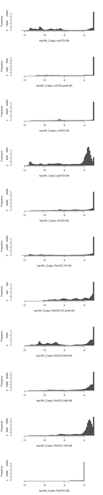
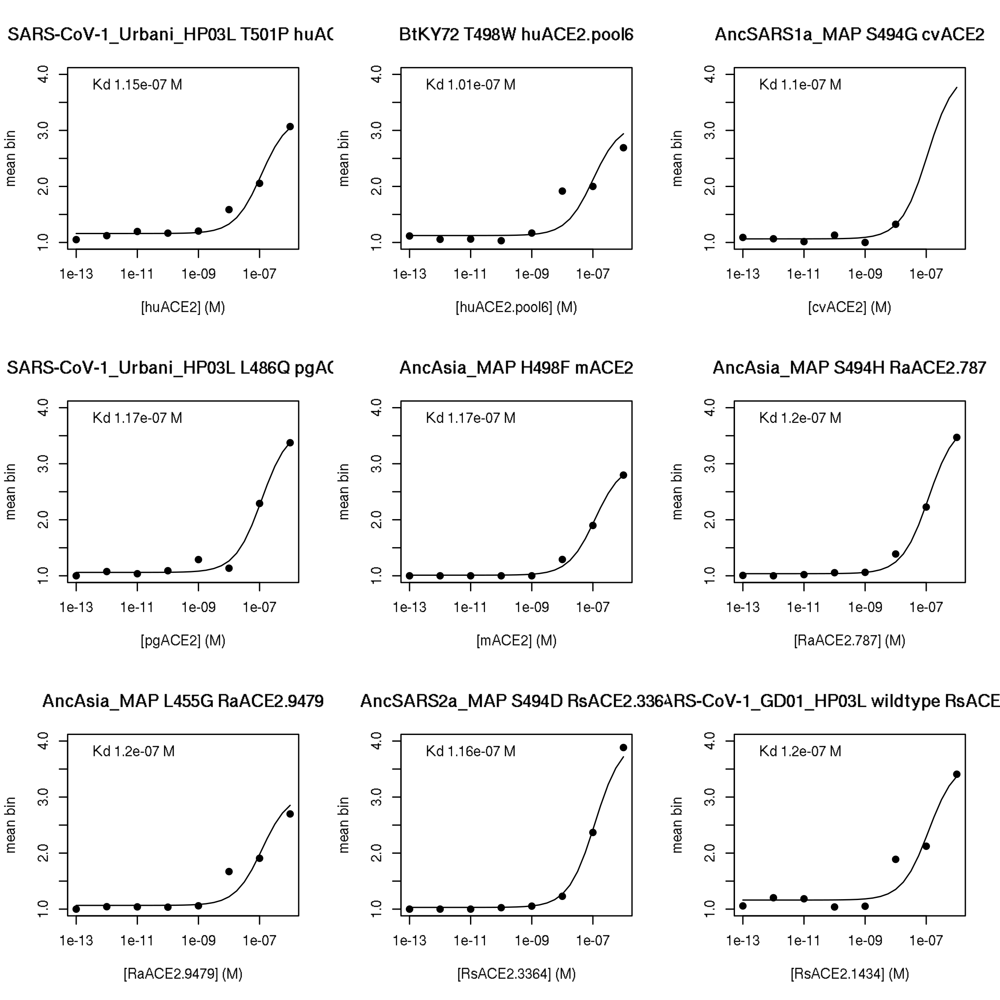
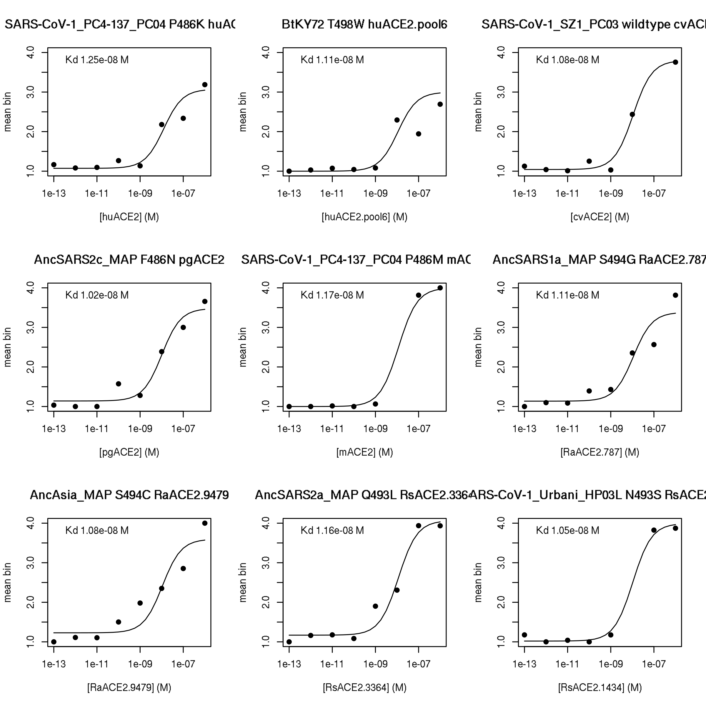
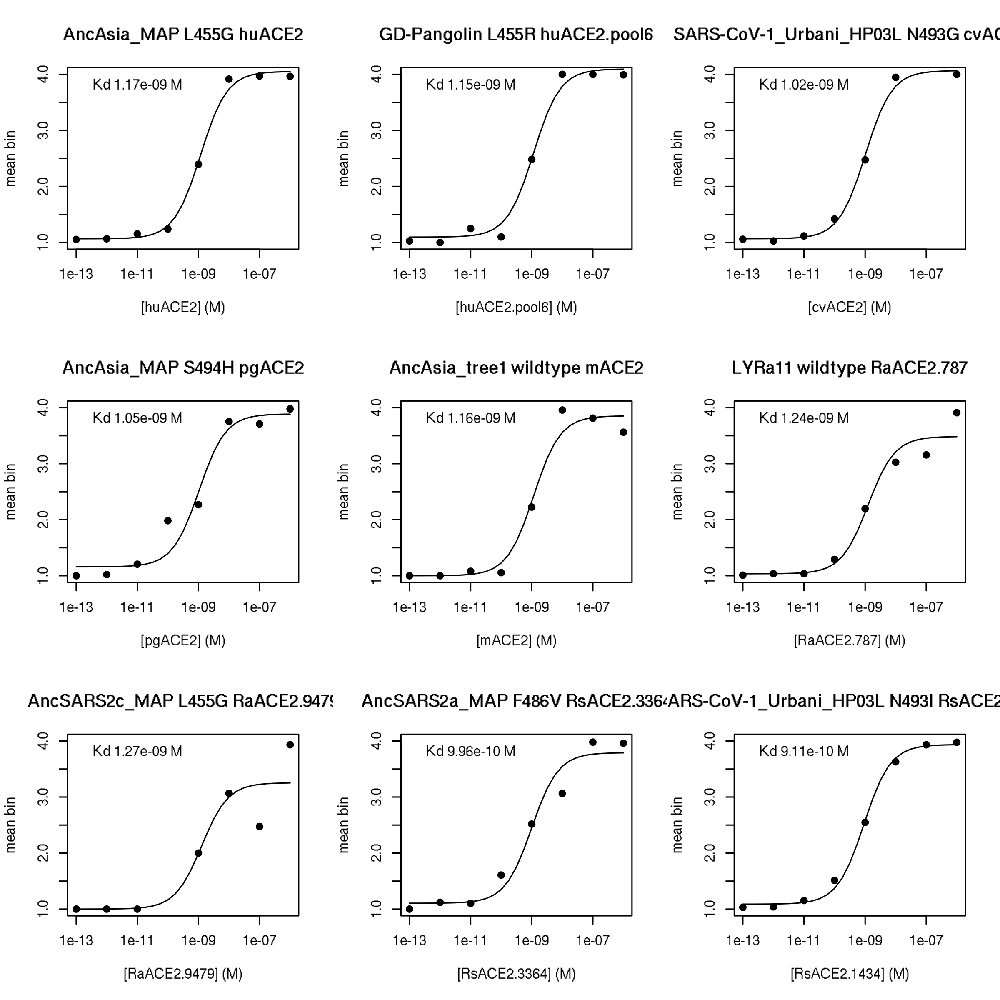
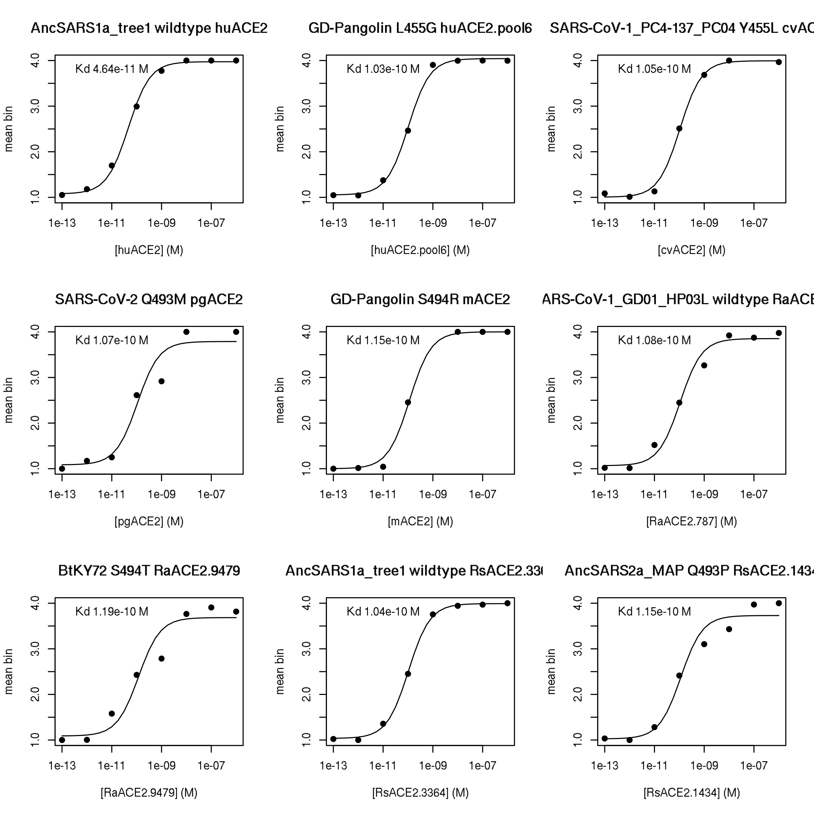
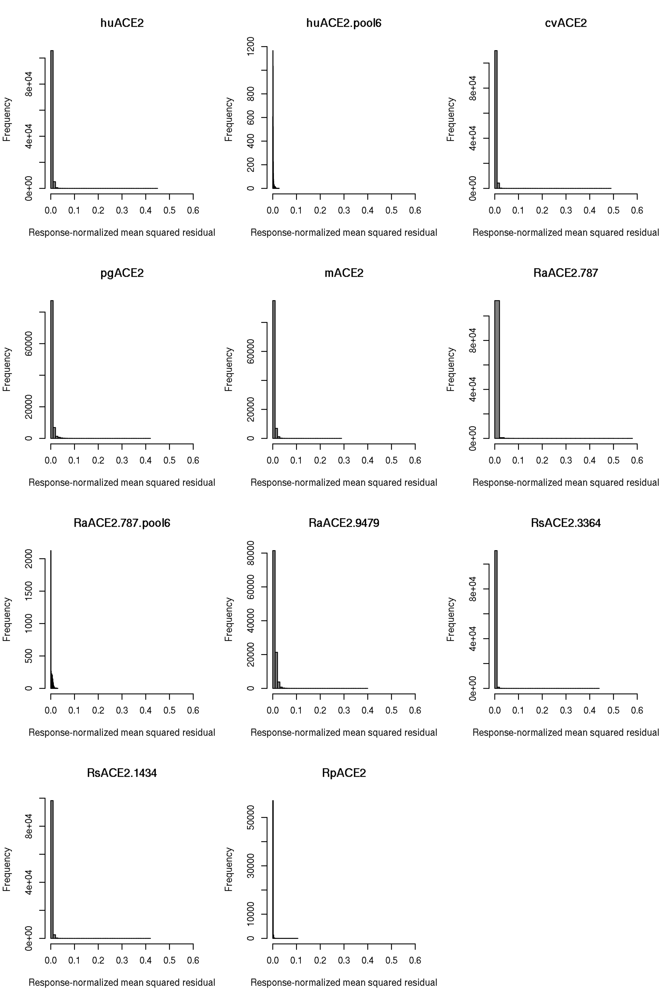
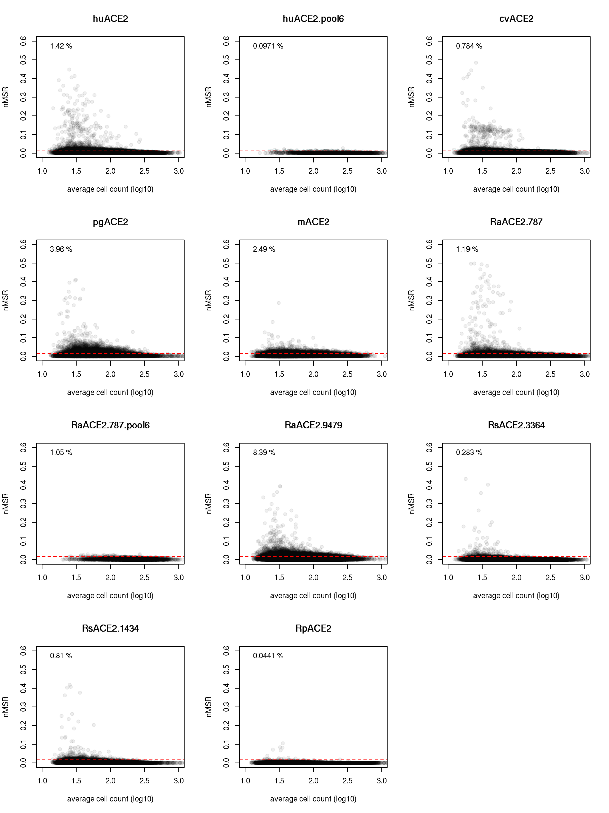

Compute per-barcode binding constants
================
Tyler Starr
10/8/2020

-   [Setup](#setup)
-   [Calculating mean bin for each barcode at each sample
    concentration](#calculating-mean-bin-for-each-barcode-at-each-sample-concentration)
-   [Fit titration curves](#fit-titration-curves)
-   [QC and sanity checks](#qc-and-sanity-checks)
-   [Data filtering by fit quality](#data-filtering-by-fit-quality)
-   [Data Output](#data-output)

This notebook computes and summarizes per-variant binding constants for
ACE2 variants.

``` r
require("knitr")
knitr::opts_chunk$set(echo = T)
knitr::opts_chunk$set(dev.args = list(png = list(type = "cairo")))

#list of packages to install/load
packages = c("yaml","data.table","tidyverse","gridExtra")
#install any packages not already installed
installed_packages <- packages %in% rownames(installed.packages())
if(any(installed_packages == F)){
  install.packages(packages[!installed_packages])
}
#load packages
invisible(lapply(packages, library, character.only=T))

#read in config file
config <- read_yaml("config.yaml")

#make output directory
if(!file.exists(config$Titeseq_Kds_dir)){
  dir.create(file.path(config$Titeseq_Kds_dir))
}
```

Session info for reproducing environment:

``` r
sessionInfo()
```

    ## R version 3.6.2 (2019-12-12)
    ## Platform: x86_64-pc-linux-gnu (64-bit)
    ## Running under: Ubuntu 18.04.4 LTS
    ## 
    ## Matrix products: default
    ## BLAS/LAPACK: /app/software/OpenBLAS/0.3.7-GCC-8.3.0/lib/libopenblas_haswellp-r0.3.7.so
    ## 
    ## locale:
    ##  [1] LC_CTYPE=en_US.UTF-8       LC_NUMERIC=C              
    ##  [3] LC_TIME=en_US.UTF-8        LC_COLLATE=en_US.UTF-8    
    ##  [5] LC_MONETARY=en_US.UTF-8    LC_MESSAGES=en_US.UTF-8   
    ##  [7] LC_PAPER=en_US.UTF-8       LC_NAME=C                 
    ##  [9] LC_ADDRESS=C               LC_TELEPHONE=C            
    ## [11] LC_MEASUREMENT=en_US.UTF-8 LC_IDENTIFICATION=C       
    ## 
    ## attached base packages:
    ## [1] stats     graphics  grDevices utils     datasets  methods   base     
    ## 
    ## other attached packages:
    ##  [1] gridExtra_2.3     forcats_0.4.0     stringr_1.4.0     dplyr_0.8.3      
    ##  [5] purrr_0.3.3       readr_1.3.1       tidyr_1.0.0       tibble_3.0.2     
    ##  [9] ggplot2_3.3.0     tidyverse_1.3.0   data.table_1.12.8 yaml_2.2.0       
    ## [13] knitr_1.26       
    ## 
    ## loaded via a namespace (and not attached):
    ##  [1] Rcpp_1.0.3       cellranger_1.1.0 pillar_1.4.5     compiler_3.6.2  
    ##  [5] dbplyr_1.4.2     tools_3.6.2      digest_0.6.23    lubridate_1.7.4 
    ##  [9] jsonlite_1.6     evaluate_0.14    lifecycle_0.2.0  gtable_0.3.0    
    ## [13] pkgconfig_2.0.3  rlang_0.4.7      reprex_0.3.0     cli_2.0.0       
    ## [17] rstudioapi_0.10  DBI_1.1.0        haven_2.2.0      xfun_0.11       
    ## [21] withr_2.1.2      xml2_1.2.2       httr_1.4.1       fs_1.3.1        
    ## [25] hms_0.5.2        generics_0.0.2   vctrs_0.3.1      grid_3.6.2      
    ## [29] tidyselect_1.1.0 glue_1.3.1       R6_2.4.1         fansi_0.4.0     
    ## [33] readxl_1.3.1     rmarkdown_2.0    modelr_0.1.5     magrittr_1.5    
    ## [37] backports_1.1.5  scales_1.1.0     ellipsis_0.3.0   htmltools_0.4.0 
    ## [41] rvest_0.3.5      assertthat_0.2.1 colorspace_1.4-1 stringi_1.4.3   
    ## [45] munsell_0.5.0    broom_0.7.0      crayon_1.3.4

Setup
-----

Read in table of variant genotypes and barcode counts. Remove samples
corresponding to expression Sort-seq experiments, analyzed in the
accompanying notebook.

``` r
dt <- data.table(read.csv(file=config$merged_sequencing_file,stringsAsFactors = F))

#eliminate columns of Sortseq counts
dt[,c("SortSeq_bin1","SortSeq_bin2","SortSeq_bin3","SortSeq_bin4"):=NULL]

#read dataframe with list of barcode runs
barcode_runs <- read.csv(file=config$barcode_runs,stringsAsFactors=F); barcode_runs <- subset(barcode_runs, select=-c(R1))

#eliminate rows from barcode_runs that are not from a binding Tite-seq experiment
barcode_runs <- barcode_runs[barcode_runs$sample_type != "SortSeq",]

#make tables giving names of Titeseq samples and the corresponding ACE2 incubation concentrations
samples_huACE2 <- data.frame(sample=unique(paste(barcode_runs[barcode_runs$sample_type=="huACE2","sample_type"],formatC(barcode_runs[barcode_runs$sample_type=="huACE2","concentration"], width=2,flag="0"),sep="_")),conc=c(10^-6, 10^-7, 10^-8, 10^-9, 10^-10, 10^-11, 10^-12, 10^-13,0))

samples_huACE2.pool6 <- data.frame(sample=unique(paste(barcode_runs[barcode_runs$sample_type=="huACE2.pool6","sample_type"],formatC(barcode_runs[barcode_runs$sample_type=="huACE2.pool6","concentration"], width=2,flag="0"),sep="_")),conc=c(10^-6, 10^-7, 10^-8, 10^-9, 10^-10, 10^-11, 10^-12, 10^-13,0))

samples_cvACE2 <- data.frame(sample=unique(paste(barcode_runs[barcode_runs$sample_type=="cvACE2","sample_type"],formatC(barcode_runs[barcode_runs$sample_type=="cvACE2","concentration"], width=2,flag="0"),sep="_")),conc=c(10^-6, 10^-7, 10^-8, 10^-9, 10^-10, 10^-11, 10^-12, 10^-13,0))
#note from FACS was that samples 2 in both replicates did not have proper cloud. Unclear why, but am going to fit without this sample
samples_cvACE2 <- samples_cvACE2[samples_cvACE2$sample != "cvACE2_02",]

samples_pgACE2 <- data.frame(sample=unique(paste(barcode_runs[barcode_runs$sample_type=="pgACE2","sample_type"],formatC(barcode_runs[barcode_runs$sample_type=="pgACE2","concentration"], width=2,flag="0"),sep="_")),conc=c(10^-6, 10^-7, 10^-8, 10^-9, 10^-10, 10^-11, 10^-12, 10^-13,0))

samples_RaACE2.787 <- data.frame(sample=unique(paste(barcode_runs[barcode_runs$sample_type=="RaACE2.787","sample_type"],formatC(barcode_runs[barcode_runs$sample_type=="RaACE2.787","concentration"], width=2,flag="0"),sep="_")),conc=c(10^-6, 10^-7, 10^-8, 10^-9, 10^-10, 10^-11, 10^-12, 10^-13,0))

samples_RaACE2.787.pool6 <- data.frame(sample=unique(paste(barcode_runs[barcode_runs$sample_type=="RaACE2.787.pool6","sample_type"],formatC(barcode_runs[barcode_runs$sample_type=="RaACE2.787.pool6","concentration"], width=2,flag="0"),sep="_")),conc=c(10^-6, 10^-7, 10^-8, 10^-9, 10^-10, 10^-11, 10^-12, 10^-13,0))

samples_RaACE2.9479 <- data.frame(sample=unique(paste(barcode_runs[barcode_runs$sample_type=="RaACE2.9479","sample_type"],formatC(barcode_runs[barcode_runs$sample_type=="RaACE2.9479","concentration"], width=2,flag="0"),sep="_")),conc=c(10^-6, 10^-7, 10^-8, 10^-9, 10^-10, 10^-11, 10^-12, 10^-13,0))

samples_RsACE2.3364 <- data.frame(sample=unique(paste(barcode_runs[barcode_runs$sample_type=="RsACE2.3364","sample_type"],formatC(barcode_runs[barcode_runs$sample_type=="RsACE2.3364","concentration"], width=2,flag="0"),sep="_")),conc=c(10^-6, 10^-7, 10^-8, 10^-9, 10^-10, 10^-11, 10^-12, 10^-13,0))

samples_RsACE2.1434 <- data.frame(sample=unique(paste(barcode_runs[barcode_runs$sample_type=="RsACE2.1434","sample_type"],formatC(barcode_runs[barcode_runs$sample_type=="RsACE2.1434","concentration"], width=2,flag="0"),sep="_")),conc=c(10^-6, 10^-7, 10^-8, 10^-9, 10^-10, 10^-11, 10^-12, 10^-13,0))

samples_RpACE2 <- data.frame(sample=unique(paste(barcode_runs[barcode_runs$sample_type=="RpACE2","sample_type"],formatC(barcode_runs[barcode_runs$sample_type=="RpACE2","concentration"], width=2,flag="0"),sep="_")),conc=c(10^-7, 10^-8, 10^-9, 10^-10, 10^-11, 10^-12,0))
```

Calculating mean bin for each barcode at each sample concentration
------------------------------------------------------------------

Next, for each barcode at each of the ACE2 concentrations, calculate the
“mean bin” response variable. This is calculated as a simple mean, where
the value of each bin is the integer value of the bin (bin1=unbound,
bin4=highly bound) – because of how bins are defined, the mean
fluorescence of cells in each bin are equally spaced on a log-normal
scale, so mean bin correlates with simple mean fluorescence. A filtering
step is included that discards mean bin estimates for
sample/concentrations where splits of cell counts across non-consecutive
bins (1/3, 2/4, 1/4) exceed certain filter cutoffs to eliminate
egregious bimodalilty. A more robust maximum likelihood approach could
be implemented to calculate these mean bins, which requires knowledge of
the fluorescence boundaries of the sort bins. We therefore provide them
for posterity’s sake below.

For the huACE2 titration sorts, the fluorescence boundaries for bins 1-4
are as follows:

    (-288, 184), (185, 2251), (2252, 27722), (27723, 262143)

``` r
#function that returns mean bin and sum of counts for four bins cell counts. Includes cutoffs for bimodal sample splits to filter out
calc.meanbin <- function(vec, split13filter=0.4, split24filter=0.4, split14filter=0.2){
  total <- sum(vec)
  if(is.na(total) | (vec[1] > split13filter*total & vec[3] > split13filter*total) | (vec[2] > split24filter*total & vec[4] > split24filter*total) | (vec[1] > split14filter*total & vec[4] > split14filter*total)){
    return(list(NA,NA))
  }else{
    return( list((vec[1]*1+vec[2]*2+vec[3]*3+vec[4]*4)/(vec[1]+vec[2]+vec[3]+vec[4]), total) )
  }
}
  

#iterate through Titeseq samples, compute mean_bin and total_count for each barcode variant
for(i in 1:nrow(samples_huACE2)){ #iterate through titeseq sample (concentration)
  meanbin_out <- paste(samples_huACE2[i,"sample"],"_meanbin",sep="") #define the header name for the meanbin output for the given concentration sample
  totalcount_out <- paste(samples_huACE2[i,"sample"],"_totalcount",sep="") #define the header name for the total cell count output for the given concentration sample
  bin1_in <- paste(samples_huACE2[i,"sample"],"_bin1",sep="") #define the header names for the input cell counts for bins1-4 of the given concnetration sample
  bin2_in <- paste(samples_huACE2[i,"sample"],"_bin2",sep="")
  bin3_in <- paste(samples_huACE2[i,"sample"],"_bin3",sep="")
  bin4_in <- paste(samples_huACE2[i,"sample"],"_bin4",sep="")
  dt[,c(meanbin_out,totalcount_out) := calc.meanbin(c(get(bin1_in),get(bin2_in),get(bin3_in),get(bin4_in))),by=c("barcode","library")]
}

for(i in 1:nrow(samples_huACE2.pool6)){ #iterate through titeseq sample (concentration)
  meanbin_out <- paste(samples_huACE2.pool6[i,"sample"],"_meanbin",sep="") #define the header name for the meanbin output for the given concentration sample
  totalcount_out <- paste(samples_huACE2.pool6[i,"sample"],"_totalcount",sep="") #define the header name for the total cell count output for the given concentration sample
  bin1_in <- paste(samples_huACE2.pool6[i,"sample"],"_bin1",sep="") #define the header names for the input cell counts for bins1-4 of the given concnetration sample
  bin2_in <- paste(samples_huACE2.pool6[i,"sample"],"_bin2",sep="")
  bin3_in <- paste(samples_huACE2.pool6[i,"sample"],"_bin3",sep="")
  bin4_in <- paste(samples_huACE2.pool6[i,"sample"],"_bin4",sep="")
  dt[,c(meanbin_out,totalcount_out) := calc.meanbin(c(get(bin1_in),get(bin2_in),get(bin3_in),get(bin4_in))),by=c("barcode","library")]
}

for(i in 1:nrow(samples_cvACE2)){ #iterate through titeseq sample (concentration)
  meanbin_out <- paste(samples_cvACE2[i,"sample"],"_meanbin",sep="") #define the header name for the meanbin output for the given concentration sample
  totalcount_out <- paste(samples_cvACE2[i,"sample"],"_totalcount",sep="") #define the header name for the total cell count output for the given concentration sample
  bin1_in <- paste(samples_cvACE2[i,"sample"],"_bin1",sep="") #define the header names for the input cell counts for bins1-4 of the given concnetration sample
  bin2_in <- paste(samples_cvACE2[i,"sample"],"_bin2",sep="")
  bin3_in <- paste(samples_cvACE2[i,"sample"],"_bin3",sep="")
  bin4_in <- paste(samples_cvACE2[i,"sample"],"_bin4",sep="")
  dt[,c(meanbin_out,totalcount_out) := calc.meanbin(c(get(bin1_in),get(bin2_in),get(bin3_in),get(bin4_in))),by=c("barcode","library")]
}

for(i in 1:nrow(samples_pgACE2)){ #iterate through titeseq sample (concentration)
  meanbin_out <- paste(samples_pgACE2[i,"sample"],"_meanbin",sep="") #define the header name for the meanbin output for the given concentration sample
  totalcount_out <- paste(samples_pgACE2[i,"sample"],"_totalcount",sep="") #define the header name for the total cell count output for the given concentration sample
  bin1_in <- paste(samples_pgACE2[i,"sample"],"_bin1",sep="") #define the header names for the input cell counts for bins1-4 of the given concnetration sample
  bin2_in <- paste(samples_pgACE2[i,"sample"],"_bin2",sep="")
  bin3_in <- paste(samples_pgACE2[i,"sample"],"_bin3",sep="")
  bin4_in <- paste(samples_pgACE2[i,"sample"],"_bin4",sep="")
  dt[,c(meanbin_out,totalcount_out) := calc.meanbin(c(get(bin1_in),get(bin2_in),get(bin3_in),get(bin4_in))),by=c("barcode","library")]
}

for(i in 1:nrow(samples_RaACE2.787)){ #iterate through titeseq sample (concentration)
  meanbin_out <- paste(samples_RaACE2.787[i,"sample"],"_meanbin",sep="") #define the header name for the meanbin output for the given concentration sample
  totalcount_out <- paste(samples_RaACE2.787[i,"sample"],"_totalcount",sep="") #define the header name for the total cell count output for the given concentration sample
  bin1_in <- paste(samples_RaACE2.787[i,"sample"],"_bin1",sep="") #define the header names for the input cell counts for bins1-4 of the given concnetration sample
  bin2_in <- paste(samples_RaACE2.787[i,"sample"],"_bin2",sep="")
  bin3_in <- paste(samples_RaACE2.787[i,"sample"],"_bin3",sep="")
  bin4_in <- paste(samples_RaACE2.787[i,"sample"],"_bin4",sep="")
  dt[,c(meanbin_out,totalcount_out) := calc.meanbin(c(get(bin1_in),get(bin2_in),get(bin3_in),get(bin4_in))),by=c("barcode","library")]
}

for(i in 1:nrow(samples_RaACE2.787.pool6)){ #iterate through titeseq sample (concentration)
  meanbin_out <- paste(samples_RaACE2.787.pool6[i,"sample"],"_meanbin",sep="") #define the header name for the meanbin output for the given concentration sample
  totalcount_out <- paste(samples_RaACE2.787.pool6[i,"sample"],"_totalcount",sep="") #define the header name for the total cell count output for the given concentration sample
  bin1_in <- paste(samples_RaACE2.787.pool6[i,"sample"],"_bin1",sep="") #define the header names for the input cell counts for bins1-4 of the given concnetration sample
  bin2_in <- paste(samples_RaACE2.787.pool6[i,"sample"],"_bin2",sep="")
  bin3_in <- paste(samples_RaACE2.787.pool6[i,"sample"],"_bin3",sep="")
  bin4_in <- paste(samples_RaACE2.787.pool6[i,"sample"],"_bin4",sep="")
  dt[,c(meanbin_out,totalcount_out) := calc.meanbin(c(get(bin1_in),get(bin2_in),get(bin3_in),get(bin4_in))),by=c("barcode","library")]
}

for(i in 1:nrow(samples_RaACE2.9479)){ #iterate through titeseq sample (concentration)
  meanbin_out <- paste(samples_RaACE2.9479[i,"sample"],"_meanbin",sep="") #define the header name for the meanbin output for the given concentration sample
  totalcount_out <- paste(samples_RaACE2.9479[i,"sample"],"_totalcount",sep="") #define the header name for the total cell count output for the given concentration sample
  bin1_in <- paste(samples_RaACE2.9479[i,"sample"],"_bin1",sep="") #define the header names for the input cell counts for bins1-4 of the given concnetration sample
  bin2_in <- paste(samples_RaACE2.9479[i,"sample"],"_bin2",sep="")
  bin3_in <- paste(samples_RaACE2.9479[i,"sample"],"_bin3",sep="")
  bin4_in <- paste(samples_RaACE2.9479[i,"sample"],"_bin4",sep="")
  dt[,c(meanbin_out,totalcount_out) := calc.meanbin(c(get(bin1_in),get(bin2_in),get(bin3_in),get(bin4_in))),by=c("barcode","library")]
}

for(i in 1:nrow(samples_RsACE2.3364)){ #iterate through titeseq sample (concentration)
  meanbin_out <- paste(samples_RsACE2.3364[i,"sample"],"_meanbin",sep="") #define the header name for the meanbin output for the given concentration sample
  totalcount_out <- paste(samples_RsACE2.3364[i,"sample"],"_totalcount",sep="") #define the header name for the total cell count output for the given concentration sample
  bin1_in <- paste(samples_RsACE2.3364[i,"sample"],"_bin1",sep="") #define the header names for the input cell counts for bins1-4 of the given concnetration sample
  bin2_in <- paste(samples_RsACE2.3364[i,"sample"],"_bin2",sep="")
  bin3_in <- paste(samples_RsACE2.3364[i,"sample"],"_bin3",sep="")
  bin4_in <- paste(samples_RsACE2.3364[i,"sample"],"_bin4",sep="")
  dt[,c(meanbin_out,totalcount_out) := calc.meanbin(c(get(bin1_in),get(bin2_in),get(bin3_in),get(bin4_in))),by=c("barcode","library")]
}

for(i in 1:nrow(samples_RsACE2.1434)){ #iterate through titeseq sample (concentration)
  meanbin_out <- paste(samples_RsACE2.1434[i,"sample"],"_meanbin",sep="") #define the header name for the meanbin output for the given concentration sample
  totalcount_out <- paste(samples_RsACE2.1434[i,"sample"],"_totalcount",sep="") #define the header name for the total cell count output for the given concentration sample
  bin1_in <- paste(samples_RsACE2.1434[i,"sample"],"_bin1",sep="") #define the header names for the input cell counts for bins1-4 of the given concnetration sample
  bin2_in <- paste(samples_RsACE2.1434[i,"sample"],"_bin2",sep="")
  bin3_in <- paste(samples_RsACE2.1434[i,"sample"],"_bin3",sep="")
  bin4_in <- paste(samples_RsACE2.1434[i,"sample"],"_bin4",sep="")
  dt[,c(meanbin_out,totalcount_out) := calc.meanbin(c(get(bin1_in),get(bin2_in),get(bin3_in),get(bin4_in))),by=c("barcode","library")]
}

for(i in 1:nrow(samples_RpACE2)){ #iterate through titeseq sample (concentration)
  meanbin_out <- paste(samples_RpACE2[i,"sample"],"_meanbin",sep="") #define the header name for the meanbin output for the given concentration sample
  totalcount_out <- paste(samples_RpACE2[i,"sample"],"_totalcount",sep="") #define the header name for the total cell count output for the given concentration sample
  bin1_in <- paste(samples_RpACE2[i,"sample"],"_bin1",sep="") #define the header names for the input cell counts for bins1-4 of the given concnetration sample
  bin2_in <- paste(samples_RpACE2[i,"sample"],"_bin2",sep="")
  bin3_in <- paste(samples_RpACE2[i,"sample"],"_bin3",sep="")
  bin4_in <- paste(samples_RpACE2[i,"sample"],"_bin4",sep="")
  dt[,c(meanbin_out,totalcount_out) := calc.meanbin(c(get(bin1_in),get(bin2_in),get(bin3_in),get(bin4_in))),by=c("barcode","library")]
}
```

Fit titration curves
--------------------

We will use nonlinear least squares regression to fit curves to each
barcode’s titration series. We will also include a minimum cell count
that is required for a meanbin estimate to be used in the titration fit,
and a minimum number of concentrations with determined meanbin that is
required for a titration to be reported.

``` r
#For QC and filtering, output columns giving the average number of cells that were sampled for a barcode across the 9 sample concentrations, and a value for the number of meanbin estimates that were removed for being below the # of cells cutoff
cutoff <- 10
dt[,huACE2_avgcount := mean(c(huACE2_01_totalcount,huACE2_02_totalcount,huACE2_03_totalcount,huACE2_04_totalcount,
                                huACE2_05_totalcount,huACE2_06_totalcount,huACE2_07_totalcount,huACE2_08_totalcount,
                                huACE2_09_totalcount),na.rm=T),by=c("library","barcode")]
dt[,huACE2.pool6_avgcount := mean(c(huACE2.pool6_01_totalcount,huACE2.pool6_02_totalcount,huACE2.pool6_03_totalcount,huACE2.pool6_04_totalcount,
                                huACE2.pool6_05_totalcount,huACE2.pool6_06_totalcount,huACE2.pool6_07_totalcount,huACE2.pool6_08_totalcount,
                                huACE2.pool6_09_totalcount),na.rm=T),by=c("library","barcode")]
dt[,cvACE2_avgcount := mean(c(cvACE2_01_totalcount,cvACE2_03_totalcount,cvACE2_04_totalcount,
                                cvACE2_05_totalcount,cvACE2_06_totalcount,cvACE2_07_totalcount,cvACE2_08_totalcount,
                                cvACE2_09_totalcount),na.rm=T),by=c("library","barcode")]
dt[,pgACE2_avgcount := mean(c(pgACE2_01_totalcount,pgACE2_02_totalcount,pgACE2_03_totalcount,pgACE2_04_totalcount,
                                pgACE2_05_totalcount,pgACE2_06_totalcount,pgACE2_07_totalcount,pgACE2_08_totalcount,
                                pgACE2_09_totalcount),na.rm=T),by=c("library","barcode")]
dt[,RaACE2.787_avgcount := mean(c(RaACE2.787_01_totalcount,RaACE2.787_02_totalcount,RaACE2.787_03_totalcount,RaACE2.787_04_totalcount,
                                RaACE2.787_05_totalcount,RaACE2.787_06_totalcount,RaACE2.787_07_totalcount,RaACE2.787_08_totalcount,
                                RaACE2.787_09_totalcount),na.rm=T),by=c("library","barcode")]
dt[,RaACE2.787.pool6_avgcount := mean(c(RaACE2.787.pool6_01_totalcount,RaACE2.787.pool6_02_totalcount,RaACE2.787.pool6_03_totalcount,RaACE2.787.pool6_04_totalcount,
                                RaACE2.787.pool6_05_totalcount,RaACE2.787.pool6_06_totalcount,RaACE2.787.pool6_07_totalcount,RaACE2.787.pool6_08_totalcount,
                                RaACE2.787.pool6_09_totalcount),na.rm=T),by=c("library","barcode")]
dt[,RaACE2.9479_avgcount := mean(c(RaACE2.9479_01_totalcount,RaACE2.9479_02_totalcount,RaACE2.9479_03_totalcount,RaACE2.9479_04_totalcount,
                                RaACE2.9479_05_totalcount,RaACE2.9479_06_totalcount,RaACE2.9479_07_totalcount,RaACE2.9479_08_totalcount,
                                RaACE2.9479_09_totalcount),na.rm=T),by=c("library","barcode")]
dt[,RsACE2.3364_avgcount := mean(c(RsACE2.3364_01_totalcount,RsACE2.3364_02_totalcount,RsACE2.3364_03_totalcount,RsACE2.3364_04_totalcount,
                                RsACE2.3364_05_totalcount,RsACE2.3364_06_totalcount,RsACE2.3364_07_totalcount,RsACE2.3364_08_totalcount,
                                RsACE2.3364_09_totalcount),na.rm=T),by=c("library","barcode")]
dt[,RsACE2.1434_avgcount := mean(c(RsACE2.1434_01_totalcount,RsACE2.1434_02_totalcount,RsACE2.1434_03_totalcount,RsACE2.1434_04_totalcount,
                                RsACE2.1434_05_totalcount,RsACE2.1434_06_totalcount,RsACE2.1434_07_totalcount,RsACE2.1434_08_totalcount,
                                RsACE2.1434_09_totalcount),na.rm=T),by=c("library","barcode")]
dt[,RpACE2_avgcount := mean(c(RpACE2_02_totalcount,RpACE2_03_totalcount,RpACE2_04_totalcount,
                                RpACE2_05_totalcount,RpACE2_06_totalcount,RpACE2_07_totalcount,
                                RpACE2_09_totalcount),na.rm=T),by=c("library","barcode")]

#number of concentrations at which meanbin is calculated from < cutoff cells or is missing b/c filtered for bimodality
dt[,huACE2_min_cell_filtered := sum(c(c(huACE2_01_totalcount,huACE2_02_totalcount,huACE2_03_totalcount,huACE2_04_totalcount,
                                        huACE2_05_totalcount,huACE2_06_totalcount,huACE2_07_totalcount,huACE2_08_totalcount,
                                        huACE2_09_totalcount)<cutoff,is.na(c(huACE2_01_totalcount,huACE2_02_totalcount,huACE2_03_totalcount,huACE2_04_totalcount,
                                                                             huACE2_05_totalcount,huACE2_06_totalcount,huACE2_07_totalcount,huACE2_08_totalcount,
                                                                             huACE2_09_totalcount))),na.rm=T),by=c("library","barcode")]
dt[,huACE2.pool6_min_cell_filtered := sum(c(c(huACE2.pool6_01_totalcount,huACE2.pool6_02_totalcount,huACE2.pool6_03_totalcount,huACE2.pool6_04_totalcount,
                                        huACE2.pool6_05_totalcount,huACE2.pool6_06_totalcount,huACE2.pool6_07_totalcount,huACE2.pool6_08_totalcount,
                                        huACE2.pool6_09_totalcount)<cutoff,is.na(c(huACE2.pool6_01_totalcount,huACE2.pool6_02_totalcount,huACE2.pool6_03_totalcount,huACE2.pool6_04_totalcount,
                                                                             huACE2.pool6_05_totalcount,huACE2.pool6_06_totalcount,huACE2.pool6_07_totalcount,huACE2.pool6_08_totalcount,
                                                                             huACE2.pool6_09_totalcount))),na.rm=T),by=c("library","barcode")]
dt[,cvACE2_min_cell_filtered := sum(c(c(cvACE2_01_totalcount,cvACE2_03_totalcount,cvACE2_04_totalcount,
                                        cvACE2_05_totalcount,cvACE2_06_totalcount,cvACE2_07_totalcount,cvACE2_08_totalcount,
                                        cvACE2_09_totalcount)<cutoff,is.na(c(cvACE2_01_totalcount,cvACE2_03_totalcount,cvACE2_04_totalcount,
                                                                             cvACE2_05_totalcount,cvACE2_06_totalcount,cvACE2_07_totalcount,cvACE2_08_totalcount,
                                                                             cvACE2_09_totalcount))),na.rm=T),by=c("library","barcode")]
dt[,pgACE2_min_cell_filtered := sum(c(c(pgACE2_01_totalcount,pgACE2_02_totalcount,pgACE2_03_totalcount,pgACE2_04_totalcount,
                                        pgACE2_05_totalcount,pgACE2_06_totalcount,pgACE2_07_totalcount,pgACE2_08_totalcount,
                                        pgACE2_09_totalcount)<cutoff,is.na(c(pgACE2_01_totalcount,pgACE2_02_totalcount,pgACE2_03_totalcount,pgACE2_04_totalcount,
                                                                             pgACE2_05_totalcount,pgACE2_06_totalcount,pgACE2_07_totalcount,pgACE2_08_totalcount,
                                                                             pgACE2_09_totalcount))),na.rm=T),by=c("library","barcode")]
dt[,RaACE2.787_min_cell_filtered := sum(c(c(RaACE2.787_01_totalcount,RaACE2.787_02_totalcount,RaACE2.787_03_totalcount,RaACE2.787_04_totalcount,
                                        RaACE2.787_05_totalcount,RaACE2.787_06_totalcount,RaACE2.787_07_totalcount,RaACE2.787_08_totalcount,
                                        RaACE2.787_09_totalcount)<cutoff,is.na(c(RaACE2.787_01_totalcount,RaACE2.787_02_totalcount,RaACE2.787_03_totalcount,RaACE2.787_04_totalcount,
                                                                             RaACE2.787_05_totalcount,RaACE2.787_06_totalcount,RaACE2.787_07_totalcount,RaACE2.787_08_totalcount,
                                                                             RaACE2.787_09_totalcount))),na.rm=T),by=c("library","barcode")]
dt[,RaACE2.787.pool6_min_cell_filtered := sum(c(c(RaACE2.787.pool6_01_totalcount,RaACE2.787.pool6_02_totalcount,RaACE2.787.pool6_03_totalcount,RaACE2.787.pool6_04_totalcount,
                                        RaACE2.787.pool6_05_totalcount,RaACE2.787.pool6_06_totalcount,RaACE2.787.pool6_07_totalcount,RaACE2.787.pool6_08_totalcount,
                                        RaACE2.787.pool6_09_totalcount)<cutoff,is.na(c(RaACE2.787.pool6_01_totalcount,RaACE2.787.pool6_02_totalcount,RaACE2.787.pool6_03_totalcount,RaACE2.787.pool6_04_totalcount,
                                                                             RaACE2.787.pool6_05_totalcount,RaACE2.787.pool6_06_totalcount,RaACE2.787.pool6_07_totalcount,RaACE2.787.pool6_08_totalcount,
                                                                             RaACE2.787.pool6_09_totalcount))),na.rm=T),by=c("library","barcode")]
dt[,RaACE2.9479_min_cell_filtered := sum(c(c(RaACE2.9479_01_totalcount,RaACE2.9479_02_totalcount,RaACE2.9479_03_totalcount,RaACE2.9479_04_totalcount,
                                        RaACE2.9479_05_totalcount,RaACE2.9479_06_totalcount,RaACE2.9479_07_totalcount,RaACE2.9479_08_totalcount,
                                        RaACE2.9479_09_totalcount)<cutoff,is.na(c(RaACE2.9479_01_totalcount,RaACE2.9479_02_totalcount,RaACE2.9479_03_totalcount,RaACE2.9479_04_totalcount,
                                                                             RaACE2.9479_05_totalcount,RaACE2.9479_06_totalcount,RaACE2.9479_07_totalcount,RaACE2.9479_08_totalcount,
                                                                             RaACE2.9479_09_totalcount))),na.rm=T),by=c("library","barcode")]
dt[,RsACE2.3364_min_cell_filtered := sum(c(c(RsACE2.3364_01_totalcount,RsACE2.3364_02_totalcount,RsACE2.3364_03_totalcount,RsACE2.3364_04_totalcount,
                                        RsACE2.3364_05_totalcount,RsACE2.3364_06_totalcount,RsACE2.3364_07_totalcount,RsACE2.3364_08_totalcount,
                                        RsACE2.3364_09_totalcount)<cutoff,is.na(c(RsACE2.3364_01_totalcount,RsACE2.3364_02_totalcount,RsACE2.3364_03_totalcount,RsACE2.3364_04_totalcount,
                                                                             RsACE2.3364_05_totalcount,RsACE2.3364_06_totalcount,RsACE2.3364_07_totalcount,RsACE2.3364_08_totalcount,
                                                                             RsACE2.3364_09_totalcount))),na.rm=T),by=c("library","barcode")]
dt[,RsACE2.1434_min_cell_filtered := sum(c(c(RsACE2.1434_01_totalcount,RsACE2.1434_02_totalcount,RsACE2.1434_03_totalcount,RsACE2.1434_04_totalcount,
                                        RsACE2.1434_05_totalcount,RsACE2.1434_06_totalcount,RsACE2.1434_07_totalcount,RsACE2.1434_08_totalcount,
                                        RsACE2.1434_09_totalcount)<cutoff,is.na(c(RsACE2.1434_01_totalcount,RsACE2.1434_02_totalcount,RsACE2.1434_03_totalcount,RsACE2.1434_04_totalcount,
                                                                             RsACE2.1434_05_totalcount,RsACE2.1434_06_totalcount,RsACE2.1434_07_totalcount,RsACE2.1434_08_totalcount,
                                                                             RsACE2.1434_09_totalcount))),na.rm=T),by=c("library","barcode")]
dt[,RpACE2_min_cell_filtered := sum(c(c(RpACE2_02_totalcount,RpACE2_03_totalcount,RpACE2_04_totalcount,
                                        RpACE2_05_totalcount,RpACE2_06_totalcount,RpACE2_07_totalcount,
                                        RpACE2_09_totalcount)<cutoff,is.na(c(RpACE2_02_totalcount,RpACE2_03_totalcount,RpACE2_04_totalcount,
                                                                             RpACE2_05_totalcount,RpACE2_06_totalcount,RpACE2_07_totalcount,
                                                                             RpACE2_09_totalcount))),na.rm=T),by=c("library","barcode")]

#function that fits a nls regression to the titration series, including an option to filter below certain thresholds for average cells across all samples, and number of samples below a cutoff of cells
fit.titration <- function(y.vals,x.vals,count.vals,min.cfu=cutoff,
                          min.means=0.8,min.average=10,Kd.start=2e-11,
                          a.start=3,a.lower=2,a.upper=3,
                          b.start=1,b.lower=1,b.upper=1.5){
  indices <- count.vals>min.cfu & !is.na(y.vals)
  y <- y.vals[indices]
  x <- x.vals[indices]
  if((length(y) < min.means*length(y.vals)) | (mean(count.vals,na.rm=T) < min.average)){ #return NAs if < min.means fraction of concentrations have above min.cfu counts or if the average count across all concentrations is below min.average
    return(list(as.numeric(NA),as.numeric(NA),as.numeric(NA),as.numeric(NA),as.numeric(NA)))
  }else{
    fit <- nls(y ~ a*(x/(x+Kd))+b,
               start=list(a=a.start,b=b.start,Kd=Kd.start),
               lower=list(a=a.lower,b=b.lower,Kd=min(x.vals[x.vals>0])/100), #constrain Kd to be no lower than 1/100x the lowest concentration value
               upper=list(a=a.upper,b=b.upper,Kd=max(x.vals[x.vals>0])*10), #constrain Kd to be no higher than the 10x highest concentration value
               algorithm="port")
    y.pred <- predict(fit,newdata=list(x=x))
    resid <- y - y.pred
    resid.norm <- resid/as.numeric(summary(fit)$coefficients["a","Estimate"])
    nMSR <- mean((resid.norm)^2,na.rm=T)
    return(list(as.numeric(summary(fit)$coefficients["Kd","Estimate"]),
                as.numeric(summary(fit)$coefficients["Kd","Std. Error"]),
                as.numeric(summary(fit)$coefficients["a","Estimate"]),
                as.numeric(summary(fit)$coefficients["b","Estimate"]),
                as.numeric(nMSR)))
  }
}

#fit titration to huACE2 Titeseq data for each barcode
dt[,c("Kd_huACE2","Kd_SE_huACE2","response_huACE2","baseline_huACE2","nMSR_huACE2") :=
     tryCatch(fit.titration(y.vals=c(huACE2_01_meanbin,huACE2_02_meanbin,huACE2_03_meanbin,huACE2_04_meanbin,
                                     huACE2_05_meanbin,huACE2_06_meanbin,huACE2_07_meanbin,huACE2_08_meanbin,
                                     huACE2_09_meanbin),
                            x.vals=samples_huACE2$conc,
                            count.vals=c(huACE2_01_totalcount,huACE2_02_totalcount,huACE2_03_totalcount,huACE2_04_totalcount,
                                         huACE2_05_totalcount,huACE2_06_totalcount,huACE2_07_totalcount,huACE2_08_totalcount,huACE2_09_totalcount)),
              error=function(e){list(as.numeric(NA),as.numeric(NA),as.numeric(NA),as.numeric(NA),as.numeric(NA))}),by=c("library","barcode")]

#fit titration to huACE2.pool6 Titeseq data for each barcode
dt[,c("Kd_huACE2.pool6","Kd_SE_huACE2.pool6","response_huACE2.pool6","baseline_huACE2.pool6","nMSR_huACE2.pool6") :=
     tryCatch(fit.titration(y.vals=c(huACE2.pool6_01_meanbin,huACE2.pool6_02_meanbin,huACE2.pool6_03_meanbin,huACE2.pool6_04_meanbin,
                                     huACE2.pool6_05_meanbin,huACE2.pool6_06_meanbin,huACE2.pool6_07_meanbin,huACE2.pool6_08_meanbin,
                                     huACE2.pool6_09_meanbin),
                            x.vals=samples_huACE2.pool6$conc,
                            count.vals=c(huACE2.pool6_01_totalcount,huACE2.pool6_02_totalcount,huACE2.pool6_03_totalcount,huACE2.pool6_04_totalcount,
                                         huACE2.pool6_05_totalcount,huACE2.pool6_06_totalcount,huACE2.pool6_07_totalcount,huACE2.pool6_08_totalcount,huACE2.pool6_09_totalcount)),
              error=function(e){list(as.numeric(NA),as.numeric(NA),as.numeric(NA),as.numeric(NA),as.numeric(NA))}),by=c("library","barcode")]

#fit titration to cvACE2 Titeseq data for each barcode
dt[,c("Kd_cvACE2","Kd_SE_cvACE2","response_cvACE2","baseline_cvACE2","nMSR_cvACE2") :=
     tryCatch(fit.titration(y.vals=c(cvACE2_01_meanbin,cvACE2_03_meanbin,cvACE2_04_meanbin,
                                     cvACE2_05_meanbin,cvACE2_06_meanbin,cvACE2_07_meanbin,cvACE2_08_meanbin,
                                     cvACE2_09_meanbin),
                            x.vals=samples_cvACE2$conc,
                            count.vals=c(cvACE2_01_totalcount,cvACE2_03_totalcount,cvACE2_04_totalcount,
                                         cvACE2_05_totalcount,cvACE2_06_totalcount,cvACE2_07_totalcount,cvACE2_08_totalcount,cvACE2_09_totalcount)),
              error=function(e){list(as.numeric(NA),as.numeric(NA),as.numeric(NA),as.numeric(NA),as.numeric(NA))}),by=c("library","barcode")]

#fit titration to pgACE2 Titeseq data for each barcode
dt[,c("Kd_pgACE2","Kd_SE_pgACE2","response_pgACE2","baseline_pgACE2","nMSR_pgACE2") :=
     tryCatch(fit.titration(y.vals=c(pgACE2_01_meanbin,pgACE2_02_meanbin,pgACE2_03_meanbin,pgACE2_04_meanbin,
                                     pgACE2_05_meanbin,pgACE2_06_meanbin,pgACE2_07_meanbin,pgACE2_08_meanbin,
                                     pgACE2_09_meanbin),
                            x.vals=samples_pgACE2$conc,
                            count.vals=c(pgACE2_01_totalcount,pgACE2_02_totalcount,pgACE2_03_totalcount,pgACE2_04_totalcount,
                                         pgACE2_05_totalcount,pgACE2_06_totalcount,pgACE2_07_totalcount,pgACE2_08_totalcount,pgACE2_09_totalcount)),
              error=function(e){list(as.numeric(NA),as.numeric(NA),as.numeric(NA),as.numeric(NA),as.numeric(NA))}),by=c("library","barcode")]

#fit titration to RaACE2.787 Titeseq data for each barcode
dt[,c("Kd_RaACE2.787","Kd_SE_RaACE2.787","response_RaACE2.787","baseline_RaACE2.787","nMSR_RaACE2.787") :=
     tryCatch(fit.titration(y.vals=c(RaACE2.787_01_meanbin,RaACE2.787_02_meanbin,RaACE2.787_03_meanbin,RaACE2.787_04_meanbin,
                                     RaACE2.787_05_meanbin,RaACE2.787_06_meanbin,RaACE2.787_07_meanbin,RaACE2.787_08_meanbin,
                                     RaACE2.787_09_meanbin),
                            x.vals=samples_RaACE2.787$conc,
                            count.vals=c(RaACE2.787_01_totalcount,RaACE2.787_02_totalcount,RaACE2.787_03_totalcount,RaACE2.787_04_totalcount,
                                         RaACE2.787_05_totalcount,RaACE2.787_06_totalcount,RaACE2.787_07_totalcount,RaACE2.787_08_totalcount,RaACE2.787_09_totalcount)),
              error=function(e){list(as.numeric(NA),as.numeric(NA),as.numeric(NA),as.numeric(NA),as.numeric(NA))}),by=c("library","barcode")]

#fit titration to RaACE2.787.pool6 Titeseq data for each barcode
dt[,c("Kd_RaACE2.787.pool6","Kd_SE_RaACE2.787.pool6","response_RaACE2.787.pool6","baseline_RaACE2.787.pool6","nMSR_RaACE2.787.pool6") :=
     tryCatch(fit.titration(y.vals=c(RaACE2.787.pool6_01_meanbin,RaACE2.787.pool6_02_meanbin,RaACE2.787.pool6_03_meanbin,RaACE2.787.pool6_04_meanbin,
                                     RaACE2.787.pool6_05_meanbin,RaACE2.787.pool6_06_meanbin,RaACE2.787.pool6_07_meanbin,RaACE2.787.pool6_08_meanbin,
                                     RaACE2.787.pool6_09_meanbin),
                            x.vals=samples_RaACE2.787.pool6$conc,
                            count.vals=c(RaACE2.787.pool6_01_totalcount,RaACE2.787.pool6_02_totalcount,RaACE2.787.pool6_03_totalcount,RaACE2.787.pool6_04_totalcount,
                                         RaACE2.787.pool6_05_totalcount,RaACE2.787.pool6_06_totalcount,RaACE2.787.pool6_07_totalcount,RaACE2.787.pool6_08_totalcount,RaACE2.787.pool6_09_totalcount)),
              error=function(e){list(as.numeric(NA),as.numeric(NA),as.numeric(NA),as.numeric(NA),as.numeric(NA))}),by=c("library","barcode")]

#fit titration to RaACE2.9479 Titeseq data for each barcode
dt[,c("Kd_RaACE2.9479","Kd_SE_RaACE2.9479","response_RaACE2.9479","baseline_RaACE2.9479","nMSR_RaACE2.9479") :=
     tryCatch(fit.titration(y.vals=c(RaACE2.9479_01_meanbin,RaACE2.9479_02_meanbin,RaACE2.9479_03_meanbin,RaACE2.9479_04_meanbin,
                                     RaACE2.9479_05_meanbin,RaACE2.9479_06_meanbin,RaACE2.9479_07_meanbin,RaACE2.9479_08_meanbin,
                                     RaACE2.9479_09_meanbin),
                            x.vals=samples_RaACE2.9479$conc,
                            count.vals=c(RaACE2.9479_01_totalcount,RaACE2.9479_02_totalcount,RaACE2.9479_03_totalcount,RaACE2.9479_04_totalcount,
                                         RaACE2.9479_05_totalcount,RaACE2.9479_06_totalcount,RaACE2.9479_07_totalcount,RaACE2.9479_08_totalcount,RaACE2.9479_09_totalcount)),
              error=function(e){list(as.numeric(NA),as.numeric(NA),as.numeric(NA),as.numeric(NA),as.numeric(NA))}),by=c("library","barcode")]

#fit titration to RsACE2.3364 Titeseq data for each barcode
dt[,c("Kd_RsACE2.3364","Kd_SE_RsACE2.3364","response_RsACE2.3364","baseline_RsACE2.3364","nMSR_RsACE2.3364") :=
     tryCatch(fit.titration(y.vals=c(RsACE2.3364_01_meanbin,RsACE2.3364_02_meanbin,RsACE2.3364_03_meanbin,RsACE2.3364_04_meanbin,
                                     RsACE2.3364_05_meanbin,RsACE2.3364_06_meanbin,RsACE2.3364_07_meanbin,RsACE2.3364_08_meanbin,
                                     RsACE2.3364_09_meanbin),
                            x.vals=samples_RsACE2.3364$conc,
                            count.vals=c(RsACE2.3364_01_totalcount,RsACE2.3364_02_totalcount,RsACE2.3364_03_totalcount,RsACE2.3364_04_totalcount,
                                         RsACE2.3364_05_totalcount,RsACE2.3364_06_totalcount,RsACE2.3364_07_totalcount,RsACE2.3364_08_totalcount,RsACE2.3364_09_totalcount)),
              error=function(e){list(as.numeric(NA),as.numeric(NA),as.numeric(NA),as.numeric(NA),as.numeric(NA))}),by=c("library","barcode")]

#fit titration to RsACE2.1434 Titeseq data for each barcode
dt[,c("Kd_RsACE2.1434","Kd_SE_RsACE2.1434","response_RsACE2.1434","baseline_RsACE2.1434","nMSR_RsACE2.1434") :=
     tryCatch(fit.titration(y.vals=c(RsACE2.1434_01_meanbin,RsACE2.1434_02_meanbin,RsACE2.1434_03_meanbin,RsACE2.1434_04_meanbin,
                                     RsACE2.1434_05_meanbin,RsACE2.1434_06_meanbin,RsACE2.1434_07_meanbin,RsACE2.1434_08_meanbin,
                                     RsACE2.1434_09_meanbin),
                            x.vals=samples_RsACE2.1434$conc,
                            count.vals=c(RsACE2.1434_01_totalcount,RsACE2.1434_02_totalcount,RsACE2.1434_03_totalcount,RsACE2.1434_04_totalcount,
                                         RsACE2.1434_05_totalcount,RsACE2.1434_06_totalcount,RsACE2.1434_07_totalcount,RsACE2.1434_08_totalcount,RsACE2.1434_09_totalcount)),
              error=function(e){list(as.numeric(NA),as.numeric(NA),as.numeric(NA),as.numeric(NA),as.numeric(NA))}),by=c("library","barcode")]

#fit titration to RpACE2 Titeseq data for each barcode
dt[,c("Kd_RpACE2","Kd_SE_RpACE2","response_RpACE2","baseline_RpACE2","nMSR_RpACE2") :=
     tryCatch(fit.titration(y.vals=c(RpACE2_02_meanbin,RpACE2_03_meanbin,RpACE2_04_meanbin,
                                     RpACE2_05_meanbin,RpACE2_06_meanbin,RpACE2_07_meanbin,
                                     RpACE2_09_meanbin),
                            x.vals=samples_RpACE2$conc,
                            count.vals=c(RpACE2_02_totalcount,RpACE2_03_totalcount,RpACE2_04_totalcount,
                                         RpACE2_05_totalcount,RpACE2_06_totalcount,RpACE2_07_totalcount,RpACE2_09_totalcount),
                            Kd.start=1e-6),
              error=function(e){list(as.numeric(NA),as.numeric(NA),as.numeric(NA),as.numeric(NA),as.numeric(NA))}),by=c("library","barcode")]
```

QC and sanity checks
--------------------

We will do some QC to make sure we got good titration curves for most of
our library barcodes. We will also spot check titration curves from
across our measurement range, and spot check curves whose fit parameters
hit the different boundary conditions of the fit variables.

We successfully generated *K*<sub>D,app</sub> estimates for 74.27% of
our lib1+lib2 huACE2 titrations, 76.23% of our lib1+lib2 cvACE2
titrations, 64.33% of our lib1+lib2 pgACE2 titrations, 75.33% of our
lib1+lib2 RaACE2.787 titrations, 71.69% of our lib1+lib2 RaACE2.9479
titrations, 74.42% of our lib1+lib2 RsACE2.3364 titrations, and 67.29%
of our lib1+lib2 RsACE2.1434 titrations. To allow manual checks of what
the data looks like for different curve fits, I define functions that
take a row from the dt table and the corresponding table of fits, and
plots the meanbin estimates and the fit titration curve (if converged).
This allows for quick and easy troubleshooting and spot-checking of
curves.

``` r
#make functions that allow me to plot a titration for any given row from the counts data frames, for spot checking curves
plot.titration <- function(row,ACE2,output.text=F){
  y.vals <- c();for(sample in get(paste("samples_",ACE2,sep=""))$sample){y.vals <- c(y.vals,paste(sample,"_meanbin",sep=""))};y.vals <- unlist(dt[row,y.vals,with=F])
  x.vals <- get(paste("samples_",ACE2,sep=""))$conc
  count.vals <- c();for(sample in get(paste("samples_",ACE2,sep=""))$sample){count.vals <- c(count.vals,paste(sample,"_totalcount",sep=""))};count.vals <- unlist(dt[row,count.vals,with=F])
  if(dt[row,variant_class] =="mutant"){
    title <- paste(dt[row,target],paste(dt[row,wildtype],dt[row,position],dt[row,mutant]," ",ACE2,sep=""))
  }else{
    title <- paste(dt[row,target],dt[row,variant_class],ACE2)
  }
  indices <- count.vals>cutoff & !is.na(count.vals)
  y.vals <- y.vals[indices]
  x.vals <- x.vals[indices]
  plot(x.vals,y.vals,xlab=paste("[",ACE2,"] (M)",sep=""),
       ylab="mean bin",log="x",ylim=c(1,4),xlim=c(1e-13,1e-6),pch=19,main=title)
  Kd_var <- paste("Kd_",ACE2,sep="")
  fit <- nls(y.vals ~ a*(x.vals/(x.vals+Kd))+b,
             start=list(a=3,b=1,Kd=dt[row,get(Kd_var)]),
             lower=list(a=2,b=1,Kd=1e-15),
             upper=list(a=3,b=1.5,Kd=1e-5), #constrain Kd to be no higher than the 10x highest concentration value
             algorithm="port") 
  if(!is.na(dt[row,get(Kd_var)])){
    lines(10^c(seq(-13,-6,0.25)),predict(fit,newdata=list(x.vals=10^c(seq(-13,-6,0.25)))))
    legend("topleft",bty="n",cex=1,legend=paste("Kd",format(dt[row,get(Kd_var)],digits=3),"M"))
  }
  if(output.text==T){ #for troubleshooting and interactive work, output some info from the counts table for the given row
    vars <- c("barcode","variant_class","wildtype","position","mutant",as.character(paste(ACE2,"_avgcount",sep="")),as.character(paste(ACE2,"_min_cell_filtered",sep="")),as.character(paste("Kd_",ACE2,sep="")),as.character(paste("Kd_SE_",ACE2,sep="")),as.character(paste("baseline_",ACE2,sep="")),as.character(paste("response_",ACE2,sep="")),as.character(paste("nMSR_",ACE2,sep="")))
    return(dt[row,..vars])
  }
}
```

Let’s look at our distribution of *K*<sub>D,app</sub> estimates.

``` r
par(mfrow=c(10,1))
hist(log10(dt$Kd_huACE2),col="gray40",breaks=60,xlab="log10(K_D,app), huACE2 (M)",main="",xlim=c(-13,-5))
hist(log10(dt$Kd_huACE2.pool6),col="gray40",breaks=60,xlab="log10(K_D,app), huACE2.pool6 (M)",main="",xlim=c(-13,-5))
hist(log10(dt$Kd_cvACE2),col="gray40",breaks=60,xlab="log10(K_D,app), cvACE2 (M)",main="",xlim=c(-13,-5))
hist(log10(dt$Kd_pgACE2),col="gray40",breaks=60,xlab="log10(K_D,app), pgACE2 (M)",main="",xlim=c(-13,-5))
hist(log10(dt$Kd_RaACE2.787),col="gray40",breaks=60,xlab="log10(K_D,app), RaACE2.787 (M)",main="",xlim=c(-13,-5))
hist(log10(dt$Kd_RaACE2.787.pool6),col="gray40",breaks=60,xlab="log10(K_D,app), RaACE2.787.pool6 (M)",main="",xlim=c(-13,-5))
hist(log10(dt$Kd_RaACE2.9479),col="gray40",breaks=60,xlab="log10(K_D,app), RaACE2.9479 (M)",main="",xlim=c(-13,-5))
hist(log10(dt$Kd_RsACE2.3364),col="gray40",breaks=60,xlab="log10(K_D,app), RsACE2.3364 (M)",main="",xlim=c(-13,-5))
hist(log10(dt$Kd_RsACE2.1434),col="gray40",breaks=60,xlab="log10(K_D,app), RsACE2.1434 (M)",main="",xlim=c(-13,-5))
hist(log10(dt$Kd_RpACE2),col="gray40",breaks=60,xlab="log10(K_D,app), RpACE2 (M)",main="",xlim=c(-13,-5))
```



``` r
#save pdf
invisible(dev.print(pdf, paste(config$Titeseq_Kds_dir,"/hist_Kd-per-barcode.pdf",sep="")))
```

Let’s take a look at some of the curves with *K*<sub>D,app</sub> values
across this distribution to get a broad sense of how things look.

First, curves with *K*<sub>D,app</sub> fixed at the 10<sup>-5</sup>
maximum. We can see these are all flat-lined curves with no response.

``` r
par(mfrow=c(3,3))
plot.titration(which(dt$Kd_huACE2==max(dt$Kd_huACE2,na.rm=T))[1],"huACE2")
plot.titration(which(dt$Kd_huACE2.pool6==max(dt$Kd_huACE2.pool6,na.rm=T))[1],"huACE2.pool6")
plot.titration(which(dt$Kd_cvACE2==max(dt$Kd_cvACE2,na.rm=T))[1],"cvACE2")
plot.titration(which(dt$Kd_pgACE2==max(dt$Kd_pgACE2,na.rm=T))[1],"pgACE2")
plot.titration(which(dt$Kd_RaACE2.787==max(dt$Kd_RaACE2.787,na.rm=T))[1],"RaACE2.787")
plot.titration(which(dt$Kd_RaACE2.787.pool6==max(dt$Kd_RaACE2.787.pool6,na.rm=T))[1],"RaACE2.787.pool6")
plot.titration(which(dt$Kd_RaACE2.9479==max(dt$Kd_RaACE2.9479,na.rm=T))[1],"RaACE2.9479")
plot.titration(which(dt$Kd_RsACE2.3364==max(dt$Kd_RsACE2.3364,na.rm=T))[1],"RsACE2.3364")
plot.titration(which(dt$Kd_RsACE2.1434==max(dt$Kd_RsACE2.1434,na.rm=T))[1],"RsACE2.1434")
```


Next, with *K*<sub>D,app</sub> around 10<sup>-6</sup>. These
10<sup>-6</sup> curves do seem to perhaps show binding signal beyond the
10<sup>-5</sup> fits? Previously we’ve collapsed this mode, but having
the ultra-replicate barcoding scheme should actually help us out to pull
out if there’s any signal.

``` r
par(mfrow=c(3,3))
plot.titration(which(dt$Kd_huACE2 > 1e-6 & dt$Kd_huACE2 < 1.2e-6)[1],"huACE2")
plot.titration(which(dt$Kd_huACE2.pool6 > 1e-6 & dt$Kd_huACE2.pool6 < 1.2e-6)[1],"huACE2.pool6")
plot.titration(which(dt$Kd_cvACE2 > 1e-6 & dt$Kd_cvACE2 < 1.2e-6)[1],"cvACE2")
plot.titration(which(dt$Kd_pgACE2 > 1e-6 & dt$Kd_pgACE2 < 1.2e-6)[1],"pgACE2")
plot.titration(which(dt$Kd_RaACE2.787 > 1e-6 & dt$Kd_RaACE2.787 < 1.2e-6)[1],"RaACE2.787")
plot.titration(which(dt$Kd_RaACE2.787.pool6 > 1e-6 & dt$Kd_RaACE2.787.pool6 < 1.2e-6)[1],"RaACE2.787.pool6")
plot.titration(which(dt$Kd_RaACE2.9479 > 1e-6 & dt$Kd_RaACE2.9479 < 1.2e-6)[1],"RaACE2.9479")
plot.titration(which(dt$Kd_RsACE2.3364 > 1e-6 & dt$Kd_RsACE2.3364 < 1.2e-6)[1],"RsACE2.3364")
plot.titration(which(dt$Kd_RsACE2.1434 > 1e-6 & dt$Kd_RsACE2.1434 < 1.2e-6)[1],"RsACE2.1434")
```


*K*<sub>D,app</sub> around 10<sup>-7</sup>.

``` r
par(mfrow=c(3,3))
plot.titration(which(dt$Kd_huACE2 > 1e-7 & dt$Kd_huACE2 < 1.2e-7)[1],"huACE2")
plot.titration(which(dt$Kd_huACE2.pool6 > 1e-7 & dt$Kd_huACE2.pool6 < 1.2e-7)[1],"huACE2.pool6")
plot.titration(which(dt$Kd_cvACE2 > 1e-7 & dt$Kd_cvACE2 < 1.2e-7)[1],"cvACE2")
plot.titration(which(dt$Kd_pgACE2 > 1e-7 & dt$Kd_pgACE2 < 1.2e-7)[1],"pgACE2")
plot.titration(which(dt$Kd_RaACE2.787 > 1e-7 & dt$Kd_RaACE2.787 < 1.2e-7)[1],"RaACE2.787")
plot.titration(which(dt$Kd_RaACE2.787.pool6 > 1e-7 & dt$Kd_RaACE2.787.pool6 < 1.2e-7)[1],"RaACE2.787.pool6")
plot.titration(which(dt$Kd_RaACE2.9479 > 1e-7 & dt$Kd_RaACE2.9479 < 1.2e-7)[1],"RaACE2.9479")
plot.titration(which(dt$Kd_RsACE2.3364 > 1e-7 & dt$Kd_RsACE2.3364 < 1.2e-7)[1],"RsACE2.3364")
plot.titration(which(dt$Kd_RsACE2.1434 > 1e-7 & dt$Kd_RsACE2.1434 < 1.2e-7)[1],"RsACE2.1434")
```



*K*<sub>D,app</sub> of \~10<sup>-8</sup>.

``` r
par(mfrow=c(3,3))
plot.titration(which(dt$Kd_huACE2 > 1e-8 & dt$Kd_huACE2 < 1.3e-8)[1],"huACE2")
plot.titration(which(dt$Kd_huACE2.pool6 > 1e-8 & dt$Kd_huACE2.pool6 < 1.2e-8)[1],"huACE2.pool6")
plot.titration(which(dt$Kd_cvACE2 > 1e-8 & dt$Kd_cvACE2 < 1.2e-8)[1],"cvACE2")
plot.titration(which(dt$Kd_pgACE2 > 1e-8 & dt$Kd_pgACE2 < 1.2e-8)[1],"pgACE2")
plot.titration(which(dt$Kd_RaACE2.787 > 1e-8 & dt$Kd_RaACE2.787 < 1.2e-8)[1],"RaACE2.787")
plot.titration(which(dt$Kd_RaACE2.787.pool6 > 1e-8 & dt$Kd_RaACE2.787.pool6 < 1.2e-8)[1],"RaACE2.787.pool6")
plot.titration(which(dt$Kd_RaACE2.9479 > 1e-8 & dt$Kd_RaACE2.9479 < 1.2e-8)[1],"RaACE2.9479")
plot.titration(which(dt$Kd_RsACE2.3364 > 1e-8 & dt$Kd_RsACE2.3364 < 1.2e-8)[1],"RsACE2.3364")
plot.titration(which(dt$Kd_RsACE2.1434 > 1e-8 & dt$Kd_RsACE2.1434 < 1.2e-8)[1],"RsACE2.1434")
```



*K*<sub>D,app</sub> of 10<sup>-9</sup>.

``` r
par(mfrow=c(3,3))
plot.titration(which(dt$Kd_huACE2 > 1e-9 & dt$Kd_huACE2 < 1.2e-9)[1],"huACE2")
plot.titration(which(dt$Kd_huACE2.pool6 > 1e-9 & dt$Kd_huACE2.pool6 < 1.2e-9)[1],"huACE2.pool6")
plot.titration(which(dt$Kd_cvACE2 > 1e-9 & dt$Kd_cvACE2 < 1.2e-9)[1],"cvACE2")
plot.titration(which(dt$Kd_pgACE2 > 1e-9 & dt$Kd_pgACE2 < 1.2e-9)[1],"pgACE2")
plot.titration(which(dt$Kd_RaACE2.787 > 1e-9 & dt$Kd_RaACE2.787 < 1.3e-9)[1],"RaACE2.787")
plot.titration(which(dt$Kd_RaACE2.787.pool6 > 1e-9 & dt$Kd_RaACE2.787.pool6 < 1.2e-9)[1],"RaACE2.787.pool6")
plot.titration(which(dt$Kd_RaACE2.9479 > 1e-9 & dt$Kd_RaACE2.9479 < 1.3e-9)[1],"RaACE2.9479")
plot.titration(which(dt$Kd_RsACE2.3364 > 9e-10 & dt$Kd_RsACE2.3364 < 1.4e-9)[1],"RsACE2.3364")
plot.titration(which(dt$Kd_RsACE2.1434 > 9e-10 & dt$Kd_RsACE2.1434 < 1.4e-9)[1],"RsACE2.1434")
```



At *K*<sub>D,app</sub> of 10<sup>-10</sup>.

``` r
par(mfrow=c(3,3))
plot.titration(which(dt$Kd_huACE2 > 10^-10.5 & dt$Kd_huACE2 < 10^-9.5)[1],"huACE2")
plot.titration(which(dt$Kd_huACE2.pool6 > 1e-10 & dt$Kd_huACE2.pool6 < 1.2e-10)[1],"huACE2.pool6")
plot.titration(which(dt$Kd_cvACE2 > 1e-10 & dt$Kd_cvACE2 < 1.2e-10)[1],"cvACE2")
plot.titration(which(dt$Kd_pgACE2 > 1e-10 & dt$Kd_pgACE2 < 1.2e-10)[1],"pgACE2")
plot.titration(which(dt$Kd_RaACE2.787 > 1e-10 & dt$Kd_RaACE2.787 < 1.3e-10)[1],"RaACE2.787")
plot.titration(which(dt$Kd_RaACE2.787.pool6 > 1e-10 & dt$Kd_RaACE2.787.pool6 < 1.2e-10)[1],"RaACE2.787.pool6")
plot.titration(which(dt$Kd_RaACE2.9479 > 1e-10 & dt$Kd_RaACE2.9479 < 1.3e-10)[1],"RaACE2.9479")
plot.titration(which(dt$Kd_RsACE2.3364 > 1e-10 & dt$Kd_RsACE2.3364 < 1.4e-10)[1],"RsACE2.3364")
plot.titration(which(dt$Kd_RsACE2.1434 > 1e-10 & dt$Kd_RsACE2.1434 < 1.4e-10)[1],"RsACE2.1434")
```



Data filtering by fit quality
-----------------------------

Next, let’s filter out poor fits using the value we previously computed,
the *normalized* mean square residual (nMSR). This metric computes the
residual between the observed response variable and that predicted from
the titration fit, normalizes this residual by the response range of the
titration fit (which is allowed to vary between 1.5 and 3 per the
titration fits above), and computes the mean-square of these normalized
residuals.

Distribution of the nMSR metric in each set of fits

``` r
par(mfrow=c(4,3))
hist(dt$nMSR_huACE2,main="huACE2",xlab="Response-normalized mean squared residual",col="gray50",breaks=40,xlim=c(0,0.6))
hist(dt$nMSR_huACE2.pool6,main="huACE2.pool6",xlab="Response-normalized mean squared residual",col="gray50",breaks=40,xlim=c(0,0.6))
hist(dt$nMSR_cvACE2,main="cvACE2",xlab="Response-normalized mean squared residual",col="gray50",breaks=40,xlim=c(0,0.6))
hist(dt$nMSR_pgACE2,main="pgACE2",xlab="Response-normalized mean squared residual",col="gray50",breaks=40,xlim=c(0,0.6))
hist(dt$nMSR_RaACE2.787,main="RaACE2.787",xlab="Response-normalized mean squared residual",col="gray50",breaks=40,xlim=c(0,0.6))
hist(dt$nMSR_RaACE2.787.pool6,main="RaACE2.787.pool6",xlab="Response-normalized mean squared residual",col="gray50",breaks=40,xlim=c(0,0.6))
hist(dt$nMSR_RaACE2.9479,main="RaACE2.9479",xlab="Response-normalized mean squared residual",col="gray50",breaks=40,xlim=c(0,0.6))
hist(dt$nMSR_RsACE2.3364,main="RsACE2.3364",xlab="Response-normalized mean squared residual",col="gray50",breaks=40,xlim=c(0,0.6))
hist(dt$nMSR_RsACE2.1434,main="RsACE2.1434",xlab="Response-normalized mean squared residual",col="gray50",breaks=40,xlim=c(0,0.6))
hist(dt$nMSR_RpACE2,main="RpACE2",xlab="Response-normalized mean squared residual",col="gray50",breaks=40,xlim=c(0,0.6))
```



As we would expect, the MSR stat decreases with cell count, indicating
that higher cell counts leads to better curve fits. Also show the cutoff
I’m proposing for nMSR (10x median across all fits), legend gives
percent of curve fits eliminated

``` r
median.nMSR <- median(c(dt$nMSR_huACE2,dt$nMSR_huACE2.pool6,dt$nMSR_cvACE2,dt$nMSR_pgACE2,dt$nMSR_RaACE2.787,dt$nMSR_RaACE2.787.pool6,dt$nMSR_RaACE2.9479,dt$nMSR_RsACE2.3364,dt$nMSR_RsACE2.1434,dt$nMSR_RpACE2),na.rm=T)

par(mfrow=c(4,3))
plot(log10(dt$huACE2_avgcount),dt$nMSR_huACE2,main="huACE2",pch=19,col="#00000010",xlab="average cell count (log10)",ylab="nMSR",xlim=c(1,3),ylim=c(0,0.6))
abline(h=10*median.nMSR,col="red",lty=2)
legend("topleft",bty="n",cex=1,legend=paste(format(100*nrow(dt[nMSR_huACE2 > 10*median.nMSR & !is.na(nMSR_huACE2),])/nrow(dt[!is.na(nMSR_huACE2),]),digits=3),"%"))

plot(log10(dt$huACE2.pool6_avgcount),dt$nMSR_huACE2.pool6,main="huACE2.pool6",pch=19,col="#00000010",xlab="average cell count (log10)",ylab="nMSR",xlim=c(1,3),ylim=c(0,0.6))
abline(h=10*median.nMSR,col="red",lty=2)
legend("topleft",bty="n",cex=1,legend=paste(format(100*nrow(dt[nMSR_huACE2.pool6 > 10*median.nMSR & !is.na(nMSR_huACE2.pool6),])/nrow(dt[!is.na(nMSR_huACE2.pool6),]),digits=3),"%"))

plot(log10(dt$cvACE2_avgcount),dt$nMSR_cvACE2,main="cvACE2",pch=19,col="#00000010",xlab="average cell count (log10)",ylab="nMSR",xlim=c(1,3),ylim=c(0,0.6))
abline(h=10*median.nMSR,col="red",lty=2)
legend("topleft",bty="n",cex=1,legend=paste(format(100*nrow(dt[nMSR_cvACE2 > 10*median.nMSR & !is.na(nMSR_cvACE2),])/nrow(dt[!is.na(nMSR_cvACE2),]),digits=3),"%"))

plot(log10(dt$pgACE2_avgcount),dt$nMSR_pgACE2,main="pgACE2",pch=19,col="#00000010",xlab="average cell count (log10)",ylab="nMSR",xlim=c(1,3),ylim=c(0,0.6))
abline(h=10*median.nMSR,col="red",lty=2)
legend("topleft",bty="n",cex=1,legend=paste(format(100*nrow(dt[nMSR_pgACE2 > 10*median.nMSR & !is.na(nMSR_pgACE2),])/nrow(dt[!is.na(nMSR_pgACE2),]),digits=3),"%"))

plot(log10(dt$RaACE2.787_avgcount),dt$nMSR_RaACE2.787,main="RaACE2.787",pch=19,col="#00000010",xlab="average cell count (log10)",ylab="nMSR",xlim=c(1,3),ylim=c(0,0.6))
abline(h=10*median.nMSR,col="red",lty=2)
legend("topleft",bty="n",cex=1,legend=paste(format(100*nrow(dt[nMSR_RaACE2.787 > 10*median.nMSR & !is.na(nMSR_RaACE2.787),])/nrow(dt[!is.na(nMSR_RaACE2.787),]),digits=3),"%"))

plot(log10(dt$RaACE2.787.pool6_avgcount),dt$nMSR_RaACE2.787.pool6,main="RaACE2.787.pool6",pch=19,col="#00000010",xlab="average cell count (log10)",ylab="nMSR",xlim=c(1,3),ylim=c(0,0.6))
abline(h=10*median.nMSR,col="red",lty=2)
legend("topleft",bty="n",cex=1,legend=paste(format(100*nrow(dt[nMSR_RaACE2.787.pool6 > 10*median.nMSR & !is.na(nMSR_RaACE2.787.pool6),])/nrow(dt[!is.na(nMSR_RaACE2.787.pool6),]),digits=3),"%"))

plot(log10(dt$RaACE2.9479_avgcount),dt$nMSR_RaACE2.9479,main="RaACE2.9479",pch=19,col="#00000010",xlab="average cell count (log10)",ylab="nMSR",xlim=c(1,3),ylim=c(0,0.6))
abline(h=10*median.nMSR,col="red",lty=2)
legend("topleft",bty="n",cex=1,legend=paste(format(100*nrow(dt[nMSR_RaACE2.9479 > 10*median.nMSR & !is.na(nMSR_RaACE2.9479),])/nrow(dt[!is.na(nMSR_RaACE2.9479),]),digits=3),"%"))

plot(log10(dt$RsACE2.3364_avgcount),dt$nMSR_RsACE2.3364,main="RsACE2.3364",pch=19,col="#00000010",xlab="average cell count (log10)",ylab="nMSR",xlim=c(1,3),ylim=c(0,0.6))
abline(h=10*median.nMSR,col="red",lty=2)
legend("topleft",bty="n",cex=1,legend=paste(format(100*nrow(dt[nMSR_RsACE2.3364 > 10*median.nMSR & !is.na(nMSR_RsACE2.3364),])/nrow(dt[!is.na(nMSR_RsACE2.3364),]),digits=3),"%"))

plot(log10(dt$RsACE2.1434_avgcount),dt$nMSR_RsACE2.1434,main="RsACE2.1434",pch=19,col="#00000010",xlab="average cell count (log10)",ylab="nMSR",xlim=c(1,3),ylim=c(0,0.6))
abline(h=10*median.nMSR,col="red",lty=2)
legend("topleft",bty="n",cex=1,legend=paste(format(100*nrow(dt[nMSR_RsACE2.1434 > 10*median.nMSR & !is.na(nMSR_RsACE2.1434),])/nrow(dt[!is.na(nMSR_RsACE2.1434),]),digits=3),"%"))

plot(log10(dt$RpACE2_avgcount),dt$nMSR_RpACE2,main="RpACE2",pch=19,col="#00000010",xlab="average cell count (log10)",ylab="nMSR",xlim=c(1,3),ylim=c(0,0.6))
abline(h=10*median.nMSR,col="red",lty=2)
legend("topleft",bty="n",cex=1,legend=paste(format(100*nrow(dt[nMSR_RpACE2 > 10*median.nMSR & !is.na(nMSR_RpACE2),])/nrow(dt[!is.na(nMSR_RpACE2),]),digits=3),"%"))
```



Next, we will apply this filtering step on normalized MSR, removing
curves with nMSR &gt;10x the median across all experiments

``` r
dt[nMSR_huACE2 > 10*median.nMSR,c("Kd_huACE2","Kd_SE_huACE2","response_huACE2","baseline_huACE2") := list(as.numeric(NA),as.numeric(NA),as.numeric(NA),as.numeric(NA))]
dt[nMSR_huACE2.pool6 > 10*median.nMSR,c("Kd_huACE2.pool6","Kd_SE_huACE2.pool6","response_huACE2.pool6","baseline_huACE2.pool6") := list(as.numeric(NA),as.numeric(NA),as.numeric(NA),as.numeric(NA))]
dt[nMSR_cvACE2 > 10*median.nMSR,c("Kd_cvACE2","Kd_SE_cvACE2","response_cvACE2","baseline_cvACE2") := list(as.numeric(NA),as.numeric(NA),as.numeric(NA),as.numeric(NA))]
dt[nMSR_pgACE2 > 10*median.nMSR,c("Kd_pgACE2","Kd_SE_pgACE2","response_pgACE2","baseline_pgACE2") := list(as.numeric(NA),as.numeric(NA),as.numeric(NA),as.numeric(NA))]
dt[nMSR_RaACE2.787 > 10*median.nMSR,c("Kd_RaACE2.787","Kd_SE_RaACE2.787","response_RaACE2.787","baseline_RaACE2.787") := list(as.numeric(NA),as.numeric(NA),as.numeric(NA),as.numeric(NA))]
dt[nMSR_RaACE2.787.pool6 > 10*median.nMSR,c("Kd_RaACE2.787.pool6","Kd_SE_RaACE2.787.pool6","response_RaACE2.787.pool6","baseline_RaACE2.787.pool6") := list(as.numeric(NA),as.numeric(NA),as.numeric(NA),as.numeric(NA))]
dt[nMSR_RaACE2.9479 > 10*median.nMSR,c("Kd_RaACE2.9479","Kd_SE_RaACE2.9479","response_RaACE2.9479","baseline_RaACE2.9479") := list(as.numeric(NA),as.numeric(NA),as.numeric(NA),as.numeric(NA))]
dt[nMSR_RsACE2.3364 > 10*median.nMSR,c("Kd_RsACE2.3364","Kd_SE_RsACE2.3364","response_RsACE2.3364","baseline_RsACE2.3364") := list(as.numeric(NA),as.numeric(NA),as.numeric(NA),as.numeric(NA))]
dt[nMSR_RsACE2.1434 > 10*median.nMSR,c("Kd_RsACE2.1434","Kd_SE_RsACE2.1434","response_RsACE2.1434","baseline_RsACE2.1434") := list(as.numeric(NA),as.numeric(NA),as.numeric(NA),as.numeric(NA))]
dt[nMSR_RpACE2 > 10*median.nMSR,c("Kd_RpACE2","Kd_SE_RpACE2","response_RpACE2","baseline_RpACE2") := list(as.numeric(NA),as.numeric(NA),as.numeric(NA),as.numeric(NA))]
```

Last, convert our *K*<sub>D,app</sub> to 1) a log<sub>10</sub>-scale,
and 2) *K*<sub>A,app</sub>, the inverse of *K*<sub>D,app</sub>, such
that higher values are associated with tighter binding, as is more
intuitive. (If we want to continue to discuss in terms of
*K*<sub>D,app</sub>, since people are often more familiar with
*K*<sub>D</sub>, we can refer to the
log<sub>10</sub>(*K*<sub>A,app</sub>) as
-log<sub>10</sub>(*K*<sub>D,app</sub>), which are identical.

``` r
dt[,log10Kd_huACE2 := log10(Kd_huACE2),by=c("barcode","library")]
dt[,log10Kd_huACE2.pool6 := log10(Kd_huACE2.pool6),by=c("barcode","library")]
dt[,log10Kd_cvACE2 := log10(Kd_cvACE2),by=c("barcode","library")]
dt[,log10Kd_pgACE2 := log10(Kd_pgACE2),by=c("barcode","library")]
dt[,log10Kd_RaACE2.787 := log10(Kd_RaACE2.787),by=c("barcode","library")]
dt[,log10Kd_RaACE2.787.pool6 := log10(Kd_RaACE2.787.pool6),by=c("barcode","library")]
dt[,log10Kd_RaACE2.9479 := log10(Kd_RaACE2.9479),by=c("barcode","library")]
dt[,log10Kd_RsACE2.3364 := log10(Kd_RsACE2.3364),by=c("barcode","library")]
dt[,log10Kd_RsACE2.1434 := log10(Kd_RsACE2.1434),by=c("barcode","library")]
dt[,log10Kd_RpACE2 := log10(Kd_RpACE2),by=c("barcode","library")]

dt[,log10Ka_huACE2 := -log10Kd_huACE2,by=c("barcode","library")]
dt[,log10Ka_huACE2.pool6 := -log10Kd_huACE2.pool6,by=c("barcode","library")]
dt[,log10Ka_cvACE2 := -log10Kd_cvACE2,by=c("barcode","library")]
dt[,log10Ka_pgACE2 := -log10Kd_pgACE2,by=c("barcode","library")]
dt[,log10Ka_RaACE2.787 := -log10Kd_RaACE2.787,by=c("barcode","library")]
dt[,log10Ka_RaACE2.787.pool6 := -log10Kd_RaACE2.787.pool6,by=c("barcode","library")]
dt[,log10Ka_RaACE2.9479:= -log10Kd_RaACE2.9479,by=c("barcode","library")]
dt[,log10Ka_RsACE2.3364 := -log10Kd_RsACE2.3364,by=c("barcode","library")]
dt[,log10Ka_RsACE2.1434 := -log10Kd_RsACE2.1434,by=c("barcode","library")]
dt[,log10Ka_RpACE2 := -log10Kd_RpACE2,by=c("barcode","library")]
```

Let’s visualize the final binding measurements as violin plots for the
different wildtype targets

``` r
#set target as factor variable with levels in order specified in config file targets_ordered object
dt[,target := factor(dt$target,levels=config$targets_ordered)]

p1 <- ggplot(dt[!is.na(log10Ka_huACE2) & variant_class=="wildtype",],aes(x=target,y=log10Ka_huACE2))+
  geom_violin(scale="width")+stat_summary(fun=median,geom="point",size=1)+
  ggtitle("huACE2")+xlab("homolog")+theme(axis.text.x=element_text(angle=-90,hjust=0))+
  scale_y_continuous(limits=c(4.99,12))

p2 <- ggplot(dt[!is.na(log10Ka_cvACE2) & variant_class=="wildtype",],aes(x=target,y=log10Ka_cvACE2))+
  geom_violin(scale="width")+stat_summary(fun=median,geom="point",size=1)+
  ggtitle("cvACE2")+xlab("homolog")+theme(axis.text.x=element_text(angle=-90,hjust=0))+
  scale_y_continuous(limits=c(4.99,12))

p3 <- ggplot(dt[!is.na(log10Ka_pgACE2) & variant_class=="wildtype",],aes(x=target,y=log10Ka_pgACE2))+
  geom_violin(scale="width")+stat_summary(fun=median,geom="point",size=1)+
  ggtitle("pgACE2")+xlab("homolog")+theme(axis.text.x=element_text(angle=-90,hjust=0))+
  scale_y_continuous(limits=c(4.99,12))

p4 <- ggplot(dt[!is.na(log10Ka_RaACE2.787) & variant_class=="wildtype",],aes(x=target,y=log10Ka_RaACE2.787))+
  geom_violin(scale="width")+stat_summary(fun=median,geom="point",size=1)+
  ggtitle("RaACE2.787")+xlab("homolog")+theme(axis.text.x=element_text(angle=-90,hjust=0))+
  scale_y_continuous(limits=c(4.99,12))

p5 <- ggplot(dt[!is.na(log10Ka_RaACE2.9479) & variant_class=="wildtype",],aes(x=target,y=log10Ka_RaACE2.9479))+
  geom_violin(scale="width")+stat_summary(fun=median,geom="point",size=1)+
  ggtitle("RaACE2.9479")+xlab("homolog")+theme(axis.text.x=element_text(angle=-90,hjust=0))+
  scale_y_continuous(limits=c(4.99,12))

p6 <- ggplot(dt[!is.na(log10Ka_RsACE2.3364) & variant_class=="wildtype",],aes(x=target,y=log10Ka_RsACE2.3364))+
  geom_violin(scale="width")+stat_summary(fun=median,geom="point",size=1)+
  ggtitle("RsACE2.3364")+xlab("homolog")+theme(axis.text.x=element_text(angle=-90,hjust=0))+
  scale_y_continuous(limits=c(4.99,12))

p7 <- ggplot(dt[!is.na(log10Ka_RsACE2.1434) & variant_class=="wildtype",],aes(x=target,y=log10Ka_RsACE2.1434))+
  geom_violin(scale="width")+stat_summary(fun=median,geom="point",size=1)+
  ggtitle("RsACE2.1434")+xlab("homolog")+theme(axis.text.x=element_text(angle=-90,hjust=0))+
  scale_y_continuous(limits=c(4.99,12))

p8 <- ggplot(dt[!is.na(log10Ka_RpACE2) & variant_class=="wildtype",],aes(x=target,y=log10Ka_RpACE2))+
  geom_violin(scale="width")+stat_summary(fun=median,geom="point",size=1)+
  ggtitle("RpACE2")+xlab("homolog")+theme(axis.text.x=element_text(angle=-90,hjust=0))+
  scale_y_continuous(limits=c(5.99,12))

grid.arrange(p1,p2,p3,p4,p5,p6,p7,p8,ncol=1)
```

    ## Warning: Removed 3 rows containing non-finite values (stat_ydensity).

    ## Warning: Removed 3 rows containing non-finite values (stat_summary).


``` r
#save pdf
invisible(dev.print(pdf, paste(config$Titeseq_Kds_dir,"/violin-plot_log10Ka-by-target.pdf",sep="")))
```

Data Output
-----------

Finally, let’s output our measurements for downstream analyses. We’ll
output the normal Kds file for mainstream processing, but also output a
file that has all of the meanbin and totalcount columns, in case we want
to be able to re-visualize particular titration curves without having to
run this entire script.

``` r
keep <- names(dt)[-c(grep("_bin1",names(dt)),grep("_bin2",names(dt)),grep("_bin3",names(dt)),grep("_bin4",names(dt)))]
dt[,..keep] %>%
  mutate_if(is.numeric, round, digits=5) %>%
  write.csv(file=config$Titeseq_Kds_full_file, row.names=F)

dt[,.(library,barcode,target,variant_class,wildtype,position,mutant,
     huACE2_avgcount,log10Kd_huACE2,log10Ka_huACE2,nMSR_huACE2,
     huACE2.pool6_avgcount,log10Kd_huACE2.pool6,log10Ka_huACE2.pool6,nMSR_huACE2.pool6,
     cvACE2_avgcount,log10Kd_cvACE2,log10Ka_cvACE2,nMSR_cvACE2,
     pgACE2_avgcount,log10Kd_pgACE2,log10Ka_pgACE2,nMSR_pgACE2,
     RaACE2.787_avgcount,log10Kd_RaACE2.787,log10Ka_RaACE2.787,nMSR_RaACE2.787,
     RaACE2.787.pool6_avgcount,log10Kd_RaACE2.787.pool6,log10Ka_RaACE2.787.pool6,nMSR_RaACE2.787.pool6,
     RaACE2.9479_avgcount,log10Kd_RaACE2.9479,log10Ka_RaACE2.9479,nMSR_RaACE2.9479,
     RsACE2.3364_avgcount,log10Kd_RsACE2.3364,log10Ka_RsACE2.3364,nMSR_RsACE2.3364,
     RsACE2.1434_avgcount,log10Kd_RsACE2.1434,log10Ka_RsACE2.1434,nMSR_RsACE2.1434,
     RpACE2_avgcount,log10Kd_RpACE2,log10Ka_RpACE2,nMSR_RpACE2)] %>%
  mutate_if(is.numeric, round, digits=5) %>%
  write.csv(file=config$Titeseq_Kds_file, row.names=F)
```
