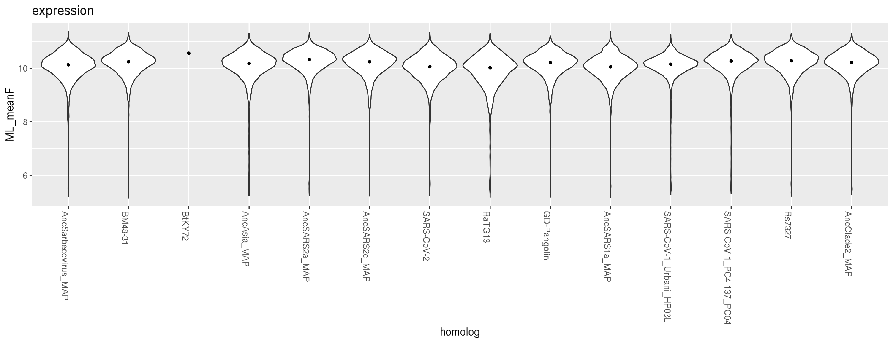
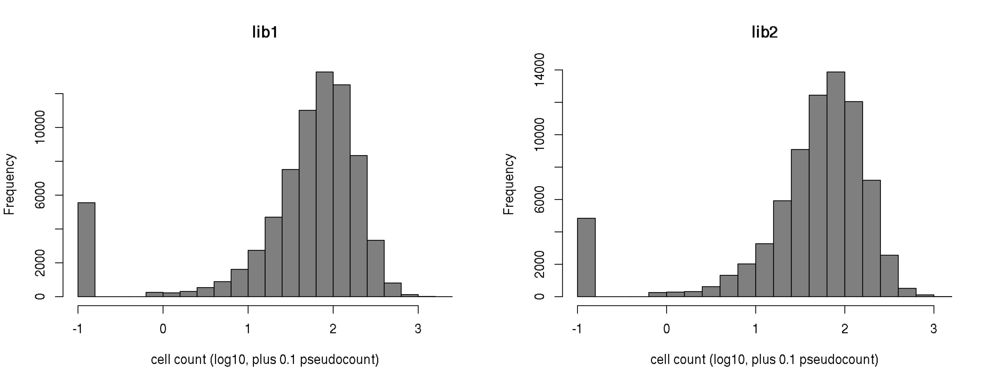

Compute per-barcode RBD expression score
================
Tyler Starr
10/11/2020

-   [Setup](#setup)
-   [Calculating mean fluorescence](#calculating-mean-fluorescence)
-   [Basic plotting and QC](#basic-plotting-and-qc)
-   [Data Output](#data-output)

This notebook reads in per-barcode counts for expression Sort-seq
experiments, computes functional scores for RBD expression levels, and
does some basic QC on variant expression functional scores.

    require("knitr")
    knitr::opts_chunk$set(echo = T)
    knitr::opts_chunk$set(dev.args = list(png = list(type = "cairo")))

    #list of packages to install/load
    packages = c("yaml","data.table","tidyverse","fitdistrplus","gridExtra")
    #install any packages not already installed
    installed_packages <- packages %in% rownames(installed.packages())
    if(any(installed_packages == F)){
      install.packages(packages[!installed_packages])
    }
    #load packages
    invisible(lapply(packages, library, character.only=T))

    #read in config file
    config <- read_yaml("config.yaml")

    #make output directory
    if(!file.exists(config$expression_sortseq_dir)){
      dir.create(file.path(config$expression_sortseq_dir))
    }

Session info for reproducing environment:

    sessionInfo()

    ## R version 3.6.2 (2019-12-12)
    ## Platform: x86_64-pc-linux-gnu (64-bit)
    ## Running under: Ubuntu 18.04.4 LTS
    ## 
    ## Matrix products: default
    ## BLAS/LAPACK: /app/software/OpenBLAS/0.3.7-GCC-8.3.0/lib/libopenblas_haswellp-r0.3.7.so
    ## 
    ## locale:
    ##  [1] LC_CTYPE=en_US.UTF-8       LC_NUMERIC=C              
    ##  [3] LC_TIME=en_US.UTF-8        LC_COLLATE=en_US.UTF-8    
    ##  [5] LC_MONETARY=en_US.UTF-8    LC_MESSAGES=en_US.UTF-8   
    ##  [7] LC_PAPER=en_US.UTF-8       LC_NAME=C                 
    ##  [9] LC_ADDRESS=C               LC_TELEPHONE=C            
    ## [11] LC_MEASUREMENT=en_US.UTF-8 LC_IDENTIFICATION=C       
    ## 
    ## attached base packages:
    ## [1] stats     graphics  grDevices utils     datasets  methods   base     
    ## 
    ## other attached packages:
    ##  [1] gridExtra_2.3       fitdistrplus_1.0-14 npsurv_0.4-0       
    ##  [4] lsei_1.2-0          survival_3.1-8      MASS_7.3-51.4      
    ##  [7] forcats_0.4.0       stringr_1.4.0       dplyr_0.8.3        
    ## [10] purrr_0.3.3         readr_1.3.1         tidyr_1.0.0        
    ## [13] tibble_3.0.2        ggplot2_3.3.0       tidyverse_1.3.0    
    ## [16] data.table_1.12.8   yaml_2.2.0          knitr_1.26         
    ## 
    ## loaded via a namespace (and not attached):
    ##  [1] tidyselect_1.1.0 xfun_0.11        lattice_0.20-38  splines_3.6.2   
    ##  [5] haven_2.2.0      colorspace_1.4-1 vctrs_0.3.1      generics_0.0.2  
    ##  [9] htmltools_0.4.0  rlang_0.4.7      pillar_1.4.5     glue_1.3.1      
    ## [13] withr_2.1.2      DBI_1.1.0        dbplyr_1.4.2     modelr_0.1.5    
    ## [17] readxl_1.3.1     lifecycle_0.2.0  munsell_0.5.0    gtable_0.3.0    
    ## [21] cellranger_1.1.0 rvest_0.3.5      evaluate_0.14    fansi_0.4.0     
    ## [25] broom_0.7.0      Rcpp_1.0.3       scales_1.1.0     backports_1.1.5 
    ## [29] jsonlite_1.6     fs_1.3.1         hms_0.5.2        digest_0.6.23   
    ## [33] stringi_1.4.3    grid_3.6.2       cli_2.0.0        tools_3.6.2     
    ## [37] magrittr_1.5     crayon_1.3.4     pkgconfig_2.0.3  Matrix_1.2-18   
    ## [41] ellipsis_0.3.0   xml2_1.2.2       reprex_0.3.0     lubridate_1.7.4 
    ## [45] assertthat_0.2.1 rmarkdown_2.0    httr_1.4.1       rstudioapi_0.10 
    ## [49] R6_2.4.1         compiler_3.6.2

Setup
-----

First, we will read in info on our sort samples and the table giving
number of reads of each barcode in each of the sort bins.

    #read dataframe with list of barcode runs
    barcode_runs <- read.csv(file=config$barcode_runs,stringsAsFactors=F); barcode_runs <- subset(barcode_runs, select=-c(R1))

    #eliminate rows from barcode_runs that are not from an expression sort-seq experiment
    barcode_runs <- barcode_runs[barcode_runs$sample_type == "SortSeq",]

    #read file giving count of each barcode in each sort partition, keep only the SortSeq counts
    dt <- data.table(read.csv(file=config$merged_sequencing_file,stringsAsFactors = F)); dt <- dt[,.(library,barcode,target,variant_class,wildtype,position,mutant,
                                                                                                     SortSeq_bin1,SortSeq_bin2,SortSeq_bin3,SortSeq_bin4)]

Calculating mean fluorescence
-----------------------------

Next, for each barcode, calculate its mean fluorescence as an indicator
of RBD expression level. We will use a maximum likelihood approach to
determine the mean and standard deviation of fluorescence for a barcode,
given its distribution of cell counts across sort bins, and the known
fluorescence boundaries of those sort bins from the sorting log. The
package `fitdistcens` enables this ML estimation for these type of
*censored* observations, where we know we observed a cell within some
fluorescence interval but do not know the exact fluorescence value
attributed to that observation. The counts are multiplied by 20 so that
there is not a large rounding effect when they are rounded to integers.

    #define function to calculate ML meanF
    calc.MLmean <- function(b1,b2,b3,b4,min.b1,min.b2,min.b3,min.b4,max.b4,min.count=1){ #b1-4 gives observed cell counts in bins 1-4; remaining arguments give fluorescence boundaries of the respective bins; min.count gives minimum number of total observations needed across bins in order to calculate meanF (default 1)
      data <- data.frame(left=c(rep(min.b1,round(b1)),rep(min.b2,round(b2)),rep(min.b3,round(b3)),rep(min.b4,round(b4))),
                         right=c(rep(min.b2,round(b1)),rep(min.b3,round(b2)),rep(min.b4,round(b3)),rep(max.b4,round(b4)))) #define data input in format required for fitdistcens
      if(nrow(unique(data))>1 & nrow(data)>min.count){ #only fits if above user-specified min.count, and if the data satisfies the fitdistcens requirement that cells are observed in at least two of the censored partitions to enable ML estimation of identifiable parameters
        fit <- fitdistcens(data,"norm")
        return(list(as.numeric(summary(fit)$estimate["mean"]),as.numeric(summary(fit)$estimate["sd"])))
      } else {
        return(list(as.numeric(NA),as.numeric(NA)))
      }
    }

    #fit ML mean and sd fluorescence for each barcode, and calculate total cell count as the sum across the four bins. Multiply cell counts by a factor of 20 to minimize rounding errors since fitdistcens requires rounding to integer inputs
    invisible(dt[library=="lib1",c("ML_meanF","ML_sdF") := tryCatch(calc.MLmean(b1=SortSeq_bin1*20,b2=SortSeq_bin2*20,
                                                                          b3=SortSeq_bin3*20,b4=SortSeq_bin4*20,
                                                                          min.b1=log(20),min.b2=log(944.5),min.b3=log(23342.5),
                                                                          min.b4=log(47884.5),max.b4=log(229000)),
                                                              error=function(e){return(list(as.numeric(NA),as.numeric(NA)))}),by=c("library","barcode")])
    invisible(dt[library=="lib2",c("ML_meanF","ML_sdF") := tryCatch(calc.MLmean(b1=SortSeq_bin1*20,b2=SortSeq_bin2*20,
                                                                          b3=SortSeq_bin3*20,b4=SortSeq_bin4*20,
                                                                          min.b1=log(20),min.b2=log(944.5),min.b3=log(23962.5),
                                                                          min.b4=log(47466.5),max.b4=log(229000)),
                                                              error=function(e){return(list(as.numeric(NA),as.numeric(NA)))}),by=c("library","barcode")])
    dt[,total_count := sum(SortSeq_bin1,SortSeq_bin2,SortSeq_bin3,SortSeq_bin4),by=c("library","barcode")]

    #save temp data file for downstream troubleshooting since the ML meanF took >1hr to calculate -- don't use these for final anlaysis though for reproducibility!
    save(dt,file=paste(config$expression_sortseq_dir,"/dt.temp.Rda",sep=""))

Basic plotting and QC
---------------------

Let’s look at the distibution of expression scores for each wildtype
target.

    dt[,target := factor(dt$target,levels=config$targets_ordered)]

    p1 <- ggplot(dt[!is.na(ML_meanF) & variant_class=="wildtype",],aes(x=target,y=ML_meanF))+
      geom_violin(scale="width")+stat_summary(fun=median,geom="point",size=1)+
      ggtitle("expression")+xlab("homolog")+theme(axis.text.x=element_text(angle=-90,hjust=0))

    grid.arrange(p1,ncol=1)

    #save pdf
    invisible(dev.print(pdf, paste(config$expression_sortseq_dir,"/violin-plot_meanF-by-target.pdf",sep="")))

And for mutated versions of the mini-MS targets:

    p1 <- ggplot(dt[!is.na(ML_meanF) & variant_class=="mutant" & target %in% config$mutated_targets,],aes(x=target,y=ML_meanF))+
      geom_violin(scale="width")+stat_summary(fun=median,geom="point",size=1)+
      ggtitle("expression")+xlab("homolog")+theme(axis.text.x=element_text(angle=-90,hjust=0))

    grid.arrange(p1,ncol=1)

    #save pdf
    invisible(dev.print(pdf, paste(config$expression_sortseq_dir,"/violin-plot_meanF-by-target_mutated.pdf",sep="")))

Next let’s look at the distributon of cell counts across the four bins
for each barcode.

    #histograms
    par(mfrow=c(1,2))
    hist(log10(dt[library=="lib1",total_count]+0.1),xlab="cell count (log10, plus 0.1 pseudocount)",main="lib1",col="gray50")
    hist(log10(dt[library=="lib2",total_count]+0.1),xlab="cell count (log10, plus 0.1 pseudocount)",main="lib2",col="gray50")

Filter meanF estimates generated from fewer than 20 cell counts across
the four bins.

    dt[total_count<20,c("ML_meanF","ML_sdF") := list(NA,NA)]

We have generated expression measurements for 80.05% of the barcodes in
our libraries.

Data Output
-----------

Finally, let’s output our measurements for downstream analyses.

    dt[,.(library,barcode,target,variant_class,wildtype,position,mutant,
         total_count,ML_meanF)] %>%
      mutate_if(is.numeric, round, digits=5) %>%
      write.csv(file=config$expression_sortseq_file, row.names=F)
