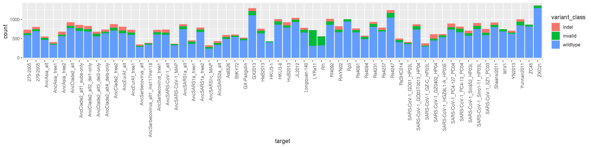
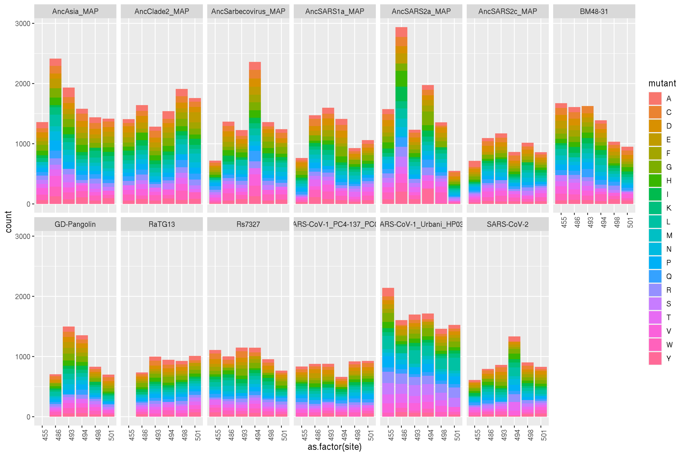
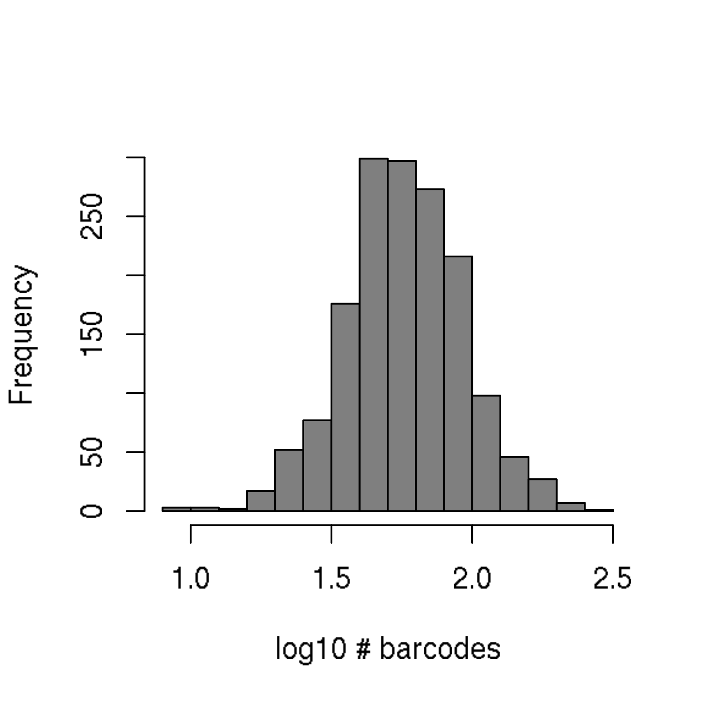

Merge processed PacBio and Illumina sequencing data
================
Tyler Starr
9/29/2020

-   [Setup](#setup)
-   [Data input](#data-input)
-   [Process PacBio sequencing: variant parsing, library
    coverage](#process-pacbio-sequencing-variant-parsing-library-coverage)
-   [Process Illumina barcode
    sequencing:](#process-illumina-barcode-sequencing)
-   [Merge barcode sequencing from FACS
    experiments](#merge-barcode-sequencing-from-facs-experiments)

Setup
-----

This notebook reads in the tables summarizing processed PacBio and
Illumina sequencing reads. It analyzes the mutant patterns among the
mini-mutational scanning backgrounds within these libraries to assess
coverage of the targeted SSM positions, and merges the Illumina barcode
counts from FACS bins with PacBio reads linking barcodes to RBD variants
for downstream computation.

    require("knitr")
    knitr::opts_chunk$set(echo = T)
    knitr::opts_chunk$set(dev.args = list(png = list(type = "cairo")))

    #list of packages to install/load
    packages = c("yaml","data.table","tidyverse","gridExtra","seqinr")
    #install any packages not already installed
    installed_packages <- packages %in% rownames(installed.packages())
    if(any(installed_packages == F)){
      install.packages(packages[!installed_packages])
    }
    #load packages
    invisible(lapply(packages, library, character.only=T))

    #read in config file
    config <- read_yaml("config.yaml")

    #read in file giving concordance between RBD numbering and SARS-CoV-2 Spike numbering
    RBD_sites <- read.csv(file=config$RBD_annotation_file,stringsAsFactors=F)

    #make output directory
    if(!file.exists(config$merged_sequencing_dir)){
     dir.create(file.path(config$merged_sequencing_dir))
    }

Session info for reproducing environment:

    sessionInfo()

    ## R version 3.6.2 (2019-12-12)
    ## Platform: x86_64-pc-linux-gnu (64-bit)
    ## Running under: Ubuntu 18.04.4 LTS
    ## 
    ## Matrix products: default
    ## BLAS/LAPACK: /app/software/OpenBLAS/0.3.7-GCC-8.3.0/lib/libopenblas_haswellp-r0.3.7.so
    ## 
    ## locale:
    ##  [1] LC_CTYPE=en_US.UTF-8       LC_NUMERIC=C              
    ##  [3] LC_TIME=en_US.UTF-8        LC_COLLATE=en_US.UTF-8    
    ##  [5] LC_MONETARY=en_US.UTF-8    LC_MESSAGES=en_US.UTF-8   
    ##  [7] LC_PAPER=en_US.UTF-8       LC_NAME=C                 
    ##  [9] LC_ADDRESS=C               LC_TELEPHONE=C            
    ## [11] LC_MEASUREMENT=en_US.UTF-8 LC_IDENTIFICATION=C       
    ## 
    ## attached base packages:
    ## [1] stats     graphics  grDevices utils     datasets  methods   base     
    ## 
    ## other attached packages:
    ##  [1] seqinr_3.6-1      gridExtra_2.3     forcats_0.4.0     stringr_1.4.0    
    ##  [5] dplyr_0.8.3       purrr_0.3.3       readr_1.3.1       tidyr_1.0.0      
    ##  [9] tibble_3.0.2      ggplot2_3.3.0     tidyverse_1.3.0   data.table_1.12.8
    ## [13] yaml_2.2.0        knitr_1.26       
    ## 
    ## loaded via a namespace (and not attached):
    ##  [1] tidyselect_1.1.0 xfun_0.11        haven_2.2.0      colorspace_1.4-1
    ##  [5] vctrs_0.3.1      generics_0.0.2   htmltools_0.4.0  rlang_0.4.7     
    ##  [9] pillar_1.4.5     glue_1.3.1       withr_2.1.2      DBI_1.1.0       
    ## [13] dbplyr_1.4.2     modelr_0.1.5     readxl_1.3.1     lifecycle_0.2.0 
    ## [17] munsell_0.5.0    gtable_0.3.0     cellranger_1.1.0 rvest_0.3.5     
    ## [21] evaluate_0.14    fansi_0.4.0      broom_0.7.0      Rcpp_1.0.3      
    ## [25] scales_1.1.0     backports_1.1.5  jsonlite_1.6     fs_1.3.1        
    ## [29] hms_0.5.2        digest_0.6.23    stringi_1.4.3    ade4_1.7-13     
    ## [33] grid_3.6.2       cli_2.0.0        tools_3.6.2      magrittr_1.5    
    ## [37] crayon_1.3.4     pkgconfig_2.0.3  MASS_7.3-51.4    ellipsis_0.3.0  
    ## [41] xml2_1.2.2       reprex_0.3.0     lubridate_1.7.4  assertthat_0.2.1
    ## [45] rmarkdown_2.0    httr_1.4.1       rstudioapi_0.10  R6_2.4.1        
    ## [49] compiler_3.6.2

Data input
----------

Read in tables from processed sequencing data. The `dt_pacbio` table
gives the barcode, RBD background, and any nucleotide mutations found
for each variant in each background. The `dt_illumina` table gives
counts of each barcode in each FACS bin.

Process PacBio sequencing: variant parsing, library coverage
------------------------------------------------------------

First, let’s assess how well we got all of the desired site-saturation
mutagenesis positions covered in our variants coming off of the PacBio
sequencing. We need to parse nucleotide mutations to their amino acid
mutations, and flag as invalid double mutants or mutants at unintended
positions/backgrounds. To do this, we create a function that checks
whether a background should be mutated, and if so, indexes the positions
that should be mutated as targeted positiosn differ in index across
backgrounds due to variations in length over evolutionary time. We then
output the variant\_class as wildtype, mutant, invalid (unintended
mutation), indel (also unintended), synonymous, or stop mutant.

Also note – we have two backgrounds currently present for
SARS-CoV-1\_Urbani and SARS-CoV-2. For SARS-CoV-1, we created our own
“in-house” SSM libraries in the 2693 background coding sequence due to
delay in shipment of the product from Genscript. The Genscript product
did arrive in time for PacBio sequencing, so we included it for barcode
attribution in case there were problems with our “in-house” assembly,
but if the “in-house” assembly looks good, we will move forward with
just that background as it is what was included in our first round of
ACE2 titrations. On the SARS-CoV-2 side, the tube from Genscript
corresponding to the SSM library for position S494 had zero volume, and
it does not appear that DNA was deposited in any of the other tubes
inadvertently since I do not see these mutated positions present in this
background. In expectation that this was the case, we performed SSM at
position S494 in our 2649 background SARS-CoV-2 sequence, meaning we
will pool the mutants across these two backgrounds to get our final set
of mini-mutant scanning mutants.

    #load a table giving the indexing of nucleotide numbers for sites targeted in each mutated background
    index <- read.csv(file=config$mutant_indexing_file,stringsAsFactors=F)

    #set empty columns for filling with mutant information
    dt_pacbio[,variant_class:=as.character(NA)];dt_pacbio[,wildtype:=as.character(NA)];dt_pacbio[,position:=as.numeric(NA)];dt_pacbio[,mutant:=as.character(NA)]

    #set a function that returns variant_class, wildtype aa, SARS2 indexed position, and mutant aa for each single nt barcode
    parse_aamut <- function(nt_substitutions,background){
      variant_class_return <- as.character(NA)
      wildtype_return <- as.character(NA)
      position_return <- as.numeric(NA)
      mutant_return <- as.character(NA)
      subs <- strsplit(as.character(nt_substitutions),split=" ")[[1]]
      if(length(subs)==0){ #if wildtype
        variant_class_return <- "wildtype"
      }else{ #if mutations
        if(background %in% config$mutated_targets){ #if background with mutation intended
          positions <- vector(length=length(subs), mode="numeric")
          for(k in 1:length(subs)){
            positions[k] <- as.numeric(paste(strsplit(subs[k],split="")[[1]][2:(length(strsplit(subs[k],split="")[[1]])-1)],collapse=""))
          }
          aa_pos <- unique(ceiling(positions/3))
          if(length(aa_pos)>1){ #if multiple codon mutations
            variant_class_return <- "invalid"
          }
          if(length(aa_pos)==1){ #if single codon mutation, assign site in SARS-CoV-2 numbering, wildtype AA, and mutant AA
            if(aa_pos==index[index$target==background,"index_455"]){ #if mutant at site 455
              variant_class_return <- "mutant"
              wildtype_return <- index[index$target==background,"aa_455"]
              position_return <- 455
              codon <- strsplit(index[index$target==background,"codon_455"],split="")[[1]]
              for(j in 1:length(positions)){ #iterate through positions in codon and mutate nt in codon string if needed
                if(positions[j]==index[index$target==background,"nt_455"]){ #if first position of codon is mutated
                  codon[1] <- strsplit(subs[j],split="")[[1]][length(strsplit(subs[j],split="")[[1]])]
                }
                if(positions[j]==index[index$target==background,"nt_455"]+1){ #if second position of codon is mutated
                  codon[2] <- strsplit(subs[j],split="")[[1]][length(strsplit(subs[j],split="")[[1]])]
                }
                if(positions[j]==index[index$target==background,"nt_455"]+2){ #if third position of codon is mutated
                  codon[3] <- strsplit(subs[j],split="")[[1]][length(strsplit(subs[j],split="")[[1]])]
                }
              }
              mutant_return <- translate(tolower(codon))
            }else if(aa_pos==index[index$target==background,"index_486"]){ #if mutant at site 486
              variant_class_return <- "mutant"
              wildtype_return <- index[index$target==background,"aa_486"]
              position_return <- 486
              codon <- strsplit(index[index$target==background,"codon_486"],split="")[[1]]
              for(j in 1:length(positions)){ #iterate through positions in codon and mutate nt in codon string if needed
                if(positions[j]==index[index$target==background,"nt_486"]){ #if first position of codon is mutated
                  codon[1] <- strsplit(subs[j],split="")[[1]][length(strsplit(subs[j],split="")[[1]])]
                }
                if(positions[j]==index[index$target==background,"nt_486"]+1){ #if second position of codon is mutated
                  codon[2] <- strsplit(subs[j],split="")[[1]][length(strsplit(subs[j],split="")[[1]])]
                }
                if(positions[j]==index[index$target==background,"nt_486"]+2){ #if third position of codon is mutated
                  codon[3] <- strsplit(subs[j],split="")[[1]][length(strsplit(subs[j],split="")[[1]])]
                }
              }
              mutant_return <- translate(tolower(codon))
            }else if(aa_pos==index[index$target==background,"index_493"]){ #if mutant at site 493
              variant_class_return <- "mutant"
              wildtype_return <- index[index$target==background,"aa_493"]
              position_return <- 493
              codon <- strsplit(index[index$target==background,"codon_493"],split="")[[1]]
              for(j in 1:length(positions)){ #iterate through positions in codon and mutate nt in codon string if needed
                if(positions[j]==index[index$target==background,"nt_493"]){ #if first position of codon is mutated
                  codon[1] <- strsplit(subs[j],split="")[[1]][length(strsplit(subs[j],split="")[[1]])]
                }
                if(positions[j]==index[index$target==background,"nt_493"]+1){ #if second position of codon is mutated
                  codon[2] <- strsplit(subs[j],split="")[[1]][length(strsplit(subs[j],split="")[[1]])]
                }
                if(positions[j]==index[index$target==background,"nt_493"]+2){ #if third position of codon is mutated
                  codon[3] <- strsplit(subs[j],split="")[[1]][length(strsplit(subs[j],split="")[[1]])]
                }
              }
              mutant_return <- translate(tolower(codon))
            }else if(aa_pos==index[index$target==background,"index_494"]){ #if mutant at site 494
              variant_class_return <- "mutant"
              wildtype_return <- index[index$target==background,"aa_494"]
              position_return <- 494
              codon <- strsplit(index[index$target==background,"codon_494"],split="")[[1]]
              for(j in 1:length(positions)){ #iterate through positions in codon and mutate nt in codon string if needed
                if(positions[j]==index[index$target==background,"nt_494"]){ #if first position of codon is mutated
                  codon[1] <- strsplit(subs[j],split="")[[1]][length(strsplit(subs[j],split="")[[1]])]
                }
                if(positions[j]==index[index$target==background,"nt_494"]+1){ #if second position of codon is mutated
                  codon[2] <- strsplit(subs[j],split="")[[1]][length(strsplit(subs[j],split="")[[1]])]
                }
                if(positions[j]==index[index$target==background,"nt_494"]+2){ #if third position of codon is mutated
                  codon[3] <- strsplit(subs[j],split="")[[1]][length(strsplit(subs[j],split="")[[1]])]
                }
              }
              mutant_return <- translate(tolower(codon))
            }else if(aa_pos==index[index$target==background,"index_498"]){ #if mutant at site 498
              variant_class_return <- "mutant"
              wildtype_return <- index[index$target==background,"aa_498"]
              position_return <- 498
              codon <- strsplit(index[index$target==background,"codon_498"],split="")[[1]]
              for(j in 1:length(positions)){ #iterate through positions in codon and mutate nt in codon string if needed
                if(positions[j]==index[index$target==background,"nt_498"]){ #if first position of codon is mutated
                  codon[1] <- strsplit(subs[j],split="")[[1]][length(strsplit(subs[j],split="")[[1]])]
                }
                if(positions[j]==index[index$target==background,"nt_498"]+1){ #if second position of codon is mutated
                  codon[2] <- strsplit(subs[j],split="")[[1]][length(strsplit(subs[j],split="")[[1]])]
                }
                if(positions[j]==index[index$target==background,"nt_498"]+2){ #if third position of codon is mutated
                  codon[3] <- strsplit(subs[j],split="")[[1]][length(strsplit(subs[j],split="")[[1]])]
                }
              }
              mutant_return <- translate(tolower(codon))
            }else if(aa_pos==index[index$target==background,"index_501"]){ #if mutant at site 501
              variant_class_return <- "mutant"
              wildtype_return <- index[index$target==background,"aa_501"]
              position_return <- 501
              codon <- strsplit(index[index$target==background,"codon_501"],split="")[[1]]
              for(j in 1:length(positions)){ #iterate through positions in codon and mutate nt in codon string if needed
                if(positions[j]==index[index$target==background,"nt_501"]){ #if first position of codon is mutated
                  codon[1] <- strsplit(subs[j],split="")[[1]][length(strsplit(subs[j],split="")[[1]])]
                }
                if(positions[j]==index[index$target==background,"nt_501"]+1){ #if second position of codon is mutated
                  codon[2] <- strsplit(subs[j],split="")[[1]][length(strsplit(subs[j],split="")[[1]])]
                }
                if(positions[j]==index[index$target==background,"nt_501"]+2){ #if third position of codon is mutated
                  codon[3] <- strsplit(subs[j],split="")[[1]][length(strsplit(subs[j],split="")[[1]])]
                }
              }
              mutant_return <- translate(tolower(codon))
            }else{ #if mutant at other (unintended) position
              variant_class_return <- "invalid"
            }
          }
        }else{ #if background with mutation unintended
          variant_class_return <- "invalid"
        }
      }
      return(list(variant_class_return, wildtype_return, position_return, mutant_return))
    }

    dt_pacbio[,c("variant_class", "wildtype", "position", "mutant") := parse_aamut(nt_substitutions=substitutions,background=target),by=c("library","barcode")]

    dt_pacbio[variant_class=="mutant" & mutant==wildtype,variant_class:="synonymous"]
    dt_pacbio[mutant=="*",variant_class:="stop"]
    dt_pacbio[number_of_indels>0,variant_class:="indel"]

For the mutated backgrounds, let’s look at the fraction of variants in
each class. We can see there is perhaps a slightly higher proportion of
invalid mutants in the GD-Pangolin and RaTG13 backgrounds (which we see
below is attributable to Genscript targeting the wrong mutation with
their SSM!). Can see our SARS-CoV-2\_2649 assembly has virtually only
mutants, consistent with the fact that we introduced mutations only at a
single position here and didn’t really pool in extra wildtype of this
sequence (since we have the Genscript SARS-CoV-2 wildtype).

For backgrounds not targeted with mutations, do any stand out as having
many “invalid” (i.e. mutated) and indel variants? Most of these were
cloned in bulk directly from Twist-synthesized oligos – so it’s
encouraging to see most assemblies are correct.

Let’s look at coverage of mutants at each position across each
background. For assessing coverage of mutants in the different
backgrounds, let’s pool together the SARS-CoV-2 (genscript mutants) and
SARS-CoV-2\_2649 sequence (my in-house mutagenesis to add the missing
mutants at position 494). Let’s also only consider the SARS-CoV-1\_2693
sequences, as these are what are actually pooled in our libraries for
the titration experiments, as SARS-CoV-1\_Urbani SSM library from
Genscript arrived late for experiments, and I only pooled it here for
PacBio sequencing in case my in-house mutagenesis was unsuccessful. (And
it should therefore have zero counts in the Illumina sequencing, anyway,
so fine to purge now for downstream counts management.)

    dt_pacbio[target=="SARS-CoV-2_2649",target:="SARS-CoV-2"]
    dt_pacbio <- dt_pacbio[target!="SARS-CoV-1_Urbani_HP03L"]

    ## Warning: Removed 78 rows containing missing values (position_stack).

Check out if we are missing any mutants at our intended positions. Apart
from the missing 455 mutations in RaTG13 and GD-Pangolin due to
Genscript targeting L452 mistakenly, we are only missing one mutation!
N501K

    kable(aa_coverage[aa_coverage$count==0 & !is.na(aa_coverage$count),])

|      | target         | site | mutant | count |
|------|:---------------|-----:|:-------|------:|
| 8    | GD-Pangolin    |  455 | A      |     0 |
| 9    | RaTG13         |  455 | A      |     0 |
| 86   | GD-Pangolin    |  455 | C      |     0 |
| 87   | RaTG13         |  455 | C      |     0 |
| 164  | GD-Pangolin    |  455 | D      |     0 |
| 165  | RaTG13         |  455 | D      |     0 |
| 242  | GD-Pangolin    |  455 | E      |     0 |
| 243  | RaTG13         |  455 | E      |     0 |
| 320  | GD-Pangolin    |  455 | F      |     0 |
| 321  | RaTG13         |  455 | F      |     0 |
| 398  | GD-Pangolin    |  455 | G      |     0 |
| 399  | RaTG13         |  455 | G      |     0 |
| 476  | GD-Pangolin    |  455 | H      |     0 |
| 477  | RaTG13         |  455 | H      |     0 |
| 554  | GD-Pangolin    |  455 | I      |     0 |
| 555  | RaTG13         |  455 | I      |     0 |
| 632  | GD-Pangolin    |  455 | K      |     0 |
| 633  | RaTG13         |  455 | K      |     0 |
| 693  | AncSARS1a\_MAP |  501 | K      |     0 |
| 788  | GD-Pangolin    |  455 | M      |     0 |
| 789  | RaTG13         |  455 | M      |     0 |
| 866  | GD-Pangolin    |  455 | N      |     0 |
| 867  | RaTG13         |  455 | N      |     0 |
| 944  | GD-Pangolin    |  455 | P      |     0 |
| 1022 | GD-Pangolin    |  455 | Q      |     0 |
| 1023 | RaTG13         |  455 | Q      |     0 |
| 1100 | GD-Pangolin    |  455 | R      |     0 |
| 1101 | RaTG13         |  455 | R      |     0 |
| 1178 | GD-Pangolin    |  455 | S      |     0 |
| 1179 | RaTG13         |  455 | S      |     0 |
| 1256 | GD-Pangolin    |  455 | T      |     0 |
| 1257 | RaTG13         |  455 | T      |     0 |
| 1334 | GD-Pangolin    |  455 | V      |     0 |
| 1335 | RaTG13         |  455 | V      |     0 |
| 1412 | GD-Pangolin    |  455 | W      |     0 |
| 1413 | RaTG13         |  455 | W      |     0 |
| 1490 | GD-Pangolin    |  455 | Y      |     0 |
| 1491 | RaTG13         |  455 | Y      |     0 |

Check out some other coverage statistics: average (median) \# barcodes
for a mutant across the two libraries is 59, minimum is 9. The
distribution of bc number per mutant is shown in the histogram below.

Process Illumina barcode sequencing:
------------------------------------

We downweight sequence counts for each bin by the ratio of total reads
acquired in that bin to the number of cells we estimate were sorted into
this bin. This is done to normalize the meaning of a “count” within each
bin from a sample – for example, if within a particular sample a variant
was sequenced 10 times in bin 3 and 100 in bin 4, but bin 3 has a 1:1
read:cell ratio and bin 4 has a 10:1 read:cell ratio, our estimates of
the binding for that variant would be biased based on the actual
distribution of sorted cells across these bins.

    barcode_runs <- read.csv(file=config$barcode_runs,stringsAsFactors=F); barcode_runs <- subset(barcode_runs, select=-c(R1))

    #for each bin, normalize the read counts to the observed ratio of cell recovery among bins
    for(i in 1:nrow(barcode_runs)){
      lib <- as.character(barcode_runs$library[i])
      bin <- as.character(barcode_runs$sample[i])
      if(sum(dt_illumina[library==lib & sample==bin,"count"]) < barcode_runs$number_cells[i]){ #if there are fewer reads from a sortseq bin than cells sorted
        dt_illumina[library==lib & sample==bin, count.norm := as.numeric(count)] #don't normalize cell counts, make count.norm the same as count
        print(paste("reads < cells for",lib,bin,", un-normalized")) #print to console to inform of undersampled bins
      }else{
        ratio <- sum(dt_illumina[library==lib & sample==bin,"count"])/barcode_runs$number_cells[i]
        dt_illumina[library==lib & sample==bin, count.norm := as.numeric(count/ratio)] #normalize read counts by the average read:cell ratio, report in new "count.norm" column
      }
    }

    ## [1] "reads < cells for lib1 RsACE2_01_bin3 , un-normalized"
    ## [1] "reads < cells for lib1 RsACE2_02_bin1 , un-normalized"
    ## [1] "reads < cells for lib1 RsACE2_03_bin1 , un-normalized"
    ## [1] "reads < cells for lib1 RsACE2_04_bin1 , un-normalized"
    ## [1] "reads < cells for lib1 RsACE2_05_bin1 , un-normalized"
    ## [1] "reads < cells for lib1 RsACE2_06_bin1 , un-normalized"
    ## [1] "reads < cells for lib1 RsACE2_07_bin1 , un-normalized"
    ## [1] "reads < cells for lib1 RsACE2_09_bin1 , un-normalized"
    ## [1] "reads < cells for lib1 RpACE2_02_bin1 , un-normalized"
    ## [1] "reads < cells for lib1 RpACE2_03_bin1 , un-normalized"
    ## [1] "reads < cells for lib1 RpACE2_04_bin1 , un-normalized"
    ## [1] "reads < cells for lib1 RpACE2_06_bin1 , un-normalized"
    ## [1] "reads < cells for lib1 RpACE2_09_bin1 , un-normalized"
    ## [1] "reads < cells for lib1 RaACE2_02_bin1 , un-normalized"
    ## [1] "reads < cells for lib1 RaACE2_05_bin1 , un-normalized"
    ## [1] "reads < cells for lib1 RaACE2_06_bin1 , un-normalized"
    ## [1] "reads < cells for lib1 RaACE2_07_bin1 , un-normalized"
    ## [1] "reads < cells for lib1 RaACE2_09_bin1 , un-normalized"

Merge barcode sequencing from FACS experiments
----------------------------------------------

Next, let’s merge in the Illumina read counts into our variant barcode
tables.

    #merge
    dt <- merge(dt_pacbio[,.(library,barcode,target,variant_class,wildtype,position,mutant)],dt_illumina,by=c("library","barcode"))

    #cast to wide table
    dt <- dcast.data.table(dt, library+barcode+target+variant_class+wildtype+position+mutant ~ sample, value.var="count.norm")

Last, we remove variants that are invalid (unintended mutation or
indel). This removes 6312 indel and 14741 invalidly mutated variants
across the two libraries, leaving 70342 valid variants from lib1 and
74107 from lib2.

    dt <- dt[variant_class %in% c("wildtype","mutant","synonymous","stop"),]

Save table of processed and merged sequencing information.

    write.csv(dt, file=config$merged_sequencing_file, quote=F, row.names=F)
