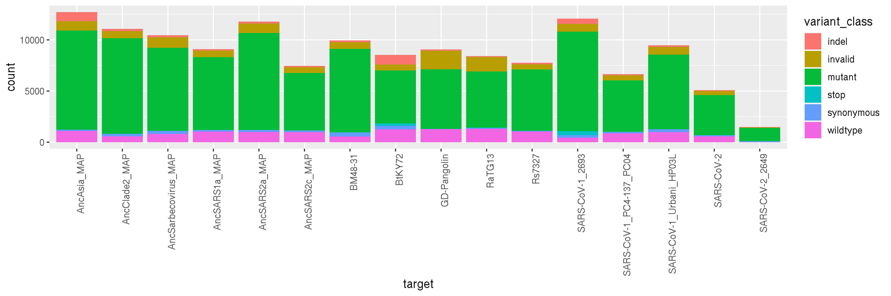
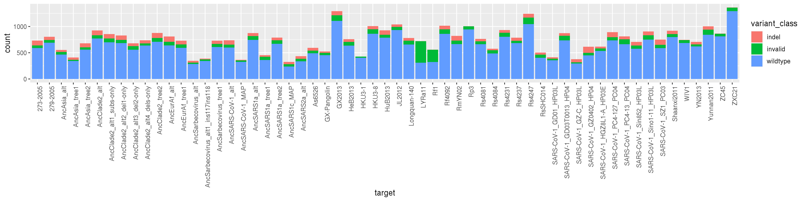
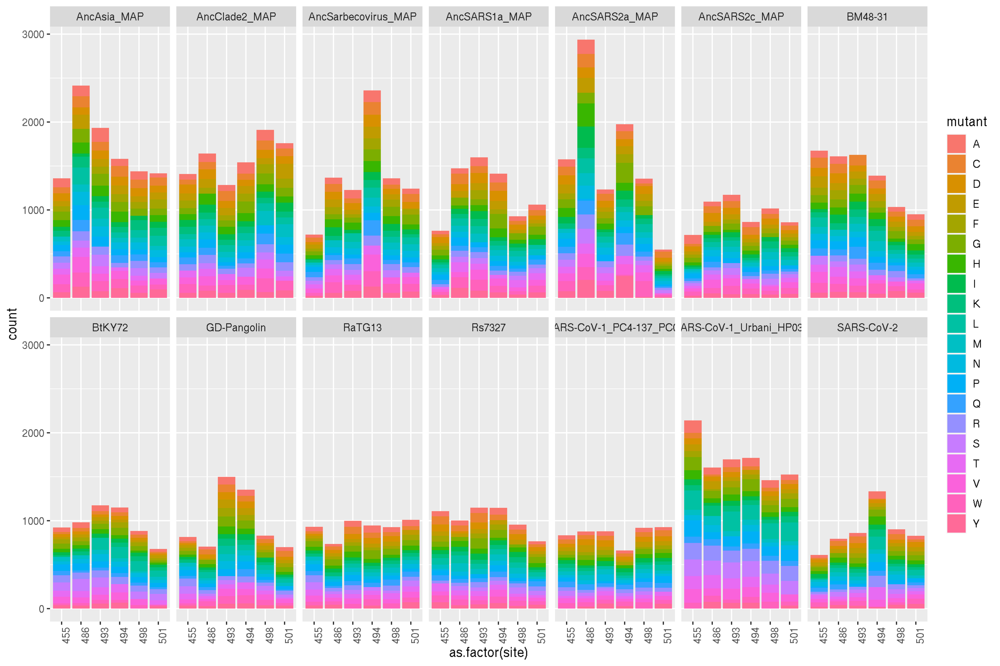

Merge processed PacBio and Illumina sequencing data
================
Tyler Starr
9/29/2020

-   [Setup](#setup)
-   [Data input](#data-input)
-   [Process PacBio sequencing: variant parsing, library
    coverage](#process-pacbio-sequencing-variant-parsing-library-coverage)
-   [Process Illumina barcode
    sequencing:](#process-illumina-barcode-sequencing)
-   [Merge barcode sequencing from FACS
    experiments](#merge-barcode-sequencing-from-facs-experiments)

Setup
-----

This notebook reads in the tables summarizing processed PacBio and
Illumina sequencing reads. It analyzes the mutant patterns among the
mini-mutational scanning backgrounds within these libraries to assess
coverage of the targeted SSM positions, and merges the Illumina barcode
counts from FACS bins with PacBio reads linking barcodes to RBD variants
for downstream computation.

``` r
require("knitr")
knitr::opts_chunk$set(echo = T)
knitr::opts_chunk$set(dev.args = list(png = list(type = "cairo")))

#list of packages to install/load
packages = c("yaml","data.table","tidyverse","gridExtra","seqinr")
#install any packages not already installed
installed_packages <- packages %in% rownames(installed.packages())
if(any(installed_packages == F)){
  install.packages(packages[!installed_packages])
}
#load packages
invisible(lapply(packages, library, character.only=T))

#read in config file
config <- read_yaml("config.yaml")

#read in file giving concordance between RBD numbering and SARS-CoV-2 Spike numbering
RBD_sites <- read.csv(file=config$RBD_annotation_file,stringsAsFactors=F)

#make output directory
if(!file.exists(config$merged_sequencing_dir)){
 dir.create(file.path(config$merged_sequencing_dir))
}
```

Session info for reproducing environment:

``` r
sessionInfo()
```

    ## R version 3.6.2 (2019-12-12)
    ## Platform: x86_64-pc-linux-gnu (64-bit)
    ## Running under: Ubuntu 18.04.4 LTS
    ## 
    ## Matrix products: default
    ## BLAS/LAPACK: /app/software/OpenBLAS/0.3.7-GCC-8.3.0/lib/libopenblas_haswellp-r0.3.7.so
    ## 
    ## locale:
    ##  [1] LC_CTYPE=en_US.UTF-8       LC_NUMERIC=C              
    ##  [3] LC_TIME=en_US.UTF-8        LC_COLLATE=en_US.UTF-8    
    ##  [5] LC_MONETARY=en_US.UTF-8    LC_MESSAGES=en_US.UTF-8   
    ##  [7] LC_PAPER=en_US.UTF-8       LC_NAME=C                 
    ##  [9] LC_ADDRESS=C               LC_TELEPHONE=C            
    ## [11] LC_MEASUREMENT=en_US.UTF-8 LC_IDENTIFICATION=C       
    ## 
    ## attached base packages:
    ## [1] stats     graphics  grDevices utils     datasets  methods   base     
    ## 
    ## other attached packages:
    ##  [1] seqinr_3.6-1      gridExtra_2.3     forcats_0.4.0     stringr_1.4.0    
    ##  [5] dplyr_0.8.3       purrr_0.3.3       readr_1.3.1       tidyr_1.0.0      
    ##  [9] tibble_3.0.2      ggplot2_3.3.0     tidyverse_1.3.0   data.table_1.12.8
    ## [13] yaml_2.2.0        knitr_1.26       
    ## 
    ## loaded via a namespace (and not attached):
    ##  [1] tidyselect_1.1.0 xfun_0.11        haven_2.2.0      colorspace_1.4-1
    ##  [5] vctrs_0.3.1      generics_0.0.2   htmltools_0.4.0  rlang_0.4.7     
    ##  [9] pillar_1.4.5     glue_1.3.1       withr_2.1.2      DBI_1.1.0       
    ## [13] dbplyr_1.4.2     modelr_0.1.5     readxl_1.3.1     lifecycle_0.2.0 
    ## [17] munsell_0.5.0    gtable_0.3.0     cellranger_1.1.0 rvest_0.3.5     
    ## [21] evaluate_0.14    fansi_0.4.0      broom_0.7.0      Rcpp_1.0.3      
    ## [25] scales_1.1.0     backports_1.1.5  jsonlite_1.6     fs_1.3.1        
    ## [29] hms_0.5.2        digest_0.6.23    stringi_1.4.3    ade4_1.7-13     
    ## [33] grid_3.6.2       cli_2.0.0        tools_3.6.2      magrittr_1.5    
    ## [37] crayon_1.3.4     pkgconfig_2.0.3  MASS_7.3-51.4    ellipsis_0.3.0  
    ## [41] xml2_1.2.2       reprex_0.3.0     lubridate_1.7.4  assertthat_0.2.1
    ## [45] rmarkdown_2.0    httr_1.4.1       rstudioapi_0.10  R6_2.4.1        
    ## [49] compiler_3.6.2

Data input
----------

Read in tables from processed sequencing data. The `dt_pacbio` table
gives the barcode, RBD background, and any nucleotide mutations found
for each variant in each background. The `dt_illumina` table gives
counts of each barcode in each FACS bin.

Process PacBio sequencing: variant parsing, library coverage
------------------------------------------------------------

First, let’s assess how well we got all of the desired site-saturation
mutagenesis positions covered in our variants coming off of the PacBio
sequencing. We need to parse nucleotide mutations to their amino acid
mutations, and flag as invalid double mutants or mutants at unintended
positions/backgrounds. To do this, we create a function that checks
whether a background should be mutated, and if so, indexes the positions
that should be mutated as targeted positiosn differ in index across
backgrounds due to variations in length over evolutionary time. We then
output the variant\_class as wildtype, mutant, invalid (unintended
mutation), indel (also unintended), synonymous, or stop mutant.

``` r
#load a table giving the indexing of nucleotide numbers for sites targeted in each mutated background
index <- read.csv(file=config$mutant_indexing_file,stringsAsFactors=F)

#set empty columns for filling with mutant information
dt_pacbio[,variant_class:=as.character(NA)];dt_pacbio[,wildtype:=as.character(NA)];dt_pacbio[,position:=as.numeric(NA)];dt_pacbio[,mutant:=as.character(NA)]

#set a function that returns variant_class, wildtype aa, SARS2 indexed position, and mutant aa for each single nt barcode
parse_aamut <- function(nt_substitutions,background){
  variant_class_return <- as.character(NA)
  wildtype_return <- as.character(NA)
  position_return <- as.numeric(NA)
  mutant_return <- as.character(NA)
  subs <- strsplit(as.character(nt_substitutions),split=" ")[[1]]
  if(length(subs)==0){ #if wildtype
    variant_class_return <- "wildtype"
  }else{ #if mutations
    if(background %in% config$mutated_targets){ #if background with mutation intended
      positions <- vector(length=length(subs), mode="numeric")
      for(k in 1:length(subs)){
        positions[k] <- as.numeric(paste(strsplit(subs[k],split="")[[1]][2:(length(strsplit(subs[k],split="")[[1]])-1)],collapse=""))
      }
      aa_pos <- unique(ceiling(positions/3))
      if(length(aa_pos)>1){ #if multiple codon mutations
        variant_class_return <- "invalid"
      }
      if(length(aa_pos)==1){ #if single codon mutation, assign site in SARS-CoV-2 numbering, wildtype AA, and mutant AA
        if(aa_pos==index[index$target==background,"index_455"]){ #if mutant at site 455
          variant_class_return <- "mutant"
          wildtype_return <- index[index$target==background,"aa_455"]
          position_return <- 455
          codon <- strsplit(index[index$target==background,"codon_455"],split="")[[1]]
          for(j in 1:length(positions)){ #iterate through positions in codon and mutate nt in codon string if needed
            if(positions[j]==index[index$target==background,"nt_455"]){ #if first position of codon is mutated
              codon[1] <- strsplit(subs[j],split="")[[1]][length(strsplit(subs[j],split="")[[1]])]
            }
            if(positions[j]==index[index$target==background,"nt_455"]+1){ #if second position of codon is mutated
              codon[2] <- strsplit(subs[j],split="")[[1]][length(strsplit(subs[j],split="")[[1]])]
            }
            if(positions[j]==index[index$target==background,"nt_455"]+2){ #if third position of codon is mutated
              codon[3] <- strsplit(subs[j],split="")[[1]][length(strsplit(subs[j],split="")[[1]])]
            }
          }
          mutant_return <- translate(tolower(codon))
        }else if(aa_pos==index[index$target==background,"index_486"]){ #if mutant at site 486
          variant_class_return <- "mutant"
          wildtype_return <- index[index$target==background,"aa_486"]
          position_return <- 486
          codon <- strsplit(index[index$target==background,"codon_486"],split="")[[1]]
          for(j in 1:length(positions)){ #iterate through positions in codon and mutate nt in codon string if needed
            if(positions[j]==index[index$target==background,"nt_486"]){ #if first position of codon is mutated
              codon[1] <- strsplit(subs[j],split="")[[1]][length(strsplit(subs[j],split="")[[1]])]
            }
            if(positions[j]==index[index$target==background,"nt_486"]+1){ #if second position of codon is mutated
              codon[2] <- strsplit(subs[j],split="")[[1]][length(strsplit(subs[j],split="")[[1]])]
            }
            if(positions[j]==index[index$target==background,"nt_486"]+2){ #if third position of codon is mutated
              codon[3] <- strsplit(subs[j],split="")[[1]][length(strsplit(subs[j],split="")[[1]])]
            }
          }
          mutant_return <- translate(tolower(codon))
        }else if(aa_pos==index[index$target==background,"index_493"]){ #if mutant at site 493
          variant_class_return <- "mutant"
          wildtype_return <- index[index$target==background,"aa_493"]
          position_return <- 493
          codon <- strsplit(index[index$target==background,"codon_493"],split="")[[1]]
          for(j in 1:length(positions)){ #iterate through positions in codon and mutate nt in codon string if needed
            if(positions[j]==index[index$target==background,"nt_493"]){ #if first position of codon is mutated
              codon[1] <- strsplit(subs[j],split="")[[1]][length(strsplit(subs[j],split="")[[1]])]
            }
            if(positions[j]==index[index$target==background,"nt_493"]+1){ #if second position of codon is mutated
              codon[2] <- strsplit(subs[j],split="")[[1]][length(strsplit(subs[j],split="")[[1]])]
            }
            if(positions[j]==index[index$target==background,"nt_493"]+2){ #if third position of codon is mutated
              codon[3] <- strsplit(subs[j],split="")[[1]][length(strsplit(subs[j],split="")[[1]])]
            }
          }
          mutant_return <- translate(tolower(codon))
        }else if(aa_pos==index[index$target==background,"index_494"]){ #if mutant at site 494
          variant_class_return <- "mutant"
          wildtype_return <- index[index$target==background,"aa_494"]
          position_return <- 494
          codon <- strsplit(index[index$target==background,"codon_494"],split="")[[1]]
          for(j in 1:length(positions)){ #iterate through positions in codon and mutate nt in codon string if needed
            if(positions[j]==index[index$target==background,"nt_494"]){ #if first position of codon is mutated
              codon[1] <- strsplit(subs[j],split="")[[1]][length(strsplit(subs[j],split="")[[1]])]
            }
            if(positions[j]==index[index$target==background,"nt_494"]+1){ #if second position of codon is mutated
              codon[2] <- strsplit(subs[j],split="")[[1]][length(strsplit(subs[j],split="")[[1]])]
            }
            if(positions[j]==index[index$target==background,"nt_494"]+2){ #if third position of codon is mutated
              codon[3] <- strsplit(subs[j],split="")[[1]][length(strsplit(subs[j],split="")[[1]])]
            }
          }
          mutant_return <- translate(tolower(codon))
        }else if(aa_pos==index[index$target==background,"index_498"]){ #if mutant at site 498
          variant_class_return <- "mutant"
          wildtype_return <- index[index$target==background,"aa_498"]
          position_return <- 498
          codon <- strsplit(index[index$target==background,"codon_498"],split="")[[1]]
          for(j in 1:length(positions)){ #iterate through positions in codon and mutate nt in codon string if needed
            if(positions[j]==index[index$target==background,"nt_498"]){ #if first position of codon is mutated
              codon[1] <- strsplit(subs[j],split="")[[1]][length(strsplit(subs[j],split="")[[1]])]
            }
            if(positions[j]==index[index$target==background,"nt_498"]+1){ #if second position of codon is mutated
              codon[2] <- strsplit(subs[j],split="")[[1]][length(strsplit(subs[j],split="")[[1]])]
            }
            if(positions[j]==index[index$target==background,"nt_498"]+2){ #if third position of codon is mutated
              codon[3] <- strsplit(subs[j],split="")[[1]][length(strsplit(subs[j],split="")[[1]])]
            }
          }
          mutant_return <- translate(tolower(codon))
        }else if(aa_pos==index[index$target==background,"index_501"]){ #if mutant at site 501
          variant_class_return <- "mutant"
          wildtype_return <- index[index$target==background,"aa_501"]
          position_return <- 501
          codon <- strsplit(index[index$target==background,"codon_501"],split="")[[1]]
          for(j in 1:length(positions)){ #iterate through positions in codon and mutate nt in codon string if needed
            if(positions[j]==index[index$target==background,"nt_501"]){ #if first position of codon is mutated
              codon[1] <- strsplit(subs[j],split="")[[1]][length(strsplit(subs[j],split="")[[1]])]
            }
            if(positions[j]==index[index$target==background,"nt_501"]+1){ #if second position of codon is mutated
              codon[2] <- strsplit(subs[j],split="")[[1]][length(strsplit(subs[j],split="")[[1]])]
            }
            if(positions[j]==index[index$target==background,"nt_501"]+2){ #if third position of codon is mutated
              codon[3] <- strsplit(subs[j],split="")[[1]][length(strsplit(subs[j],split="")[[1]])]
            }
          }
          mutant_return <- translate(tolower(codon))
        }else{ #if mutant at other (unintended) position
          variant_class_return <- "invalid"
        }
      }
    }else{ #if background with mutation unintended
      variant_class_return <- "invalid"
    }
  }
  return(list(variant_class_return, wildtype_return, position_return, mutant_return))
}

dt_pacbio[,c("variant_class", "wildtype", "position", "mutant") := parse_aamut(nt_substitutions=substitutions,background=target),by=c("library","barcode")]

dt_pacbio[variant_class=="mutant" & mutant==wildtype,variant_class:="synonymous"]
dt_pacbio[mutant=="*",variant_class:="stop"]
dt_pacbio[number_of_indels>0,variant_class:="indel"]
```

For the mutated backgrounds, let’s look at the fraction of variants in
each class. In this PacBio sequencing, we have two backgrounds currently
present for SARS-CoV-1\_Urbani and SARS-CoV-2. For SARS-CoV-1, we
created our own “in-house” SSM libraries in the 2693 background coding
sequence due to delay in shipment of the product from Genscript. The
Genscript product did arrive in time for PacBio sequencing, so we
included it for barcode attribution in case there were problems with our
“in-house” assembly, but because the “in-house” assembly looks good, we
will move forward just that background (\_2693, but we will rename it to
the full \_Urbani\_HP03L name further below). On the SARS-CoV-2 side,
the tube from Genscript corresponding to the SSM library for position
S494 had zero volume, and it does not appear that DNA was deposited in
any of the other tubes inadvertently since I do not see these mutated
positions present in this background. In expectation that this was the
case, we performed SSM at position S494 in our 2649 background
SARS-CoV-2 sequence, so further below we will pool the mutants across
these two backgrounds to get our final set of mini-mutant scanning
mutants for this background.

We can see there is perhaps a slightly higher proportion of invalid
mutants in the GD-Pangolin and RaTG13 backgrounds (which we see below is
attributable to Genscript targeting the wrong mutation with their SSM!).
Can see our SARS-CoV-2\_2649 assembly has virtually only mutants,
consistent with the fact that we introduced mutations only at a single
position here and didn’t really pool in extra wildtype of this sequence
(since we have the Genscript SARS-CoV-2 wildtype).



For backgrounds not targeted with mutations, do any stand out as having
many “invalid” (i.e. mutated) and indel variants? Most of these were
cloned in bulk directly from Twist-synthesized oligos – so it’s
encouraging to see most assemblies are correct.



Let’s collapse the SARS-CoV-1\_Urbani and SARS-CoV-2 information, as
described above. For SARS-CoV-1\_Urbani, we will remove the
“SARS-CoV-1\_Urbani\_HP03L” mutant variants – these were pooled into the
PacBio but were not part of the titrations. (The wildtype of this
background is, though, as it was pooled separately from the delayed
mutants shipment.) For SARS-CoV-2, we can simply pool the \_2649 mutants
into the remaining SARS-CoV-2 mutants from Genscript.

``` r
dt_pacbio[target=="SARS-CoV-2_2649",target:="SARS-CoV-2"]
dt_pacbio <- dt_pacbio[target!="SARS-CoV-1_Urbani_HP03L" | variant_class=="wildtype"]
dt_pacbio[target=="SARS-CoV-1_2693",target:="SARS-CoV-1_Urbani_HP03L"]
```

Let’s look at coverage of mutants at each position across each
background.

    ## Warning: Removed 84 rows containing missing values (position_stack).



Check out if we are missing any mutants at our intended positions. Apart
from the missing 455 mutations in RaTG13 and GD-Pangolin due to
Genscript targeting L452 mistakenly, we are only missing one mutation!
N501K in AncSARS1a.

``` r
kable(aa_coverage[aa_coverage$count==0 & !is.na(aa_coverage$count),])
```

|     | target         | site | mutant | count |
|-----|:---------------|-----:|:-------|------:|
| 746 | AncSARS1a\_MAP |  501 | K      |     0 |

Check out some other coverage statistics: average (median) \# barcodes
for a mutant across the two libraries is 58, minimum is 9. The
distribution of bc number per mutant is shown in the histogram below.


Process Illumina barcode sequencing:
------------------------------------

We downweight sequence counts for each bin by the ratio of total reads
acquired in that bin to the number of cells we estimate were sorted into
this bin. This is done to normalize the meaning of a “count” within each
bin from a sample – for example, if within a particular sample a variant
was sequenced 10 times in bin 3 and 100 in bin 4, but bin 3 has a 1:1
read:cell ratio and bin 4 has a 10:1 read:cell ratio, our estimates of
the binding for that variant would be biased based on the actual
distribution of sorted cells across these bins.

``` r
barcode_runs <- read.csv(file=config$barcode_runs,stringsAsFactors=F); barcode_runs <- subset(barcode_runs, select=-c(R1))

#for each bin, normalize the read counts to the observed ratio of cell recovery among bins
for(i in 1:nrow(barcode_runs)){
  lib <- as.character(barcode_runs$library[i])
  bin <- as.character(barcode_runs$sample[i])
  if(sum(dt_illumina[library==lib & sample==bin,"count"]) < barcode_runs$number_cells[i]){ #if there are fewer reads from a sortseq bin than cells sorted
    dt_illumina[library==lib & sample==bin, count.norm := as.numeric(count)] #don't normalize cell counts, make count.norm the same as count
    print(paste("reads < cells for",lib,bin,", un-normalized")) #print to console to inform of undersampled bins
  }else{
    ratio <- sum(dt_illumina[library==lib & sample==bin,"count"])/barcode_runs$number_cells[i]
    dt_illumina[library==lib & sample==bin, count.norm := as.numeric(count/ratio)] #normalize read counts by the average read:cell ratio, report in new "count.norm" column
  }
}
```

    ## [1] "reads < cells for lib1 RsACE2old_01_bin3 , un-normalized"
    ## [1] "reads < cells for lib1 RsACE2old_02_bin1 , un-normalized"
    ## [1] "reads < cells for lib1 RsACE2old_03_bin1 , un-normalized"
    ## [1] "reads < cells for lib1 RsACE2old_04_bin1 , un-normalized"
    ## [1] "reads < cells for lib1 RsACE2old_05_bin1 , un-normalized"
    ## [1] "reads < cells for lib1 RsACE2old_06_bin1 , un-normalized"
    ## [1] "reads < cells for lib1 RsACE2old_07_bin1 , un-normalized"
    ## [1] "reads < cells for lib1 RsACE2old_09_bin1 , un-normalized"
    ## [1] "reads < cells for lib1 RpACE2_02_bin1 , un-normalized"
    ## [1] "reads < cells for lib1 RpACE2_03_bin1 , un-normalized"
    ## [1] "reads < cells for lib1 RpACE2_04_bin1 , un-normalized"
    ## [1] "reads < cells for lib1 RpACE2_06_bin1 , un-normalized"
    ## [1] "reads < cells for lib1 RpACE2_09_bin1 , un-normalized"
    ## [1] "reads < cells for lib1 RaACE2_02_bin1 , un-normalized"
    ## [1] "reads < cells for lib1 RaACE2_05_bin1 , un-normalized"
    ## [1] "reads < cells for lib1 RaACE2_06_bin1 , un-normalized"
    ## [1] "reads < cells for lib1 RaACE2_07_bin1 , un-normalized"
    ## [1] "reads < cells for lib1 RaACE2_09_bin1 , un-normalized"
    ## [1] "reads < cells for lib2 RaACE2_05_bin1 , un-normalized"
    ## [1] "reads < cells for lib1 RsACE2_01_bin1 , un-normalized"
    ## [1] "reads < cells for lib1 RsACE2_01_bin2 , un-normalized"
    ## [1] "reads < cells for lib1 RsACE2_02_bin1 , un-normalized"
    ## [1] "reads < cells for lib1 RsACE2_02_bin2 , un-normalized"
    ## [1] "reads < cells for lib1 RsACE2_03_bin1 , un-normalized"
    ## [1] "reads < cells for lib1 RsACE2_04_bin1 , un-normalized"
    ## [1] "reads < cells for lib1 RsACE2_05_bin4 , un-normalized"
    ## [1] "reads < cells for lib1 RsACE2_06_bin1 , un-normalized"
    ## [1] "reads < cells for lib1 RsACE2_06_bin3 , un-normalized"
    ## [1] "reads < cells for lib1 RaACE2pool6_01_bin4 , un-normalized"
    ## [1] "reads < cells for lib1 RaACE2pool6_02_bin1 , un-normalized"
    ## [1] "reads < cells for lib1 RaACE2pool6_02_bin2 , un-normalized"
    ## [1] "reads < cells for lib1 RaACE2pool6_02_bin4 , un-normalized"
    ## [1] "reads < cells for lib1 RaACE2pool6_03_bin1 , un-normalized"
    ## [1] "reads < cells for lib1 RaACE2pool6_03_bin2 , un-normalized"
    ## [1] "reads < cells for lib1 RaACE2pool6_03_bin3 , un-normalized"
    ## [1] "reads < cells for lib1 RaACE2pool6_03_bin4 , un-normalized"
    ## [1] "reads < cells for lib1 RaACE2pool6_04_bin1 , un-normalized"
    ## [1] "reads < cells for lib1 RaACE2pool6_04_bin2 , un-normalized"
    ## [1] "reads < cells for lib1 RaACE2pool6_04_bin3 , un-normalized"
    ## [1] "reads < cells for lib1 RaACE2pool6_04_bin4 , un-normalized"
    ## [1] "reads < cells for lib1 RaACE2pool6_05_bin1 , un-normalized"
    ## [1] "reads < cells for lib1 RaACE2pool6_05_bin2 , un-normalized"
    ## [1] "reads < cells for lib1 RaACE2pool6_06_bin1 , un-normalized"
    ## [1] "reads < cells for lib1 RaACE2pool6_06_bin2 , un-normalized"
    ## [1] "reads < cells for lib1 RaACE2pool6_07_bin1 , un-normalized"
    ## [1] "reads < cells for lib1 RaACE2pool6_07_bin2 , un-normalized"
    ## [1] "reads < cells for lib1 RaACE2pool6_08_bin1 , un-normalized"
    ## [1] "reads < cells for lib1 RaACE2pool6_08_bin2 , un-normalized"
    ## [1] "reads < cells for lib1 RaACE2pool6_09_bin1 , un-normalized"
    ## [1] "reads < cells for lib1 RaACE2pool6_09_bin2 , un-normalized"
    ## [1] "reads < cells for lib1 huACE2pool6_01_bin1 , un-normalized"
    ## [1] "reads < cells for lib1 huACE2pool6_02_bin1 , un-normalized"
    ## [1] "reads < cells for lib1 huACE2pool6_02_bin2 , un-normalized"
    ## [1] "reads < cells for lib1 huACE2pool6_02_bin3 , un-normalized"
    ## [1] "reads < cells for lib1 huACE2pool6_02_bin4 , un-normalized"
    ## [1] "reads < cells for lib1 huACE2pool6_03_bin1 , un-normalized"
    ## [1] "reads < cells for lib1 huACE2pool6_03_bin2 , un-normalized"
    ## [1] "reads < cells for lib1 huACE2pool6_03_bin3 , un-normalized"
    ## [1] "reads < cells for lib1 huACE2pool6_04_bin2 , un-normalized"
    ## [1] "reads < cells for lib1 huACE2pool6_04_bin3 , un-normalized"
    ## [1] "reads < cells for lib1 huACE2pool6_05_bin2 , un-normalized"
    ## [1] "reads < cells for lib1 huACE2pool6_05_bin3 , un-normalized"
    ## [1] "reads < cells for lib1 huACE2pool6_05_bin4 , un-normalized"
    ## [1] "reads < cells for lib1 huACE2pool6_06_bin4 , un-normalized"
    ## [1] "reads < cells for lib1 huACE2pool6_07_bin4 , un-normalized"
    ## [1] "reads < cells for lib1 huACE2pool6_09_bin4 , un-normalized"
    ## [1] "reads < cells for lib2 cvACE2_06_bin1 , un-normalized"

Merge barcode sequencing from FACS experiments
----------------------------------------------

Next, let’s merge in the Illumina read counts into our variant barcode
tables.

``` r
#merge
dt <- merge(dt_pacbio[,.(library,barcode,target,variant_class,wildtype,position,mutant)],dt_illumina,by=c("library","barcode"))

#cast to wide table
dt <- dcast.data.table(dt, library+barcode+target+variant_class+wildtype+position+mutant ~ sample, value.var="count.norm")
```

We remove variants that are invalid (unintended mutation or indel). This
removes 7265 indel and 15375 invalidly mutated variants across the two
libraries, leaving 75421 valid variants from lib1 and 78475 from lib2.

``` r
dt <- dt[variant_class %in% c("wildtype","mutant"),]
```

Save table of processed and merged sequencing information.

``` r
write.csv(dt, file=config$merged_sequencing_file, quote=F, row.names=F)
```
