<h1>Table of Contents<span class="tocSkip"></span></h1>
<div class="toc"><ul class="toc-item"><li><span><a href="#Process-CCSs" data-toc-modified-id="Process-CCSs-1">Process CCSs</a></span><ul class="toc-item"><li><span><a href="#Setup" data-toc-modified-id="Setup-1.1">Setup</a></span></li><li><span><a href="#PacBio-amplicons" data-toc-modified-id="PacBio-amplicons-1.2">PacBio amplicons</a></span></li><li><span><a href="#CCS-stats-for-PacBio-runs" data-toc-modified-id="CCS-stats-for-PacBio-runs-1.3">CCS stats for PacBio runs</a></span></li><li><span><a href="#Align-CCSs-to-amplicons" data-toc-modified-id="Align-CCSs-to-amplicons-1.4">Align CCSs to amplicons</a></span></li><li><span><a href="#Write-valid-CCSs" data-toc-modified-id="Write-valid-CCSs-1.5">Write valid CCSs</a></span></li></ul></li></ul></div>

# Process CCSs
This Python Jupyter notebook processes the PacBio circular consensus sequences (CCSs) to extract barcodes and call mutations in the gene.

## Setup

Import Python modules

Plotting is done with [plotnine](https://plotnine.readthedocs.io/en/stable/), which uses ggplot2-like syntax.

The analysis uses the Bloom lab's [alignparse](https://jbloomlab.github.io/alignparse) and [dms_variants](https://jbloomlab.github.io/dms_variants) packages.


```python
import collections
import math
import os
import re
import time
import warnings

import alignparse
import alignparse.ccs
from alignparse.constants import CBPALETTE
import alignparse.minimap2
import alignparse.targets
import alignparse.consensus

import dms_variants
import dms_variants.plotnine_themes
import dms_variants.utils

from IPython.display import display, HTML

import numpy

import pandas as pd

from plotnine import *

import yaml

```

Set [plotnine](https://plotnine.readthedocs.io/en/stable/) theme to the one defined in [dms_variants](https://jbloomlab.github.io/dms_variants):


```python
theme_set(dms_variants.plotnine_themes.theme_graygrid())
```

Versions of key software:


```python
print(f"Using alignparse version {alignparse.__version__}")
print(f"Using dms_variants version {dms_variants.__version__}")
```

    Using alignparse version 0.1.3
    Using dms_variants version 0.8.4


Ignore warnings that clutter output:


```python
warnings.simplefilter('ignore')
```

Read the configuration file:


```python
with open('config.yaml') as f:
    config = yaml.safe_load(f)
```

Make output directory for figures:


```python
os.makedirs(config['figs_dir'], exist_ok=True)
os.makedirs(config['process_ccs_dir'], exist_ok=True)
os.makedirs(config['variants_dir'], exist_ok=True)
```

## PacBio amplicons
Get the amplicons sequenced by PacBio as the alignment target along with the specs on how to parse the features:


```python
print(f"Reading amplicons from {config['amplicons']}")
print(f"Reading feature parse specs from {config['feature_parse_specs']}")

targets = alignparse.targets.Targets(
                seqsfile=config['amplicons'],
                feature_parse_specs=config['feature_parse_specs'])
```

    Reading amplicons from data/PacBio_amplicons.gb
    Reading feature parse specs from data/feature_parse_specs.yaml


Draw the target amplicons:


```python
fig = targets.plot(ax_width=7,
                   plots_indexing='biopython',  # numbering starts at 0
                   ax_height=2,  # height of each plot
                   hspace=1.2,  # vertical space between plots
                   )

plotfile = os.path.join(config['figs_dir'], 'amplicons.pdf')
print(f"Saving plot to {plotfile}")
fig.savefig(plotfile, bbox_inches='tight')
```

    Saving plot to results/figures/amplicons.pdf


    
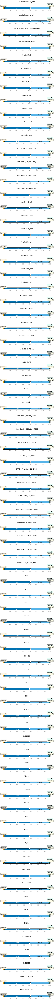
    


Write out the specs used to parse the features (these are the same specs provided as `feature_parse_specs` when initializing `targets`, but with defaults filled in):


```python
print(targets.feature_parse_specs('yaml'))
```

    SARS-CoV-2: &id001
      query_clip5: 4
      query_clip3: 4
      termini5:
        filter:
          clip5: 4
          mutation_nt_count: 1
          mutation_op_count: null
          clip3: 0
        return: []
      gene:
        filter:
          mutation_nt_count: 18
          mutation_op_count: null
          clip5: 0
          clip3: 0
        return:
        - mutations
        - accuracy
      spacer:
        filter:
          mutation_nt_count: 1
          mutation_op_count: null
          clip5: 0
          clip3: 0
        return: []
      barcode:
        filter:
          mutation_nt_count: 0
          mutation_op_count: null
          clip5: 0
          clip3: 0
        return:
        - sequence
        - accuracy
      termini3:
        filter:
          clip3: 4
          mutation_nt_count: 1
          mutation_op_count: null
          clip5: 0
        return: []
    AncSarbecovirus_MAP: *id001
    AncSarbecovirus_alt: *id001
    AncSarbecovirus_alt1_ins117ins118: *id001
    AncSarbecovirus_tree1: *id001
    AncEurAf_alt: *id001
    AncEurAf_tree1: *id001
    AncAsia_MAP: *id001
    AncAsia_alt: *id001
    AncAsia_tree1: *id001
    AncAsia_tree2: *id001
    AncClade2_MAP: *id001
    AncClade2_alt1_subs-only: *id001
    AncClade2_alt2_del1-only: *id001
    AncClade2_alt3_del2-only: *id001
    AncClade2_alt4_dels-only: *id001
    AncClade2_alt: *id001
    AncClade2_tree2: *id001
    AncSARS2a_MAP: *id001
    AncSARS2a_alt: *id001
    AncSARS2c_MAP: *id001
    AncSARS1a_MAP: *id001
    AncSARS1a_alt: *id001
    AncSARS1a_tree1: *id001
    AncSARS1a_tree2: *id001
    AncSARS1c_MAP: *id001
    AncSARS-CoV-1_MAP: *id001
    AncSARS-CoV-1_alt: *id001
    GD-Pangolin: *id001
    RaTG13: *id001
    GX-Pangolin: *id001
    SARS-CoV-1_Urbani_HP03L: *id001
    SARS-CoV-1_HGZ8L1-A_HP03E: *id001
    SARS-CoV-1_GD01_HP03L: *id001
    SARS-CoV-1_GZ-C_HP03L: *id001
    SARS-CoV-1_Sino1-11_HP03L: *id001
    SARS-CoV-1_Sin852_HP03L: *id001
    SARS-CoV-1_SZ1_PC03: *id001
    SARS-CoV-1_GD03T0013_HP04: *id001
    SARS-CoV-1_GZ0402_HP04: *id001
    SARS-CoV-1_PC4-127_PC04: *id001
    SARS-CoV-1_PC4-137_PC04: *id001
    SARS-CoV-1_PC4-13_PC04: *id001
    WIV1: *id001
    Rs7327: *id001
    LYRa11: *id001
    Rs4231: *id001
    RsSHC014: *id001
    Rs4084: *id001
    BM48-31: *id001
    BtKY72: *id001
    ZXC21: *id001
    ZC45: *id001
    JL2012: *id001
    Rf1: *id001
    HeB2013: *id001
    273-2005: *id001
    Rf4092: *id001
    YN2013: *id001
    RmYN02: *id001
    As6526: *id001
    Rs4237: *id001
    Rs4081: *id001
    Rp3: *id001
    279-2005: *id001
    Shaanxi2011: *id001
    Yunnan2011: *id001
    Rs4247: *id001
    HKU3-1: *id001
    GX2013: *id001
    Longquan-140: *id001
    HKU3-8: *id001
    HuB2013: *id001
    SARS-CoV-2_2649: *id001
    SARS-CoV-1_2693: *id001
    


## CCS stats for PacBio runs
Read data frame with information on PacBio runs:


```python
pacbio_runs = (
    pd.read_csv(config['pacbio_runs'], dtype=str)
    .drop(columns=['subreads'])
    .assign(name=lambda x: x['library'] + '_' + x['run'],
            fastq=lambda x: config['ccs_dir'] + '/' + x['name'] + '_ccs.fastq.gz'
            )
    )

# we only have report files on the Hutch server, not for SRA download
if config['seqdata_source'] == 'HutchServer':
    pacbio_runs = (
        pacbio_runs
        .assign(report=lambda x: config['ccs_dir'] + '/' + x['name'] + '_report.txt')
        )
    report_col = 'report'
elif config['seqdata_source'] == 'SRA':
    report_col = None
else:
    raise ValueError(f"invalid `seqdata_source` {config['seqdata_source']}")

display(HTML(pacbio_runs.to_html(index=False)))
```


<table border="1" class="dataframe">
  <thead>
    <tr style="text-align: right;">
      <th>library</th>
      <th>run</th>
      <th>name</th>
      <th>fastq</th>
      <th>report</th>
    </tr>
  </thead>
  <tbody>
    <tr>
      <td>lib1</td>
      <td>200916_1</td>
      <td>lib1_200916_1</td>
      <td>results/ccs/lib1_200916_1_ccs.fastq.gz</td>
      <td>results/ccs/lib1_200916_1_report.txt</td>
    </tr>
    <tr>
      <td>lib2</td>
      <td>200916_1</td>
      <td>lib2_200916_1</td>
      <td>results/ccs/lib2_200916_1_ccs.fastq.gz</td>
      <td>results/ccs/lib2_200916_1_report.txt</td>
    </tr>
  </tbody>
</table>


Create an object that summarizes the `ccs` runs:


```python
#ccs_summaries = alignparse.ccs.Summaries(pacbio_runs,
#                                         report_col=report_col,
#                                         ncpus=config['max_cpus'],
#                                         )
```

If available, plot statistics on the number of ZMWs for each run:


```python
#if ccs_summaries.has_zmw_stats():
#    p = ccs_summaries.plot_zmw_stats()
#    p = p + theme(panel_grid_major_x=element_blank())  # no vertical grid lines
#    _ = p.draw()
#else:
#    print('No ZMW stats available.')
```

Plot statistics on generated CCSs: their length, number of subread passes, and accuracy (as reported by the `ccs` program):


```python
#for variable in ['length', 'passes', 'accuracy']:
#    if ccs_summaries.has_stat(variable):
#        p = ccs_summaries.plot_ccs_stats(variable, maxcol=7, bins=25)
#        p = p + theme(panel_grid_major_x=element_blank())  # no vertical grid lines
#        _ = p.draw()
#    else:
#        print(f"No {variable} statistics available.")
```

## Align CCSs to amplicons
We now align the CCSs to the amplicon and parse features from the resulting alignments using the specs above.

First, we initialize an `alignparse.minimap2.Mapper` to align the reads to SAM files:


```python
mapper = alignparse.minimap2.Mapper(alignparse.minimap2.OPTIONS_CODON_DMS)

print(f"Using `minimap2` {mapper.version} with these options:\n" +
      ' '.join(mapper.options))
```

    Using `minimap2` 2.17-r941 with these options:
    -A2 -B4 -O12 -E2 --end-bonus=13 --secondary=no --cs


Next, we use `Targets.align_and_parse` to create the alignments and parse them:


```python
readstats, aligned, filtered = targets.align_and_parse(
        df=pacbio_runs,
        mapper=mapper,
        outdir=config['process_ccs_dir'],
        name_col='run',
        group_cols=['name', 'library'],
        queryfile_col='fastq',
        overwrite=True,
        ncpus=config['max_cpus'],
        )
```

First, examine the read stats from the alignment / parsing, both extracting alignment target name and getting stats aggregated by target:


```python
readstats = (
    readstats
    .assign(category_all_targets=lambda x: x['category'].str.split().str[0],
            target=lambda x: x['category'].str.split(None, 1).str[1],
            valid=lambda x: x['category_all_targets'] == 'aligned')
    )
```

Now plot the read stats by run (combining all targets and libraries within a run):


```python
ncol = 7
p = (
    ggplot(readstats
           .groupby(['name', 'category_all_targets', 'valid'])
           .aggregate({'count': 'sum'})
           .reset_index(),
           aes('category_all_targets', 'count', fill='valid')) +
    geom_bar(stat='identity') +
    facet_wrap('~ name', ncol=ncol) +
    theme(axis_text_x=element_text(angle=90),
          figure_size=(1.85 * min(ncol, len(pacbio_runs)),
                       2 * math.ceil(len(pacbio_runs) / ncol)),
          panel_grid_major_x=element_blank(),
          legend_position='none',
          ) +
    scale_fill_manual(values=CBPALETTE)
    )
_ = p.draw()
```


    
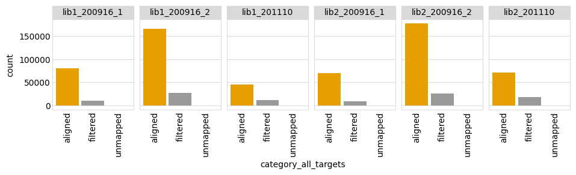
    


And the read stats by library (combining all targets and runs within a library):


```python
p = (
    ggplot(readstats
           .groupby(['library', 'category_all_targets', 'valid'])
           .aggregate({'count': 'sum'})
           .reset_index(), 
           aes('category_all_targets', 'count', fill='valid')) +
    geom_bar(stat='identity') +
    facet_wrap('~ library', nrow=1) +
    theme(axis_text_x=element_text(angle=90),
          figure_size=(1.5 * pacbio_runs['library'].nunique(), 2),
          panel_grid_major_x=element_blank(),
          legend_position='none',
          ) +
    scale_fill_manual(values=CBPALETTE)
    )
_ = p.draw()
```


    

    


And the number of reads by target (combining all libraries and runs for a target):


```python
p = (
    ggplot(readstats
           .groupby(['target'])
           .aggregate({'count': 'sum'})
           .reset_index(), 
           aes('target', 'count')) +
    geom_point(stat='identity', size=3) +
    theme(axis_text_x=element_text(angle=90),
          figure_size=(0.3 * readstats['target'].nunique(), 2),
          panel_grid_major_x=element_blank(),
          ) +
    scale_y_log10(name='number of reads')
    )
_ = p.draw()
```


    
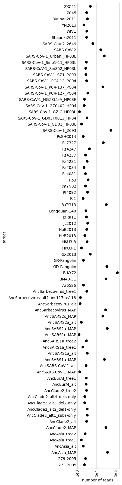
    


And read stats by target (combining all libraries and runs for a target):


```python
p = (
    ggplot(readstats
           .groupby(['target', 'valid'])
           .aggregate({'count': 'sum'})
           .reset_index()
           .assign(total=lambda x: x.groupby('target')['count'].transform('sum'),
                   frac=lambda x: x['count'] / x['total'],
                   ), 
           aes('target', 'frac', fill='valid')) +
    geom_bar(stat='identity') +
    theme(axis_text_x=element_text(angle=90),
          figure_size=(0.5 * readstats['target'].nunique(), 2),
          panel_grid_major_x=element_blank(),
          ) +
    scale_fill_manual(values=CBPALETTE)
    )
_ = p.draw()
```


    
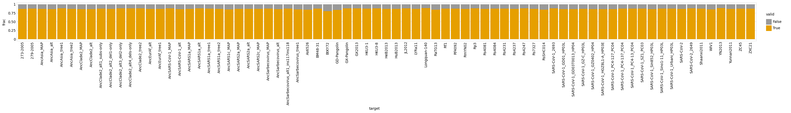
    


Now let's see **why** we filtered the reads.
First, we do some transformations on the `filtered` dict returned by `Targets.align_and_parse`.
Then we count up the number of CCSs filtered for each reason, and group together "unusual" reasons that represent less than some fraction of all filtering.
For now, we group together all targets to the stats represent all targets combined:


```python
other_cutoff = 0.02  # group as "other" reasons with <= this frac

filtered_df = (
    pd.concat(df.assign(target=target) for target, df in filtered.items())
    .groupby(['library', 'name', 'run', 'filter_reason'])
    .size()
    .rename('count')
    .reset_index()
    .assign(tot_reason_frac=lambda x: (x.groupby('filter_reason')['count']
                                       .transform('sum')) / x['count'].sum(),
            filter_reason=lambda x: numpy.where(x['tot_reason_frac'] > other_cutoff,
                                                x['filter_reason'],
                                                'other')
            )
    )
```

Now plot the filtering reason for all runs:


```python
ncol = 7
nreasons = filtered_df['filter_reason'].nunique()

p = (
    ggplot(filtered_df, aes('filter_reason', 'count')) +
    geom_bar(stat='identity') +
    facet_wrap('~ name', ncol=ncol) +
    theme(axis_text_x=element_text(angle=90),
          figure_size=(0.25 * nreasons * min(ncol, len(pacbio_runs)),
                       2 * math.ceil(len(pacbio_runs) / ncol)),
          panel_grid_major_x=element_blank(),
          )
    )
_ = p.draw()
```


    
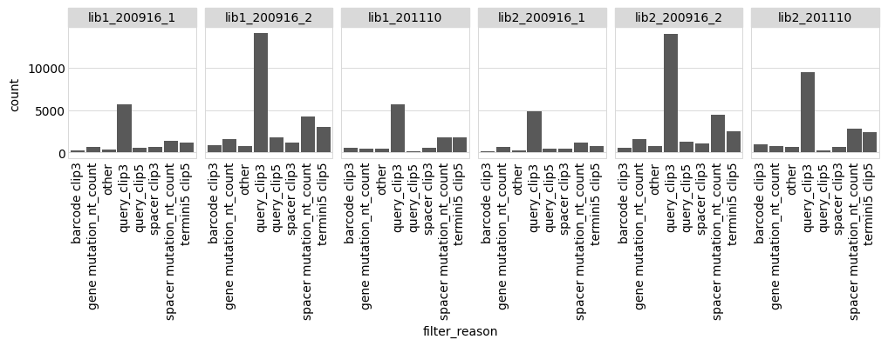
    


Now make a similar plot to above, but combine all the runs for each library:


```python
p = (
    ggplot(filtered_df
           .groupby(['library', 'filter_reason'])
           .aggregate({'count': 'sum'})
           .reset_index(),
           aes('filter_reason', 'count')) +
    geom_bar(stat='identity') +
    facet_wrap('~ library', nrow=1) +
    theme(axis_text_x=element_text(angle=90),
          figure_size=(0.3 * nreasons * pacbio_runs['library'].nunique(), 2),
          panel_grid_major_x=element_blank(),
          )
    )
_ = p.draw()
```


    
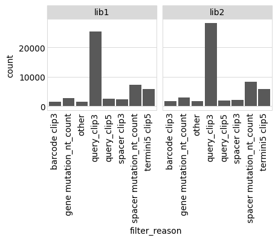
    


Finally, we take the successfully parsed alignments and read them into a data frame, keeping track of the target that each CCS aligns to.
We also drop the pieces of information we won't use going forward, and rename a few columns:


```python
aligned_df = (
    pd.concat(df.assign(target=target) for target, df in aligned.items())
    .drop(columns=['query_clip5', 'query_clip3', 'run','name'])
    .rename(columns={'barcode_sequence': 'barcode'})
    )

print(f"First few lines of information on the parsed alignments:")
display(HTML(aligned_df.head().to_html(index=False)))
```

    First few lines of information on the parsed alignments:


<table border="1" class="dataframe">
  <thead>
    <tr style="text-align: right;">
      <th>library</th>
      <th>query_name</th>
      <th>gene_mutations</th>
      <th>gene_accuracy</th>
      <th>barcode</th>
      <th>barcode_accuracy</th>
      <th>target</th>
    </tr>
  </thead>
  <tbody>
    <tr>
      <td>lib1</td>
      <td>m54228_200925_184138/4194978/ccs</td>
      <td></td>
      <td>1.0</td>
      <td>GCTCCCTGGATGAATA</td>
      <td>1.0</td>
      <td>AncSarbecovirus_MAP</td>
    </tr>
    <tr>
      <td>lib1</td>
      <td>m54228_200925_184138/4195041/ccs</td>
      <td>T371C A372T</td>
      <td>1.0</td>
      <td>GCGGTTACCGCACAGG</td>
      <td>1.0</td>
      <td>AncSarbecovirus_MAP</td>
    </tr>
    <tr>
      <td>lib1</td>
      <td>m54228_200925_184138/4260338/ccs</td>
      <td>A499C C500A A501T ins506C</td>
      <td>1.0</td>
      <td>ACCATGAAGCCGACGG</td>
      <td>1.0</td>
      <td>AncSarbecovirus_MAP</td>
    </tr>
    <tr>
      <td>lib1</td>
      <td>m54228_200925_184138/4260429/ccs</td>
      <td>T370G T371G A372T</td>
      <td>1.0</td>
      <td>GCGTGACTAATATTAA</td>
      <td>1.0</td>
      <td>AncSarbecovirus_MAP</td>
    </tr>
    <tr>
      <td>lib1</td>
      <td>m54228_200925_184138/4260622/ccs</td>
      <td>T487A C488G T489A</td>
      <td>1.0</td>
      <td>ATACTAGATGAGATAA</td>
      <td>1.0</td>
      <td>AncSarbecovirus_MAP</td>
    </tr>
  </tbody>
</table>


## Write valid CCSs

Write the processed CCSs to a file:


```python
aligned_df.to_csv(config['processed_ccs_file'], index=False)

print("Barcodes and mutations for valid processed CCSs "
      f"have been written to {config['processed_ccs_file']}.")
```

    Barcodes and mutations for valid processed CCSs have been written to results/process_ccs/processed_ccs.csv.


# Build barcode variant table
Next, we build consensus sequences for barcoded variants from the mutations called in the processed PacBio CCSs.

## Build variant consensus sequences
We now use the processed CCSs to build a consensus sequence (list of mutations) for each barcoded variant in each library.

### Get processed CCSs
Read the CSV file with the processed CCSs into a data frame:


```python
processed_ccs = pd.read_csv(config['processed_ccs_file'], na_filter=None)

nlibs = processed_ccs['library'].nunique()  # number of unique libraries

ntargets = processed_ccs['target'].nunique()  # number of unique targets

print(f"Read {len(processed_ccs)} CCSs from {nlibs} libraries and {ntargets} targets.")
```

    Read 149805 CCSs from 2 libraries and 75 targets.


Overall statistics on number of total CCSs and number of unique barcodes:


```python
display(HTML(
    processed_ccs
    .groupby(['target', 'library'])
    .aggregate(total_CCSs=('barcode', 'size'),
               unique_barcodes=('barcode', 'nunique'))
    .assign(avg_CCSs_per_barcode=lambda x: x['total_CCSs'] / x['unique_barcodes'])
    .round(2)
    .to_html()
    ))
```


<table border="1" class="dataframe">
  <thead>
    <tr style="text-align: right;">
      <th></th>
      <th></th>
      <th>total_CCSs</th>
      <th>unique_barcodes</th>
      <th>avg_CCSs_per_barcode</th>
    </tr>
    <tr>
      <th>target</th>
      <th>library</th>
      <th></th>
      <th></th>
      <th></th>
    </tr>
  </thead>
  <tbody>
    <tr>
      <th rowspan="2" valign="top">273-2005</th>
      <th>lib1</th>
      <td>420</td>
      <td>275</td>
      <td>1.53</td>
    </tr>
    <tr>
      <th>lib2</th>
      <td>235</td>
      <td>164</td>
      <td>1.43</td>
    </tr>
    <tr>
      <th rowspan="2" valign="top">279-2005</th>
      <th>lib1</th>
      <td>465</td>
      <td>279</td>
      <td>1.67</td>
    </tr>
    <tr>
      <th>lib2</th>
      <td>315</td>
      <td>213</td>
      <td>1.48</td>
    </tr>
    <tr>
      <th rowspan="2" valign="top">AncAsia_MAP</th>
      <th>lib1</th>
      <td>5117</td>
      <td>3423</td>
      <td>1.49</td>
    </tr>
    <tr>
      <th>lib2</th>
      <td>4873</td>
      <td>3436</td>
      <td>1.42</td>
    </tr>
    <tr>
      <th rowspan="2" valign="top">AncAsia_alt</th>
      <th>lib1</th>
      <td>326</td>
      <td>193</td>
      <td>1.69</td>
    </tr>
    <tr>
      <th>lib2</th>
      <td>242</td>
      <td>144</td>
      <td>1.68</td>
    </tr>
    <tr>
      <th rowspan="2" valign="top">AncAsia_tree1</th>
      <th>lib1</th>
      <td>201</td>
      <td>124</td>
      <td>1.62</td>
    </tr>
    <tr>
      <th>lib2</th>
      <td>212</td>
      <td>129</td>
      <td>1.64</td>
    </tr>
    <tr>
      <th rowspan="2" valign="top">AncAsia_tree2</th>
      <th>lib1</th>
      <td>402</td>
      <td>246</td>
      <td>1.63</td>
    </tr>
    <tr>
      <th>lib2</th>
      <td>291</td>
      <td>187</td>
      <td>1.56</td>
    </tr>
    <tr>
      <th rowspan="2" valign="top">AncClade2_MAP</th>
      <th>lib1</th>
      <td>4238</td>
      <td>2828</td>
      <td>1.50</td>
    </tr>
    <tr>
      <th>lib2</th>
      <td>3831</td>
      <td>2847</td>
      <td>1.35</td>
    </tr>
    <tr>
      <th rowspan="2" valign="top">AncClade2_alt</th>
      <th>lib1</th>
      <td>445</td>
      <td>277</td>
      <td>1.61</td>
    </tr>
    <tr>
      <th>lib2</th>
      <td>287</td>
      <td>211</td>
      <td>1.36</td>
    </tr>
    <tr>
      <th rowspan="2" valign="top">AncClade2_alt1_subs-only</th>
      <th>lib1</th>
      <td>418</td>
      <td>252</td>
      <td>1.66</td>
    </tr>
    <tr>
      <th>lib2</th>
      <td>434</td>
      <td>252</td>
      <td>1.72</td>
    </tr>
    <tr>
      <th rowspan="2" valign="top">AncClade2_alt2_del1-only</th>
      <th>lib1</th>
      <td>495</td>
      <td>283</td>
      <td>1.75</td>
    </tr>
    <tr>
      <th>lib2</th>
      <td>414</td>
      <td>251</td>
      <td>1.65</td>
    </tr>
    <tr>
      <th rowspan="2" valign="top">AncClade2_alt3_del2-only</th>
      <th>lib1</th>
      <td>380</td>
      <td>232</td>
      <td>1.64</td>
    </tr>
    <tr>
      <th>lib2</th>
      <td>260</td>
      <td>164</td>
      <td>1.59</td>
    </tr>
    <tr>
      <th rowspan="2" valign="top">AncClade2_alt4_dels-only</th>
      <th>lib1</th>
      <td>414</td>
      <td>244</td>
      <td>1.70</td>
    </tr>
    <tr>
      <th>lib2</th>
      <td>269</td>
      <td>190</td>
      <td>1.42</td>
    </tr>
    <tr>
      <th rowspan="2" valign="top">AncClade2_tree2</th>
      <th>lib1</th>
      <td>495</td>
      <td>302</td>
      <td>1.64</td>
    </tr>
    <tr>
      <th>lib2</th>
      <td>293</td>
      <td>205</td>
      <td>1.43</td>
    </tr>
    <tr>
      <th rowspan="2" valign="top">AncEurAf_alt</th>
      <th>lib1</th>
      <td>426</td>
      <td>269</td>
      <td>1.58</td>
    </tr>
    <tr>
      <th>lib2</th>
      <td>315</td>
      <td>196</td>
      <td>1.61</td>
    </tr>
    <tr>
      <th rowspan="2" valign="top">AncEurAf_tree1</th>
      <th>lib1</th>
      <td>398</td>
      <td>233</td>
      <td>1.71</td>
    </tr>
    <tr>
      <th>lib2</th>
      <td>374</td>
      <td>232</td>
      <td>1.61</td>
    </tr>
    <tr>
      <th rowspan="2" valign="top">AncSARS-CoV-1_MAP</th>
      <th>lib1</th>
      <td>203</td>
      <td>119</td>
      <td>1.71</td>
    </tr>
    <tr>
      <th>lib2</th>
      <td>174</td>
      <td>115</td>
      <td>1.51</td>
    </tr>
    <tr>
      <th rowspan="2" valign="top">AncSARS-CoV-1_alt</th>
      <th>lib1</th>
      <td>467</td>
      <td>273</td>
      <td>1.71</td>
    </tr>
    <tr>
      <th>lib2</th>
      <td>288</td>
      <td>176</td>
      <td>1.64</td>
    </tr>
    <tr>
      <th rowspan="2" valign="top">AncSARS1a_MAP</th>
      <th>lib1</th>
      <td>3541</td>
      <td>2433</td>
      <td>1.46</td>
    </tr>
    <tr>
      <th>lib2</th>
      <td>3264</td>
      <td>2405</td>
      <td>1.36</td>
    </tr>
    <tr>
      <th rowspan="2" valign="top">AncSARS1a_alt</th>
      <th>lib1</th>
      <td>541</td>
      <td>321</td>
      <td>1.69</td>
    </tr>
    <tr>
      <th>lib2</th>
      <td>373</td>
      <td>244</td>
      <td>1.53</td>
    </tr>
    <tr>
      <th rowspan="2" valign="top">AncSARS1a_tree1</th>
      <th>lib1</th>
      <td>260</td>
      <td>156</td>
      <td>1.67</td>
    </tr>
    <tr>
      <th>lib2</th>
      <td>239</td>
      <td>136</td>
      <td>1.76</td>
    </tr>
    <tr>
      <th rowspan="2" valign="top">AncSARS1a_tree2</th>
      <th>lib1</th>
      <td>414</td>
      <td>252</td>
      <td>1.64</td>
    </tr>
    <tr>
      <th>lib2</th>
      <td>336</td>
      <td>214</td>
      <td>1.57</td>
    </tr>
    <tr>
      <th rowspan="2" valign="top">AncSARS1c_MAP</th>
      <th>lib1</th>
      <td>203</td>
      <td>116</td>
      <td>1.75</td>
    </tr>
    <tr>
      <th>lib2</th>
      <td>125</td>
      <td>84</td>
      <td>1.49</td>
    </tr>
    <tr>
      <th rowspan="2" valign="top">AncSARS2a_MAP</th>
      <th>lib1</th>
      <td>4734</td>
      <td>3079</td>
      <td>1.54</td>
    </tr>
    <tr>
      <th>lib2</th>
      <td>4664</td>
      <td>3220</td>
      <td>1.45</td>
    </tr>
    <tr>
      <th rowspan="2" valign="top">AncSARS2a_alt</th>
      <th>lib1</th>
      <td>240</td>
      <td>146</td>
      <td>1.64</td>
    </tr>
    <tr>
      <th>lib2</th>
      <td>208</td>
      <td>126</td>
      <td>1.65</td>
    </tr>
    <tr>
      <th rowspan="2" valign="top">AncSARS2c_MAP</th>
      <th>lib1</th>
      <td>2909</td>
      <td>2024</td>
      <td>1.44</td>
    </tr>
    <tr>
      <th>lib2</th>
      <td>2765</td>
      <td>1948</td>
      <td>1.42</td>
    </tr>
    <tr>
      <th rowspan="2" valign="top">AncSarbecovirus_MAP</th>
      <th>lib1</th>
      <td>4125</td>
      <td>2779</td>
      <td>1.48</td>
    </tr>
    <tr>
      <th>lib2</th>
      <td>3893</td>
      <td>2774</td>
      <td>1.40</td>
    </tr>
    <tr>
      <th rowspan="2" valign="top">AncSarbecovirus_alt</th>
      <th>lib1</th>
      <td>205</td>
      <td>128</td>
      <td>1.60</td>
    </tr>
    <tr>
      <th>lib2</th>
      <td>182</td>
      <td>93</td>
      <td>1.96</td>
    </tr>
    <tr>
      <th rowspan="2" valign="top">AncSarbecovirus_alt1_ins117ins118</th>
      <th>lib1</th>
      <td>195</td>
      <td>127</td>
      <td>1.54</td>
    </tr>
    <tr>
      <th>lib2</th>
      <td>198</td>
      <td>115</td>
      <td>1.72</td>
    </tr>
    <tr>
      <th rowspan="2" valign="top">AncSarbecovirus_tree1</th>
      <th>lib1</th>
      <td>449</td>
      <td>254</td>
      <td>1.77</td>
    </tr>
    <tr>
      <th>lib2</th>
      <td>337</td>
      <td>191</td>
      <td>1.76</td>
    </tr>
    <tr>
      <th rowspan="2" valign="top">As6526</th>
      <th>lib1</th>
      <td>336</td>
      <td>203</td>
      <td>1.66</td>
    </tr>
    <tr>
      <th>lib2</th>
      <td>216</td>
      <td>143</td>
      <td>1.51</td>
    </tr>
    <tr>
      <th rowspan="2" valign="top">BM48-31</th>
      <th>lib1</th>
      <td>4123</td>
      <td>2659</td>
      <td>1.55</td>
    </tr>
    <tr>
      <th>lib2</th>
      <td>4137</td>
      <td>2738</td>
      <td>1.51</td>
    </tr>
    <tr>
      <th rowspan="2" valign="top">BtKY72</th>
      <th>lib1</th>
      <td>353</td>
      <td>218</td>
      <td>1.62</td>
    </tr>
    <tr>
      <th>lib2</th>
      <td>257</td>
      <td>166</td>
      <td>1.55</td>
    </tr>
    <tr>
      <th rowspan="2" valign="top">GD-Pangolin</th>
      <th>lib1</th>
      <td>3066</td>
      <td>2138</td>
      <td>1.43</td>
    </tr>
    <tr>
      <th>lib2</th>
      <td>2897</td>
      <td>2097</td>
      <td>1.38</td>
    </tr>
    <tr>
      <th rowspan="2" valign="top">GX-Pangolin</th>
      <th>lib1</th>
      <td>288</td>
      <td>165</td>
      <td>1.75</td>
    </tr>
    <tr>
      <th>lib2</th>
      <td>256</td>
      <td>150</td>
      <td>1.71</td>
    </tr>
    <tr>
      <th rowspan="2" valign="top">GX2013</th>
      <th>lib1</th>
      <td>715</td>
      <td>419</td>
      <td>1.71</td>
    </tr>
    <tr>
      <th>lib2</th>
      <td>555</td>
      <td>345</td>
      <td>1.61</td>
    </tr>
    <tr>
      <th rowspan="2" valign="top">HKU3-1</th>
      <th>lib1</th>
      <td>264</td>
      <td>156</td>
      <td>1.69</td>
    </tr>
    <tr>
      <th>lib2</th>
      <td>171</td>
      <td>117</td>
      <td>1.46</td>
    </tr>
    <tr>
      <th rowspan="2" valign="top">HKU3-8</th>
      <th>lib1</th>
      <td>578</td>
      <td>373</td>
      <td>1.55</td>
    </tr>
    <tr>
      <th>lib2</th>
      <td>299</td>
      <td>219</td>
      <td>1.37</td>
    </tr>
    <tr>
      <th rowspan="2" valign="top">HeB2013</th>
      <th>lib1</th>
      <td>444</td>
      <td>281</td>
      <td>1.58</td>
    </tr>
    <tr>
      <th>lib2</th>
      <td>239</td>
      <td>163</td>
      <td>1.47</td>
    </tr>
    <tr>
      <th rowspan="2" valign="top">HuB2013</th>
      <th>lib1</th>
      <td>513</td>
      <td>310</td>
      <td>1.65</td>
    </tr>
    <tr>
      <th>lib2</th>
      <td>356</td>
      <td>239</td>
      <td>1.49</td>
    </tr>
    <tr>
      <th rowspan="2" valign="top">JL2012</th>
      <th>lib1</th>
      <td>595</td>
      <td>352</td>
      <td>1.69</td>
    </tr>
    <tr>
      <th>lib2</th>
      <td>361</td>
      <td>253</td>
      <td>1.43</td>
    </tr>
    <tr>
      <th rowspan="2" valign="top">LYRa11</th>
      <th>lib1</th>
      <td>393</td>
      <td>233</td>
      <td>1.69</td>
    </tr>
    <tr>
      <th>lib2</th>
      <td>363</td>
      <td>215</td>
      <td>1.69</td>
    </tr>
    <tr>
      <th rowspan="2" valign="top">Longquan-140</th>
      <th>lib1</th>
      <td>476</td>
      <td>267</td>
      <td>1.78</td>
    </tr>
    <tr>
      <th>lib2</th>
      <td>282</td>
      <td>188</td>
      <td>1.50</td>
    </tr>
    <tr>
      <th rowspan="2" valign="top">RaTG13</th>
      <th>lib1</th>
      <td>2805</td>
      <td>1912</td>
      <td>1.47</td>
    </tr>
    <tr>
      <th>lib2</th>
      <td>2523</td>
      <td>1857</td>
      <td>1.36</td>
    </tr>
    <tr>
      <th rowspan="2" valign="top">Rf1</th>
      <th>lib1</th>
      <td>321</td>
      <td>196</td>
      <td>1.64</td>
    </tr>
    <tr>
      <th>lib2</th>
      <td>216</td>
      <td>130</td>
      <td>1.66</td>
    </tr>
    <tr>
      <th rowspan="2" valign="top">Rf4092</th>
      <th>lib1</th>
      <td>586</td>
      <td>375</td>
      <td>1.56</td>
    </tr>
    <tr>
      <th>lib2</th>
      <td>364</td>
      <td>248</td>
      <td>1.47</td>
    </tr>
    <tr>
      <th rowspan="2" valign="top">RmYN02</th>
      <th>lib1</th>
      <td>471</td>
      <td>303</td>
      <td>1.55</td>
    </tr>
    <tr>
      <th>lib2</th>
      <td>273</td>
      <td>195</td>
      <td>1.40</td>
    </tr>
    <tr>
      <th rowspan="2" valign="top">Rp3</th>
      <th>lib1</th>
      <td>627</td>
      <td>377</td>
      <td>1.66</td>
    </tr>
    <tr>
      <th>lib2</th>
      <td>339</td>
      <td>250</td>
      <td>1.36</td>
    </tr>
    <tr>
      <th rowspan="2" valign="top">Rs4081</th>
      <th>lib1</th>
      <td>467</td>
      <td>275</td>
      <td>1.70</td>
    </tr>
    <tr>
      <th>lib2</th>
      <td>256</td>
      <td>182</td>
      <td>1.41</td>
    </tr>
    <tr>
      <th rowspan="2" valign="top">Rs4084</th>
      <th>lib1</th>
      <td>348</td>
      <td>207</td>
      <td>1.68</td>
    </tr>
    <tr>
      <th>lib2</th>
      <td>255</td>
      <td>159</td>
      <td>1.60</td>
    </tr>
    <tr>
      <th rowspan="2" valign="top">Rs4231</th>
      <th>lib1</th>
      <td>484</td>
      <td>300</td>
      <td>1.61</td>
    </tr>
    <tr>
      <th>lib2</th>
      <td>379</td>
      <td>235</td>
      <td>1.61</td>
    </tr>
    <tr>
      <th rowspan="2" valign="top">Rs4237</th>
      <th>lib1</th>
      <td>471</td>
      <td>290</td>
      <td>1.62</td>
    </tr>
    <tr>
      <th>lib2</th>
      <td>268</td>
      <td>185</td>
      <td>1.45</td>
    </tr>
    <tr>
      <th rowspan="2" valign="top">Rs4247</th>
      <th>lib1</th>
      <td>679</td>
      <td>417</td>
      <td>1.63</td>
    </tr>
    <tr>
      <th>lib2</th>
      <td>436</td>
      <td>297</td>
      <td>1.47</td>
    </tr>
    <tr>
      <th rowspan="2" valign="top">Rs7327</th>
      <th>lib1</th>
      <td>3136</td>
      <td>2135</td>
      <td>1.47</td>
    </tr>
    <tr>
      <th>lib2</th>
      <td>2815</td>
      <td>2008</td>
      <td>1.40</td>
    </tr>
    <tr>
      <th rowspan="2" valign="top">RsSHC014</th>
      <th>lib1</th>
      <td>298</td>
      <td>175</td>
      <td>1.70</td>
    </tr>
    <tr>
      <th>lib2</th>
      <td>218</td>
      <td>132</td>
      <td>1.65</td>
    </tr>
    <tr>
      <th rowspan="2" valign="top">SARS-CoV-1_2693</th>
      <th>lib1</th>
      <td>7248</td>
      <td>3819</td>
      <td>1.90</td>
    </tr>
    <tr>
      <th>lib2</th>
      <td>7574</td>
      <td>4284</td>
      <td>1.77</td>
    </tr>
    <tr>
      <th rowspan="2" valign="top">SARS-CoV-1_GD01_HP03L</th>
      <th>lib1</th>
      <td>251</td>
      <td>144</td>
      <td>1.74</td>
    </tr>
    <tr>
      <th>lib2</th>
      <td>209</td>
      <td>115</td>
      <td>1.82</td>
    </tr>
    <tr>
      <th rowspan="2" valign="top">SARS-CoV-1_GD03T0013_HP04</th>
      <th>lib1</th>
      <td>434</td>
      <td>281</td>
      <td>1.54</td>
    </tr>
    <tr>
      <th>lib2</th>
      <td>417</td>
      <td>258</td>
      <td>1.62</td>
    </tr>
    <tr>
      <th rowspan="2" valign="top">SARS-CoV-1_GZ-C_HP03L</th>
      <th>lib1</th>
      <td>195</td>
      <td>118</td>
      <td>1.65</td>
    </tr>
    <tr>
      <th>lib2</th>
      <td>151</td>
      <td>106</td>
      <td>1.42</td>
    </tr>
    <tr>
      <th rowspan="2" valign="top">SARS-CoV-1_GZ0402_HP04</th>
      <th>lib1</th>
      <td>356</td>
      <td>209</td>
      <td>1.70</td>
    </tr>
    <tr>
      <th>lib2</th>
      <td>277</td>
      <td>174</td>
      <td>1.59</td>
    </tr>
    <tr>
      <th rowspan="2" valign="top">SARS-CoV-1_HGZ8L1-A_HP03E</th>
      <th>lib1</th>
      <td>319</td>
      <td>182</td>
      <td>1.75</td>
    </tr>
    <tr>
      <th>lib2</th>
      <td>285</td>
      <td>174</td>
      <td>1.64</td>
    </tr>
    <tr>
      <th rowspan="2" valign="top">SARS-CoV-1_PC4-127_PC04</th>
      <th>lib1</th>
      <td>488</td>
      <td>290</td>
      <td>1.68</td>
    </tr>
    <tr>
      <th>lib2</th>
      <td>384</td>
      <td>250</td>
      <td>1.54</td>
    </tr>
    <tr>
      <th rowspan="2" valign="top">SARS-CoV-1_PC4-137_PC04</th>
      <th>lib1</th>
      <td>2940</td>
      <td>1872</td>
      <td>1.57</td>
    </tr>
    <tr>
      <th>lib2</th>
      <td>2696</td>
      <td>1823</td>
      <td>1.48</td>
    </tr>
    <tr>
      <th rowspan="2" valign="top">SARS-CoV-1_PC4-13_PC04</th>
      <th>lib1</th>
      <td>429</td>
      <td>257</td>
      <td>1.67</td>
    </tr>
    <tr>
      <th>lib2</th>
      <td>353</td>
      <td>221</td>
      <td>1.60</td>
    </tr>
    <tr>
      <th rowspan="2" valign="top">SARS-CoV-1_SZ1_PC03</th>
      <th>lib1</th>
      <td>397</td>
      <td>240</td>
      <td>1.65</td>
    </tr>
    <tr>
      <th>lib2</th>
      <td>343</td>
      <td>219</td>
      <td>1.57</td>
    </tr>
    <tr>
      <th rowspan="2" valign="top">SARS-CoV-1_Sin852_HP03L</th>
      <th>lib1</th>
      <td>395</td>
      <td>249</td>
      <td>1.59</td>
    </tr>
    <tr>
      <th>lib2</th>
      <td>311</td>
      <td>194</td>
      <td>1.60</td>
    </tr>
    <tr>
      <th rowspan="2" valign="top">SARS-CoV-1_Sino1-11_HP03L</th>
      <th>lib1</th>
      <td>445</td>
      <td>300</td>
      <td>1.48</td>
    </tr>
    <tr>
      <th>lib2</th>
      <td>338</td>
      <td>232</td>
      <td>1.46</td>
    </tr>
    <tr>
      <th rowspan="2" valign="top">SARS-CoV-1_Urbani_HP03L</th>
      <th>lib1</th>
      <td>3731</td>
      <td>2486</td>
      <td>1.50</td>
    </tr>
    <tr>
      <th>lib2</th>
      <td>3096</td>
      <td>2428</td>
      <td>1.28</td>
    </tr>
    <tr>
      <th rowspan="2" valign="top">SARS-CoV-2</th>
      <th>lib1</th>
      <td>2205</td>
      <td>1413</td>
      <td>1.56</td>
    </tr>
    <tr>
      <th>lib2</th>
      <td>2149</td>
      <td>1460</td>
      <td>1.47</td>
    </tr>
    <tr>
      <th rowspan="2" valign="top">SARS-CoV-2_2649</th>
      <th>lib1</th>
      <td>900</td>
      <td>541</td>
      <td>1.66</td>
    </tr>
    <tr>
      <th>lib2</th>
      <td>728</td>
      <td>423</td>
      <td>1.72</td>
    </tr>
    <tr>
      <th rowspan="2" valign="top">Shaanxi2011</th>
      <th>lib1</th>
      <td>516</td>
      <td>316</td>
      <td>1.63</td>
    </tr>
    <tr>
      <th>lib2</th>
      <td>360</td>
      <td>249</td>
      <td>1.45</td>
    </tr>
    <tr>
      <th rowspan="2" valign="top">WIV1</th>
      <th>lib1</th>
      <td>423</td>
      <td>244</td>
      <td>1.73</td>
    </tr>
    <tr>
      <th>lib2</th>
      <td>396</td>
      <td>231</td>
      <td>1.71</td>
    </tr>
    <tr>
      <th rowspan="2" valign="top">YN2013</th>
      <th>lib1</th>
      <td>377</td>
      <td>255</td>
      <td>1.48</td>
    </tr>
    <tr>
      <th>lib2</th>
      <td>233</td>
      <td>175</td>
      <td>1.33</td>
    </tr>
    <tr>
      <th rowspan="2" valign="top">Yunnan2011</th>
      <th>lib1</th>
      <td>515</td>
      <td>326</td>
      <td>1.58</td>
    </tr>
    <tr>
      <th>lib2</th>
      <td>385</td>
      <td>256</td>
      <td>1.50</td>
    </tr>
    <tr>
      <th rowspan="2" valign="top">ZC45</th>
      <th>lib1</th>
      <td>494</td>
      <td>290</td>
      <td>1.70</td>
    </tr>
    <tr>
      <th>lib2</th>
      <td>367</td>
      <td>236</td>
      <td>1.56</td>
    </tr>
    <tr>
      <th rowspan="2" valign="top">ZXC21</th>
      <th>lib1</th>
      <td>787</td>
      <td>474</td>
      <td>1.66</td>
    </tr>
    <tr>
      <th>lib2</th>
      <td>523</td>
      <td>343</td>
      <td>1.52</td>
    </tr>
  </tbody>
</table>


### Filter processed CCSs
We have the PacBio `ccs` program's estimated "accuracy" for both the barcode and the gene sequence for each processed CCS.
We will filter the CCSs to only keep ones of sufficiently high accuracy.

First, we want to plot the accuracies.
It is actually visually easier to look at the error rate, which is one minus the accuracy.
Because we want to plot on a log scale (which can't show error rates of zero), we define a *error_rate_floor*, and set all error rates less than this to that value:


```python
error_rate_floor = 1e-7  # error rates < this set to this
if error_rate_floor >= config['max_error_rate']:
    raise ValueError('error_rate_floor must be < max_error_rate')

processed_ccs = (
    processed_ccs
    .assign(barcode_error=lambda x: numpy.clip(1 - x['barcode_accuracy'],
                                               error_rate_floor, None),
            gene_error=lambda x: numpy.clip(1 - x['gene_accuracy'],
                                            error_rate_floor, None)
            )
    )
```

Now plot the error rates, drawing a dashed vertical line at the threshold separating the CCSs we retain for consensus building versus those that we discard:


```python
_ = (
 ggplot(processed_ccs
        .melt(value_vars=['barcode_error', 'gene_error'],
              var_name='feature_type', value_name='error rate'),
        aes('error rate')) +
 geom_histogram(bins=25) +
 geom_vline(xintercept=config['max_error_rate'],
            linetype='dashed',
            color=CBPALETTE[1]) +
 facet_wrap('~ feature_type') +
 theme(figure_size=(4.5, 2)) +
 ylab('number of CCSs') +
 scale_x_log10()
 ).draw()
```


    
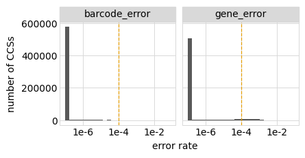
    


Flag the CCSs to retain, and indicate how many we are retaining and purging due to the accuracy filter:


```python
processed_ccs = (
    processed_ccs
    .assign(retained=lambda x: ((x['gene_error'] < config['max_error_rate']) &
                                (x['barcode_error'] < config['max_error_rate'])))
    )
```

Here are number of retained CCSs:


```python
_ = (
 ggplot(processed_ccs.assign(xlabel=lambda x: x['target'] + ', ' + x['library'])
                     .groupby(['xlabel', 'retained'])
                     .size()
                     .rename('count')
                     .reset_index(),
        aes('xlabel', 'count', color='retained', label='count')) +
 geom_point(size=3) +
 geom_text(va='bottom', size=7, ha='center',format_string='{:.3g}', nudge_y=0.2) +
 theme(figure_size=(0.5 * nlibs * ntargets, 3),
       panel_grid_major_x=element_blank(),
       axis_text_x=element_text(angle=90),
       ) +
 scale_y_log10(name='number of CCSs') +
 xlab('') +
 scale_color_manual(values=CBPALETTE[1:])
 ).draw()
```


    
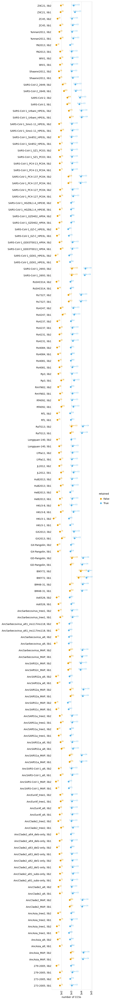
    


### Sequences per barcode
How many times is each barcode sequenced?
This is useful to know for thinking about building the barcode consensus.

First, plot the distribution of the number of times each **barcode** is observed among the retained CCSs:


```python
max_count = 8 # in plot, group all barcodes with >= this many counts

p = (
 ggplot(
    processed_ccs
     .query('retained')
     .groupby(['library', 'barcode'])
     .size()
     .rename('nseqs')
     .reset_index()
     .assign(nseqs=lambda x: numpy.clip(x['nseqs'], None, max_count)),
    aes('nseqs')) +
 geom_bar() +
 facet_wrap('~ library', nrow=1) +
 theme(figure_size=(1.75 * nlibs, 2),
       panel_grid_major_x=element_blank(),
       ) +
 ylab('number of barcodes') +
 xlab('CCSs for barcode')
 )

_ = p.draw()
```


    
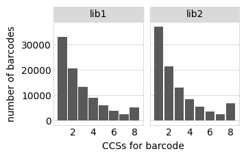
    


Now we plot the distribution of the number of **sequences** with barcodes that are observed a given number of time (again among retained CCSs).
This plot differs from the one above because if a barcode is observed multiple times it is given one count in the barcode-count plot above (which tallies barcodes) but multiple counts in the sequence-count plot below:


```python
_ = (
 ggplot(
    processed_ccs
     .query('retained')
     .assign(barcode_counts=1)
     .assign(barcode_counts=lambda x: numpy.clip(
        x.groupby(['library', 'barcode']).transform('count'), None, max_count)),
    aes('barcode_counts')) +
 geom_bar() +
 facet_wrap('~ library', nrow=1) +
 theme(figure_size=(1.75 * nlibs, 2),
       panel_grid_major_x=element_blank(),) +
 ylab('number of CCSs') +
 xlab('CCSs per barcode')
 ).draw()
```


    
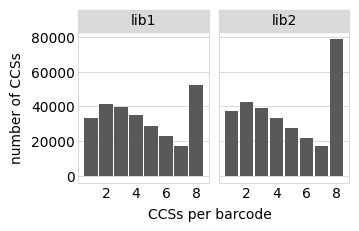
    


### Empirical accuracy of CCSs
We want to directly estimate the accuracy of the gene-barcode link rather than relying on the PacBio `ccs` accuracy, which doesn't include inaccuracies due to things like strand exchange or the same barcode on different sequences.

One way to do this is to examine instances when we have multiple sequences for the same barcode. 
We can calculate the empirical accuracy of the sequences by looking at all instances of multiple sequences of the same barcode and determining how often they are identical.
This calculation is performed by `alignparse.consensus.empirical_accuracy` using the equations described in the docs for that function.

We will do this four for sets of sequences:

 1. All of the CCSs retained above.
 2. CCSs retained by applying a PacBio `ccs` accuracy filter 10-fold more stringent than the one above.
    The rationale is that if this improves the concordance (real accuracy) of the CCSs substantially then maybe we should make the accuracy filter more stringent.
 3. Like (1) but excluding all CCSs with indels.
    the rationale is that we only really care about substitutions, and will exclude sequences with indels anyway.
 4. Like (2) but excluding all CCSs with indels.
 
First, we annotate the sequences with the number of indels and whether they have an indel to enable categorization into the aforementioned sets:


```python
processed_ccs = alignparse.consensus.add_mut_info_cols(processed_ccs,
                                                       mutation_col='gene_mutations',
                                                       n_indel_col='n_indels')

processed_ccs = processed_ccs.assign(has_indel=lambda x: x['n_indels'] > 0)
```

Plot how many sequences have indels:


```python
_ = (
 ggplot(processed_ccs,
        aes('retained', fill='has_indel')) +
 geom_bar(position='dodge') +
 geom_text(aes(label='..count..'), stat='count', va='bottom', size=7,
           position=position_dodge(width=0.9), format_string='{:.2g}') +
 theme(figure_size=(2.5 * nlibs, 3),
       panel_grid_major_x=element_blank(),
       ) +
 ylab('number of CCSs') +
 scale_fill_manual(values=CBPALETTE[1:]) +
 facet_wrap('~ library', nrow=1)
 ).draw()
```


    
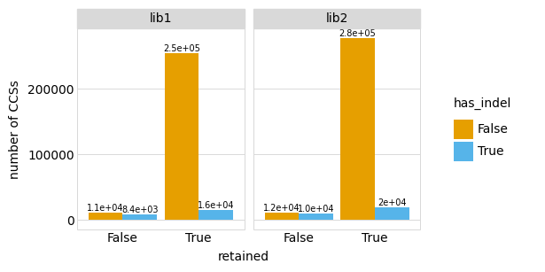
    


Now get the empirical accuracy for each of the CCS groups mentioned above:


```python
high_acc = config['max_error_rate'] / 10
empirical_acc = []

for desc, query_str in [
        ('retained', 'retained'),
        ('retained, no indel', 'retained and not has_indel'),
        ('10X accuracy',
         f"(gene_error < {high_acc}) and (barcode_error < {high_acc})"),
        ('10X accuracy, no indel',
         f"(gene_error < {high_acc}) and (barcode_error < {high_acc}) and not has_indel")
        ]:
    # get just CCSs in that category
    df = processed_ccs.query(query_str)
    
    # compute empirical accuracy
    empirical_acc.append(
        alignparse.consensus.empirical_accuracy(df,
                                                mutation_col='gene_mutations')
        .assign(description=desc)
        .merge(df
               .groupby('library')
               .size()
               .rename('number_CCSs')
               .reset_index()
               )
        )

# make description categorical to preserve order, and annotate as "actual"
# the category ("retained, no indel") that we will use for building variants.
empirical_acc = (
    pd.concat(empirical_acc, ignore_index=True, sort=False)
    .assign(description=lambda x: pd.Categorical(x['description'],
                                                 x['description'].unique(),
                                                 ordered=True),
            actual=lambda x: numpy.where(x['description'] == 'retained, no indel',
                                         True, False),
            )
    )
```

Display table of the empirical accuracies:


```python
display(HTML(empirical_acc.to_html(index=False)))
```


<table border="1" class="dataframe">
  <thead>
    <tr style="text-align: right;">
      <th>library</th>
      <th>accuracy</th>
      <th>description</th>
      <th>number_CCSs</th>
      <th>actual</th>
    </tr>
  </thead>
  <tbody>
    <tr>
      <td>lib1</td>
      <td>0.984107</td>
      <td>retained</td>
      <td>76744</td>
      <td>False</td>
    </tr>
    <tr>
      <td>lib2</td>
      <td>0.982199</td>
      <td>retained</td>
      <td>67515</td>
      <td>False</td>
    </tr>
    <tr>
      <td>lib1</td>
      <td>0.995001</td>
      <td>retained, no indel</td>
      <td>73320</td>
      <td>True</td>
    </tr>
    <tr>
      <td>lib2</td>
      <td>0.994807</td>
      <td>retained, no indel</td>
      <td>64459</td>
      <td>True</td>
    </tr>
    <tr>
      <td>lib1</td>
      <td>0.987827</td>
      <td>10X accuracy</td>
      <td>74697</td>
      <td>False</td>
    </tr>
    <tr>
      <td>lib2</td>
      <td>0.985763</td>
      <td>10X accuracy</td>
      <td>65850</td>
      <td>False</td>
    </tr>
    <tr>
      <td>lib1</td>
      <td>0.994991</td>
      <td>10X accuracy, no indel</td>
      <td>71625</td>
      <td>False</td>
    </tr>
    <tr>
      <td>lib2</td>
      <td>0.994858</td>
      <td>10X accuracy, no indel</td>
      <td>63120</td>
      <td>False</td>
    </tr>
  </tbody>
</table>


Plot the empirical accuracies, using a different color to show the category that we will actually use:


```python
p = (
    ggplot(empirical_acc,
           aes('description', 'accuracy', color='actual', label='accuracy')
           ) +
    geom_point(size=3) +
    geom_text(va='bottom', size=9, format_string='{:.3g}', nudge_y=0.003) +
    facet_wrap('~ library') +
    theme(figure_size=(1.75 * nlibs, 2.25),
          axis_text_x=element_text(angle=90),
          panel_grid_major_x=element_blank(),
          ) +
    xlab('') +
    scale_y_continuous(name='empirical accuracy', limits=(0.95, 1.005)) +
    scale_color_manual(values=CBPALETTE, guide=False)
    )

plotfile = os.path.join(config['figs_dir'], 'empirical_CCS_accuracy.pdf')
print(f"Saving plot to {plotfile}")
_ = p.draw()
```

    Saving plot to results/figures/empirical_CCS_accuracy.pdf


    

    


The above analysis shows that if we exclude sequences with indels (which we plan to do among our consensus sequences), then the accuracy of each CCS is around 99%. 
We do **not** get notably higher empirical accuracy by imposing a more stringent filter from the PacBio `ccs` program, indicating that the major sources of error are due to processes that are not modeled in this program's accuracy filter (perhaps strand exchange or barcode sharing).

Note that this empirical accuracy is for a **single** CCS.
When we build the consensus sequences for each barcode below, we will take the consensus of CCSs within a barcode.
So for barcodes with multiple CCSs, the actual accuracy of the consensus sequences will be higher than the empirical accuracy above due to capturing information from multiple CCSs.

### Consensus sequences for barcodes
We call the consensus sequence for each barcode using the simple method implemented in [alignparse.consensus.simple_mutconsensus](https://jbloomlab.github.io/alignparse/alignparse.consensus.html?highlight=simple_mutconsensus#alignparse.consensus.simple_mutconsensus).
The documentation for that function explains the method in detail, but basically it works like this:
 1. When there is just one CCS per barcode, the consensus is just that sequence.
 2. When there are multiple CCSs per barcode, they are used to build a consensus--however, the entire barcode is discarded if there are many differences between CCSs with the barcode, or high-frequency non-consensus mutations. The reason that barcodes are discarded in such cases as many differences between CCSs or high-frequency non-consensus mutations suggest errors such as barcode collisions or strand exchange.
 
First, call the consensus for each barcode including **all** retained sequences, even those with indels:


```python
consensus, dropped = alignparse.consensus.simple_mutconsensus(
                        processed_ccs.query('retained'),
                        group_cols=('library', 'barcode', 'target'),
                        mutation_col='gene_mutations',
                        )
```

Here are the first few lines of the data frame of consensus sequences for each barcode.
In addition to giving the library, barcode, target, and mutations, it also has a column indicating how many CCSs support the variant call:


```python
display(HTML(consensus.head().to_html(index=False)))
```


<table border="1" class="dataframe">
  <thead>
    <tr style="text-align: right;">
      <th>library</th>
      <th>barcode</th>
      <th>target</th>
      <th>gene_mutations</th>
      <th>variant_call_support</th>
    </tr>
  </thead>
  <tbody>
    <tr>
      <td>lib1</td>
      <td>AAAAAAAAAACAAAGG</td>
      <td>AncSarbecovirus_MAP</td>
      <td>T508A C509T T510G</td>
      <td>1</td>
    </tr>
    <tr>
      <td>lib1</td>
      <td>AAAAAAAAAACATGGC</td>
      <td>SARS-CoV-2_2649</td>
      <td>T490C C491A T492C</td>
      <td>1</td>
    </tr>
    <tr>
      <td>lib1</td>
      <td>AAAAAAAAAGTGAAAG</td>
      <td>AncSARS1a_tree1</td>
      <td></td>
      <td>1</td>
    </tr>
    <tr>
      <td>lib1</td>
      <td>AAAAAAAAAGTTACTA</td>
      <td>ZXC21</td>
      <td></td>
      <td>2</td>
    </tr>
    <tr>
      <td>lib1</td>
      <td>AAAAAAAAATAATGTT</td>
      <td>Rf1</td>
      <td>T506A</td>
      <td>2</td>
    </tr>
  </tbody>
</table>


Since we retain variants with substitutions but ignore those with indels, add information about substitution mutations and number of indels:


```python
consensus = alignparse.consensus.add_mut_info_cols(
                    consensus,
                    mutation_col='gene_mutations',
                    sub_str_col='substitutions',
                    n_indel_col='number_of_indels',
                    overwrite_cols=True)

display(HTML(consensus.head().to_html(index=False)))
```


<table border="1" class="dataframe">
  <thead>
    <tr style="text-align: right;">
      <th>library</th>
      <th>barcode</th>
      <th>target</th>
      <th>gene_mutations</th>
      <th>variant_call_support</th>
      <th>substitutions</th>
      <th>number_of_indels</th>
    </tr>
  </thead>
  <tbody>
    <tr>
      <td>lib1</td>
      <td>AAAAAAAAAACAAAGG</td>
      <td>AncSarbecovirus_MAP</td>
      <td>T508A C509T T510G</td>
      <td>1</td>
      <td>T508A C509T T510G</td>
      <td>0</td>
    </tr>
    <tr>
      <td>lib1</td>
      <td>AAAAAAAAAACATGGC</td>
      <td>SARS-CoV-2_2649</td>
      <td>T490C C491A T492C</td>
      <td>1</td>
      <td>T490C C491A T492C</td>
      <td>0</td>
    </tr>
    <tr>
      <td>lib1</td>
      <td>AAAAAAAAAGTGAAAG</td>
      <td>AncSARS1a_tree1</td>
      <td></td>
      <td>1</td>
      <td></td>
      <td>0</td>
    </tr>
    <tr>
      <td>lib1</td>
      <td>AAAAAAAAAGTTACTA</td>
      <td>ZXC21</td>
      <td></td>
      <td>2</td>
      <td></td>
      <td>0</td>
    </tr>
    <tr>
      <td>lib1</td>
      <td>AAAAAAAAATAATGTT</td>
      <td>Rf1</td>
      <td>T506A</td>
      <td>2</td>
      <td>T506A</td>
      <td>0</td>
    </tr>
  </tbody>
</table>


Plot distribution of number of CCSs supporting each variant call (consensus), indicating whether or not there is an indel:


```python
max_variant_call_support = 6  # group variants with >= this much support

_ = (
 ggplot(consensus
        .assign(variant_call_support=lambda x: numpy.clip(x['variant_call_support'],
                                                          None,
                                                          max_variant_call_support),
                indel_state=lambda x: numpy.where(x['number_of_indels'] > 0,
                                                  'has indel', 'no indel')
                ),
        aes('variant_call_support')) +
 geom_bar() +
 ylab('number of variants') +
 facet_grid('indel_state ~ library') +
 theme(figure_size=(1.75 * nlibs, 3.5),
       panel_grid_major_x=element_blank(),
       ) 
 ).draw()
```


    

    


We see that most variant consensus sequences do **not** have indels, especially if we limit to the more "accurate" ones that have multiple CCSs supporting them.

We will ignore all consensus sequences with indels in the variant-barcode lookup table. 
We do this for two reasons:
 1. When there is just one CCS supporting a consensus, it is less likely to be accurate as indels are the main mode of PacBio error.
 2. For the purposes of our studies, we are interested in point mutations rather than indels anyway.
 
Here are number of valid consensus sequence (no indels) for each library and target:


```python
consensus = consensus.query('number_of_indels == 0')

lib_target_counts = (
    consensus
    .groupby(['library', 'target'])
    .size()
    .rename('consensus sequences')
    .reset_index()
    )

display(HTML(lib_target_counts.to_html(index=False)))

p = (ggplot(lib_target_counts.assign(xlabel=lambda x: x['target'] + ', ' + x['library']),
            aes('xlabel', 'consensus sequences')) +
     geom_point(size=3) +
     theme(figure_size=(0.5 * nlibs * ntargets, 1.75),
           axis_text_x=element_text(angle=90)) +
     xlab('') +
     scale_y_log10()
     )

_ = p.draw()
```


<table border="1" class="dataframe">
  <thead>
    <tr style="text-align: right;">
      <th>library</th>
      <th>target</th>
      <th>consensus sequences</th>
    </tr>
  </thead>
  <tbody>
    <tr>
      <td>lib1</td>
      <td>273-2005</td>
      <td>234</td>
    </tr>
    <tr>
      <td>lib1</td>
      <td>279-2005</td>
      <td>247</td>
    </tr>
    <tr>
      <td>lib1</td>
      <td>AncAsia_MAP</td>
      <td>3075</td>
    </tr>
    <tr>
      <td>lib1</td>
      <td>AncAsia_alt</td>
      <td>176</td>
    </tr>
    <tr>
      <td>lib1</td>
      <td>AncAsia_tree1</td>
      <td>118</td>
    </tr>
    <tr>
      <td>lib1</td>
      <td>AncAsia_tree2</td>
      <td>209</td>
    </tr>
    <tr>
      <td>lib1</td>
      <td>AncClade2_MAP</td>
      <td>2688</td>
    </tr>
    <tr>
      <td>lib1</td>
      <td>AncClade2_alt</td>
      <td>242</td>
    </tr>
    <tr>
      <td>lib1</td>
      <td>AncClade2_alt1_subs-only</td>
      <td>220</td>
    </tr>
    <tr>
      <td>lib1</td>
      <td>AncClade2_alt2_del1-only</td>
      <td>234</td>
    </tr>
    <tr>
      <td>lib1</td>
      <td>AncClade2_alt3_del2-only</td>
      <td>219</td>
    </tr>
    <tr>
      <td>lib1</td>
      <td>AncClade2_alt4_dels-only</td>
      <td>223</td>
    </tr>
    <tr>
      <td>lib1</td>
      <td>AncClade2_tree2</td>
      <td>259</td>
    </tr>
    <tr>
      <td>lib1</td>
      <td>AncEurAf_alt</td>
      <td>232</td>
    </tr>
    <tr>
      <td>lib1</td>
      <td>AncEurAf_tree1</td>
      <td>202</td>
    </tr>
    <tr>
      <td>lib1</td>
      <td>AncSARS-CoV-1_MAP</td>
      <td>113</td>
    </tr>
    <tr>
      <td>lib1</td>
      <td>AncSARS-CoV-1_alt</td>
      <td>235</td>
    </tr>
    <tr>
      <td>lib1</td>
      <td>AncSARS1a_MAP</td>
      <td>2308</td>
    </tr>
    <tr>
      <td>lib1</td>
      <td>AncSARS1a_alt</td>
      <td>290</td>
    </tr>
    <tr>
      <td>lib1</td>
      <td>AncSARS1a_tree1</td>
      <td>137</td>
    </tr>
    <tr>
      <td>lib1</td>
      <td>AncSARS1a_tree2</td>
      <td>220</td>
    </tr>
    <tr>
      <td>lib1</td>
      <td>AncSARS1c_MAP</td>
      <td>93</td>
    </tr>
    <tr>
      <td>lib1</td>
      <td>AncSARS2a_MAP</td>
      <td>2951</td>
    </tr>
    <tr>
      <td>lib1</td>
      <td>AncSARS2a_alt</td>
      <td>119</td>
    </tr>
    <tr>
      <td>lib1</td>
      <td>AncSARS2c_MAP</td>
      <td>1948</td>
    </tr>
    <tr>
      <td>lib1</td>
      <td>AncSarbecovirus_MAP</td>
      <td>2651</td>
    </tr>
    <tr>
      <td>lib1</td>
      <td>AncSarbecovirus_alt</td>
      <td>113</td>
    </tr>
    <tr>
      <td>lib1</td>
      <td>AncSarbecovirus_alt1_ins117ins118</td>
      <td>116</td>
    </tr>
    <tr>
      <td>lib1</td>
      <td>AncSarbecovirus_tree1</td>
      <td>235</td>
    </tr>
    <tr>
      <td>lib1</td>
      <td>As6526</td>
      <td>187</td>
    </tr>
    <tr>
      <td>lib1</td>
      <td>BM48-31</td>
      <td>2536</td>
    </tr>
    <tr>
      <td>lib1</td>
      <td>BtKY72</td>
      <td>195</td>
    </tr>
    <tr>
      <td>lib1</td>
      <td>GD-Pangolin</td>
      <td>2033</td>
    </tr>
    <tr>
      <td>lib1</td>
      <td>GX-Pangolin</td>
      <td>153</td>
    </tr>
    <tr>
      <td>lib1</td>
      <td>GX2013</td>
      <td>382</td>
    </tr>
    <tr>
      <td>lib1</td>
      <td>HKU3-1</td>
      <td>153</td>
    </tr>
    <tr>
      <td>lib1</td>
      <td>HKU3-8</td>
      <td>348</td>
    </tr>
    <tr>
      <td>lib1</td>
      <td>HeB2013</td>
      <td>255</td>
    </tr>
    <tr>
      <td>lib1</td>
      <td>HuB2013</td>
      <td>278</td>
    </tr>
    <tr>
      <td>lib1</td>
      <td>JL2012</td>
      <td>321</td>
    </tr>
    <tr>
      <td>lib1</td>
      <td>LYRa11</td>
      <td>224</td>
    </tr>
    <tr>
      <td>lib1</td>
      <td>Longquan-140</td>
      <td>241</td>
    </tr>
    <tr>
      <td>lib1</td>
      <td>RaTG13</td>
      <td>1827</td>
    </tr>
    <tr>
      <td>lib1</td>
      <td>Rf1</td>
      <td>193</td>
    </tr>
    <tr>
      <td>lib1</td>
      <td>Rf4092</td>
      <td>331</td>
    </tr>
    <tr>
      <td>lib1</td>
      <td>RmYN02</td>
      <td>261</td>
    </tr>
    <tr>
      <td>lib1</td>
      <td>Rp3</td>
      <td>371</td>
    </tr>
    <tr>
      <td>lib1</td>
      <td>Rs4081</td>
      <td>250</td>
    </tr>
    <tr>
      <td>lib1</td>
      <td>Rs4084</td>
      <td>192</td>
    </tr>
    <tr>
      <td>lib1</td>
      <td>Rs4231</td>
      <td>281</td>
    </tr>
    <tr>
      <td>lib1</td>
      <td>Rs4237</td>
      <td>260</td>
    </tr>
    <tr>
      <td>lib1</td>
      <td>Rs4247</td>
      <td>377</td>
    </tr>
    <tr>
      <td>lib1</td>
      <td>Rs7327</td>
      <td>2039</td>
    </tr>
    <tr>
      <td>lib1</td>
      <td>RsSHC014</td>
      <td>154</td>
    </tr>
    <tr>
      <td>lib1</td>
      <td>SARS-CoV-1_2693</td>
      <td>3535</td>
    </tr>
    <tr>
      <td>lib1</td>
      <td>SARS-CoV-1_GD01_HP03L</td>
      <td>134</td>
    </tr>
    <tr>
      <td>lib1</td>
      <td>SARS-CoV-1_GD03T0013_HP04</td>
      <td>252</td>
    </tr>
    <tr>
      <td>lib1</td>
      <td>SARS-CoV-1_GZ-C_HP03L</td>
      <td>96</td>
    </tr>
    <tr>
      <td>lib1</td>
      <td>SARS-CoV-1_GZ0402_HP04</td>
      <td>169</td>
    </tr>
    <tr>
      <td>lib1</td>
      <td>SARS-CoV-1_HGZ8L1-A_HP03E</td>
      <td>171</td>
    </tr>
    <tr>
      <td>lib1</td>
      <td>SARS-CoV-1_PC4-127_PC04</td>
      <td>262</td>
    </tr>
    <tr>
      <td>lib1</td>
      <td>SARS-CoV-1_PC4-137_PC04</td>
      <td>1800</td>
    </tr>
    <tr>
      <td>lib1</td>
      <td>SARS-CoV-1_PC4-13_PC04</td>
      <td>230</td>
    </tr>
    <tr>
      <td>lib1</td>
      <td>SARS-CoV-1_SZ1_PC03</td>
      <td>208</td>
    </tr>
    <tr>
      <td>lib1</td>
      <td>SARS-CoV-1_Sin852_HP03L</td>
      <td>229</td>
    </tr>
    <tr>
      <td>lib1</td>
      <td>SARS-CoV-1_Sino1-11_HP03L</td>
      <td>268</td>
    </tr>
    <tr>
      <td>lib1</td>
      <td>SARS-CoV-1_Urbani_HP03L</td>
      <td>2333</td>
    </tr>
    <tr>
      <td>lib1</td>
      <td>SARS-CoV-2</td>
      <td>1342</td>
    </tr>
    <tr>
      <td>lib1</td>
      <td>SARS-CoV-2_2649</td>
      <td>500</td>
    </tr>
    <tr>
      <td>lib1</td>
      <td>Shaanxi2011</td>
      <td>282</td>
    </tr>
    <tr>
      <td>lib1</td>
      <td>WIV1</td>
      <td>237</td>
    </tr>
    <tr>
      <td>lib1</td>
      <td>YN2013</td>
      <td>230</td>
    </tr>
    <tr>
      <td>lib1</td>
      <td>Yunnan2011</td>
      <td>294</td>
    </tr>
    <tr>
      <td>lib1</td>
      <td>ZC45</td>
      <td>284</td>
    </tr>
    <tr>
      <td>lib1</td>
      <td>ZXC21</td>
      <td>466</td>
    </tr>
    <tr>
      <td>lib2</td>
      <td>273-2005</td>
      <td>138</td>
    </tr>
    <tr>
      <td>lib2</td>
      <td>279-2005</td>
      <td>198</td>
    </tr>
    <tr>
      <td>lib2</td>
      <td>AncAsia_MAP</td>
      <td>3085</td>
    </tr>
    <tr>
      <td>lib2</td>
      <td>AncAsia_alt</td>
      <td>130</td>
    </tr>
    <tr>
      <td>lib2</td>
      <td>AncAsia_tree1</td>
      <td>111</td>
    </tr>
    <tr>
      <td>lib2</td>
      <td>AncAsia_tree2</td>
      <td>166</td>
    </tr>
    <tr>
      <td>lib2</td>
      <td>AncClade2_MAP</td>
      <td>2693</td>
    </tr>
    <tr>
      <td>lib2</td>
      <td>AncClade2_alt</td>
      <td>182</td>
    </tr>
    <tr>
      <td>lib2</td>
      <td>AncClade2_alt1_subs-only</td>
      <td>220</td>
    </tr>
    <tr>
      <td>lib2</td>
      <td>AncClade2_alt2_del1-only</td>
      <td>223</td>
    </tr>
    <tr>
      <td>lib2</td>
      <td>AncClade2_alt3_del2-only</td>
      <td>145</td>
    </tr>
    <tr>
      <td>lib2</td>
      <td>AncClade2_alt4_dels-only</td>
      <td>174</td>
    </tr>
    <tr>
      <td>lib2</td>
      <td>AncClade2_tree2</td>
      <td>179</td>
    </tr>
    <tr>
      <td>lib2</td>
      <td>AncEurAf_alt</td>
      <td>162</td>
    </tr>
    <tr>
      <td>lib2</td>
      <td>AncEurAf_tree1</td>
      <td>205</td>
    </tr>
    <tr>
      <td>lib2</td>
      <td>AncSARS-CoV-1_MAP</td>
      <td>107</td>
    </tr>
    <tr>
      <td>lib2</td>
      <td>AncSARS-CoV-1_alt</td>
      <td>148</td>
    </tr>
    <tr>
      <td>lib2</td>
      <td>AncSARS1a_MAP</td>
      <td>2276</td>
    </tr>
    <tr>
      <td>lib2</td>
      <td>AncSARS1a_alt</td>
      <td>214</td>
    </tr>
    <tr>
      <td>lib2</td>
      <td>AncSARS1a_tree1</td>
      <td>124</td>
    </tr>
    <tr>
      <td>lib2</td>
      <td>AncSARS1a_tree2</td>
      <td>198</td>
    </tr>
    <tr>
      <td>lib2</td>
      <td>AncSARS1c_MAP</td>
      <td>69</td>
    </tr>
    <tr>
      <td>lib2</td>
      <td>AncSARS2a_MAP</td>
      <td>3071</td>
    </tr>
    <tr>
      <td>lib2</td>
      <td>AncSARS2a_alt</td>
      <td>108</td>
    </tr>
    <tr>
      <td>lib2</td>
      <td>AncSARS2c_MAP</td>
      <td>1856</td>
    </tr>
    <tr>
      <td>lib2</td>
      <td>AncSarbecovirus_MAP</td>
      <td>2648</td>
    </tr>
    <tr>
      <td>lib2</td>
      <td>AncSarbecovirus_alt</td>
      <td>78</td>
    </tr>
    <tr>
      <td>lib2</td>
      <td>AncSarbecovirus_alt1_ins117ins118</td>
      <td>112</td>
    </tr>
    <tr>
      <td>lib2</td>
      <td>AncSarbecovirus_tree1</td>
      <td>163</td>
    </tr>
    <tr>
      <td>lib2</td>
      <td>As6526</td>
      <td>123</td>
    </tr>
    <tr>
      <td>lib2</td>
      <td>BM48-31</td>
      <td>2609</td>
    </tr>
    <tr>
      <td>lib2</td>
      <td>BtKY72</td>
      <td>151</td>
    </tr>
    <tr>
      <td>lib2</td>
      <td>GD-Pangolin</td>
      <td>2008</td>
    </tr>
    <tr>
      <td>lib2</td>
      <td>GX-Pangolin</td>
      <td>140</td>
    </tr>
    <tr>
      <td>lib2</td>
      <td>GX2013</td>
      <td>314</td>
    </tr>
    <tr>
      <td>lib2</td>
      <td>HKU3-1</td>
      <td>116</td>
    </tr>
    <tr>
      <td>lib2</td>
      <td>HKU3-8</td>
      <td>199</td>
    </tr>
    <tr>
      <td>lib2</td>
      <td>HeB2013</td>
      <td>149</td>
    </tr>
    <tr>
      <td>lib2</td>
      <td>HuB2013</td>
      <td>211</td>
    </tr>
    <tr>
      <td>lib2</td>
      <td>JL2012</td>
      <td>235</td>
    </tr>
    <tr>
      <td>lib2</td>
      <td>LYRa11</td>
      <td>206</td>
    </tr>
    <tr>
      <td>lib2</td>
      <td>Longquan-140</td>
      <td>167</td>
    </tr>
    <tr>
      <td>lib2</td>
      <td>RaTG13</td>
      <td>1775</td>
    </tr>
    <tr>
      <td>lib2</td>
      <td>Rf1</td>
      <td>128</td>
    </tr>
    <tr>
      <td>lib2</td>
      <td>Rf4092</td>
      <td>229</td>
    </tr>
    <tr>
      <td>lib2</td>
      <td>RmYN02</td>
      <td>167</td>
    </tr>
    <tr>
      <td>lib2</td>
      <td>Rp3</td>
      <td>242</td>
    </tr>
    <tr>
      <td>lib2</td>
      <td>Rs4081</td>
      <td>167</td>
    </tr>
    <tr>
      <td>lib2</td>
      <td>Rs4084</td>
      <td>149</td>
    </tr>
    <tr>
      <td>lib2</td>
      <td>Rs4231</td>
      <td>219</td>
    </tr>
    <tr>
      <td>lib2</td>
      <td>Rs4237</td>
      <td>159</td>
    </tr>
    <tr>
      <td>lib2</td>
      <td>Rs4247</td>
      <td>273</td>
    </tr>
    <tr>
      <td>lib2</td>
      <td>Rs7327</td>
      <td>1903</td>
    </tr>
    <tr>
      <td>lib2</td>
      <td>RsSHC014</td>
      <td>124</td>
    </tr>
    <tr>
      <td>lib2</td>
      <td>SARS-CoV-1_2693</td>
      <td>3951</td>
    </tr>
    <tr>
      <td>lib2</td>
      <td>SARS-CoV-1_GD01_HP03L</td>
      <td>101</td>
    </tr>
    <tr>
      <td>lib2</td>
      <td>SARS-CoV-1_GD03T0013_HP04</td>
      <td>240</td>
    </tr>
    <tr>
      <td>lib2</td>
      <td>SARS-CoV-1_GZ-C_HP03L</td>
      <td>92</td>
    </tr>
    <tr>
      <td>lib2</td>
      <td>SARS-CoV-1_GZ0402_HP04</td>
      <td>141</td>
    </tr>
    <tr>
      <td>lib2</td>
      <td>SARS-CoV-1_HGZ8L1-A_HP03E</td>
      <td>158</td>
    </tr>
    <tr>
      <td>lib2</td>
      <td>SARS-CoV-1_PC4-127_PC04</td>
      <td>219</td>
    </tr>
    <tr>
      <td>lib2</td>
      <td>SARS-CoV-1_PC4-137_PC04</td>
      <td>1741</td>
    </tr>
    <tr>
      <td>lib2</td>
      <td>SARS-CoV-1_PC4-13_PC04</td>
      <td>202</td>
    </tr>
    <tr>
      <td>lib2</td>
      <td>SARS-CoV-1_SZ1_PC03</td>
      <td>189</td>
    </tr>
    <tr>
      <td>lib2</td>
      <td>SARS-CoV-1_Sin852_HP03L</td>
      <td>173</td>
    </tr>
    <tr>
      <td>lib2</td>
      <td>SARS-CoV-1_Sino1-11_HP03L</td>
      <td>207</td>
    </tr>
    <tr>
      <td>lib2</td>
      <td>SARS-CoV-1_Urbani_HP03L</td>
      <td>2291</td>
    </tr>
    <tr>
      <td>lib2</td>
      <td>SARS-CoV-2</td>
      <td>1392</td>
    </tr>
    <tr>
      <td>lib2</td>
      <td>SARS-CoV-2_2649</td>
      <td>387</td>
    </tr>
    <tr>
      <td>lib2</td>
      <td>Shaanxi2011</td>
      <td>223</td>
    </tr>
    <tr>
      <td>lib2</td>
      <td>WIV1</td>
      <td>227</td>
    </tr>
    <tr>
      <td>lib2</td>
      <td>YN2013</td>
      <td>152</td>
    </tr>
    <tr>
      <td>lib2</td>
      <td>Yunnan2011</td>
      <td>229</td>
    </tr>
    <tr>
      <td>lib2</td>
      <td>ZC45</td>
      <td>226</td>
    </tr>
    <tr>
      <td>lib2</td>
      <td>ZXC21</td>
      <td>336</td>
    </tr>
  </tbody>
</table>


    
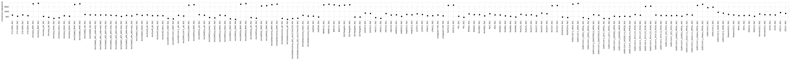
    


For the non-primary targets, we want to drop all barcodes with mutations:


```python
mutated_targets = config['mutated_targets']
print(f"Dropping variants with mutations for all targets except {mutated_targets}")

consensus = (
    consensus
    .assign(has_substitutions=lambda x: x['substitutions'].str.len().astype(bool))
    )

has_subs_by_target = (
        consensus
        .groupby(['target', 'library', 'has_substitutions'])
        .aggregate(n_barcodes=pd.NamedAgg('barcode', 'count'))
        .reset_index()
        )

display(HTML(has_subs_by_target
             .pivot_table(index=['target', 'library'],
                          columns='has_substitutions',
                          values='n_barcodes',
                          fill_value=0)
             .to_html()))

p = (ggplot(has_subs_by_target.assign(xlabel=lambda x: x['target'] + ', ' + x['library']),
            aes('xlabel', 'n_barcodes', color='has_substitutions')) +
     geom_point(size=3, alpha=0.7) +
     theme(figure_size=(0.5 * nlibs * ntargets, 1.75),
           axis_text_x=element_text(angle=90)) +
     xlab('') +
     scale_y_log10() +
     scale_color_manual(values=CBPALETTE)
     )

_ = p.draw()
```

    Dropping variants with mutations for all targets except ['AncSarbecovirus_MAP', 'AncAsia_MAP', 'AncClade2_MAP', 'AncSARS2a_MAP', 'AncSARS2c_MAP', 'AncSARS1a_MAP', 'SARS-CoV-2', 'SARS-CoV-2_2649', 'GD-Pangolin', 'RaTG13', 'SARS-CoV-1_Urbani_HP03L', 'SARS-CoV-1_2693', 'SARS-CoV-1_PC4-137_PC04', 'Rs7327', 'BM48-31']


<table border="1" class="dataframe">
  <thead>
    <tr style="text-align: right;">
      <th></th>
      <th>has_substitutions</th>
      <th>False</th>
      <th>True</th>
    </tr>
    <tr>
      <th>target</th>
      <th>library</th>
      <th></th>
      <th></th>
    </tr>
  </thead>
  <tbody>
    <tr>
      <th rowspan="2" valign="top">273-2005</th>
      <th>lib1</th>
      <td>210</td>
      <td>24</td>
    </tr>
    <tr>
      <th>lib2</th>
      <td>128</td>
      <td>10</td>
    </tr>
    <tr>
      <th rowspan="2" valign="top">279-2005</th>
      <th>lib1</th>
      <td>232</td>
      <td>15</td>
    </tr>
    <tr>
      <th>lib2</th>
      <td>182</td>
      <td>16</td>
    </tr>
    <tr>
      <th rowspan="2" valign="top">AncAsia_MAP</th>
      <th>lib1</th>
      <td>315</td>
      <td>2760</td>
    </tr>
    <tr>
      <th>lib2</th>
      <td>311</td>
      <td>2774</td>
    </tr>
    <tr>
      <th rowspan="2" valign="top">AncAsia_alt</th>
      <th>lib1</th>
      <td>161</td>
      <td>15</td>
    </tr>
    <tr>
      <th>lib2</th>
      <td>117</td>
      <td>13</td>
    </tr>
    <tr>
      <th rowspan="2" valign="top">AncAsia_tree1</th>
      <th>lib1</th>
      <td>112</td>
      <td>6</td>
    </tr>
    <tr>
      <th>lib2</th>
      <td>101</td>
      <td>10</td>
    </tr>
    <tr>
      <th rowspan="2" valign="top">AncAsia_tree2</th>
      <th>lib1</th>
      <td>194</td>
      <td>15</td>
    </tr>
    <tr>
      <th>lib2</th>
      <td>160</td>
      <td>6</td>
    </tr>
    <tr>
      <th rowspan="2" valign="top">AncClade2_MAP</th>
      <th>lib1</th>
      <td>160</td>
      <td>2528</td>
    </tr>
    <tr>
      <th>lib2</th>
      <td>156</td>
      <td>2537</td>
    </tr>
    <tr>
      <th rowspan="2" valign="top">AncClade2_alt</th>
      <th>lib1</th>
      <td>217</td>
      <td>25</td>
    </tr>
    <tr>
      <th>lib2</th>
      <td>171</td>
      <td>11</td>
    </tr>
    <tr>
      <th rowspan="2" valign="top">AncClade2_alt1_subs-only</th>
      <th>lib1</th>
      <td>199</td>
      <td>21</td>
    </tr>
    <tr>
      <th>lib2</th>
      <td>201</td>
      <td>19</td>
    </tr>
    <tr>
      <th rowspan="2" valign="top">AncClade2_alt2_del1-only</th>
      <th>lib1</th>
      <td>216</td>
      <td>18</td>
    </tr>
    <tr>
      <th>lib2</th>
      <td>201</td>
      <td>22</td>
    </tr>
    <tr>
      <th rowspan="2" valign="top">AncClade2_alt3_del2-only</th>
      <th>lib1</th>
      <td>194</td>
      <td>25</td>
    </tr>
    <tr>
      <th>lib2</th>
      <td>126</td>
      <td>19</td>
    </tr>
    <tr>
      <th rowspan="2" valign="top">AncClade2_alt4_dels-only</th>
      <th>lib1</th>
      <td>211</td>
      <td>12</td>
    </tr>
    <tr>
      <th>lib2</th>
      <td>158</td>
      <td>16</td>
    </tr>
    <tr>
      <th rowspan="2" valign="top">AncClade2_tree2</th>
      <th>lib1</th>
      <td>231</td>
      <td>28</td>
    </tr>
    <tr>
      <th>lib2</th>
      <td>163</td>
      <td>16</td>
    </tr>
    <tr>
      <th rowspan="2" valign="top">AncEurAf_alt</th>
      <th>lib1</th>
      <td>207</td>
      <td>25</td>
    </tr>
    <tr>
      <th>lib2</th>
      <td>151</td>
      <td>11</td>
    </tr>
    <tr>
      <th rowspan="2" valign="top">AncEurAf_tree1</th>
      <th>lib1</th>
      <td>181</td>
      <td>21</td>
    </tr>
    <tr>
      <th>lib2</th>
      <td>187</td>
      <td>18</td>
    </tr>
    <tr>
      <th rowspan="2" valign="top">AncSARS-CoV-1_MAP</th>
      <th>lib1</th>
      <td>106</td>
      <td>7</td>
    </tr>
    <tr>
      <th>lib2</th>
      <td>96</td>
      <td>11</td>
    </tr>
    <tr>
      <th rowspan="2" valign="top">AncSARS-CoV-1_alt</th>
      <th>lib1</th>
      <td>214</td>
      <td>21</td>
    </tr>
    <tr>
      <th>lib2</th>
      <td>138</td>
      <td>10</td>
    </tr>
    <tr>
      <th rowspan="2" valign="top">AncSARS1a_MAP</th>
      <th>lib1</th>
      <td>325</td>
      <td>1983</td>
    </tr>
    <tr>
      <th>lib2</th>
      <td>261</td>
      <td>2015</td>
    </tr>
    <tr>
      <th rowspan="2" valign="top">AncSARS1a_alt</th>
      <th>lib1</th>
      <td>266</td>
      <td>24</td>
    </tr>
    <tr>
      <th>lib2</th>
      <td>192</td>
      <td>22</td>
    </tr>
    <tr>
      <th rowspan="2" valign="top">AncSARS1a_tree1</th>
      <th>lib1</th>
      <td>116</td>
      <td>21</td>
    </tr>
    <tr>
      <th>lib2</th>
      <td>107</td>
      <td>17</td>
    </tr>
    <tr>
      <th rowspan="2" valign="top">AncSARS1a_tree2</th>
      <th>lib1</th>
      <td>207</td>
      <td>13</td>
    </tr>
    <tr>
      <th>lib2</th>
      <td>181</td>
      <td>17</td>
    </tr>
    <tr>
      <th rowspan="2" valign="top">AncSARS1c_MAP</th>
      <th>lib1</th>
      <td>75</td>
      <td>18</td>
    </tr>
    <tr>
      <th>lib2</th>
      <td>62</td>
      <td>7</td>
    </tr>
    <tr>
      <th rowspan="2" valign="top">AncSARS2a_MAP</th>
      <th>lib1</th>
      <td>304</td>
      <td>2647</td>
    </tr>
    <tr>
      <th>lib2</th>
      <td>268</td>
      <td>2803</td>
    </tr>
    <tr>
      <th rowspan="2" valign="top">AncSARS2a_alt</th>
      <th>lib1</th>
      <td>107</td>
      <td>12</td>
    </tr>
    <tr>
      <th>lib2</th>
      <td>98</td>
      <td>10</td>
    </tr>
    <tr>
      <th rowspan="2" valign="top">AncSARS2c_MAP</th>
      <th>lib1</th>
      <td>302</td>
      <td>1646</td>
    </tr>
    <tr>
      <th>lib2</th>
      <td>249</td>
      <td>1607</td>
    </tr>
    <tr>
      <th rowspan="2" valign="top">AncSarbecovirus_MAP</th>
      <th>lib1</th>
      <td>271</td>
      <td>2380</td>
    </tr>
    <tr>
      <th>lib2</th>
      <td>228</td>
      <td>2420</td>
    </tr>
    <tr>
      <th rowspan="2" valign="top">AncSarbecovirus_alt</th>
      <th>lib1</th>
      <td>102</td>
      <td>11</td>
    </tr>
    <tr>
      <th>lib2</th>
      <td>73</td>
      <td>5</td>
    </tr>
    <tr>
      <th rowspan="2" valign="top">AncSarbecovirus_alt1_ins117ins118</th>
      <th>lib1</th>
      <td>112</td>
      <td>4</td>
    </tr>
    <tr>
      <th>lib2</th>
      <td>100</td>
      <td>12</td>
    </tr>
    <tr>
      <th rowspan="2" valign="top">AncSarbecovirus_tree1</th>
      <th>lib1</th>
      <td>206</td>
      <td>29</td>
    </tr>
    <tr>
      <th>lib2</th>
      <td>150</td>
      <td>13</td>
    </tr>
    <tr>
      <th rowspan="2" valign="top">As6526</th>
      <th>lib1</th>
      <td>170</td>
      <td>17</td>
    </tr>
    <tr>
      <th>lib2</th>
      <td>113</td>
      <td>10</td>
    </tr>
    <tr>
      <th rowspan="2" valign="top">BM48-31</th>
      <th>lib1</th>
      <td>164</td>
      <td>2372</td>
    </tr>
    <tr>
      <th>lib2</th>
      <td>165</td>
      <td>2444</td>
    </tr>
    <tr>
      <th rowspan="2" valign="top">BtKY72</th>
      <th>lib1</th>
      <td>187</td>
      <td>8</td>
    </tr>
    <tr>
      <th>lib2</th>
      <td>139</td>
      <td>12</td>
    </tr>
    <tr>
      <th rowspan="2" valign="top">GD-Pangolin</th>
      <th>lib1</th>
      <td>314</td>
      <td>1719</td>
    </tr>
    <tr>
      <th>lib2</th>
      <td>324</td>
      <td>1684</td>
    </tr>
    <tr>
      <th rowspan="2" valign="top">GX-Pangolin</th>
      <th>lib1</th>
      <td>136</td>
      <td>17</td>
    </tr>
    <tr>
      <th>lib2</th>
      <td>128</td>
      <td>12</td>
    </tr>
    <tr>
      <th rowspan="2" valign="top">GX2013</th>
      <th>lib1</th>
      <td>347</td>
      <td>35</td>
    </tr>
    <tr>
      <th>lib2</th>
      <td>288</td>
      <td>26</td>
    </tr>
    <tr>
      <th rowspan="2" valign="top">HKU3-1</th>
      <th>lib1</th>
      <td>144</td>
      <td>9</td>
    </tr>
    <tr>
      <th>lib2</th>
      <td>108</td>
      <td>8</td>
    </tr>
    <tr>
      <th rowspan="2" valign="top">HKU3-8</th>
      <th>lib1</th>
      <td>313</td>
      <td>35</td>
    </tr>
    <tr>
      <th>lib2</th>
      <td>176</td>
      <td>23</td>
    </tr>
    <tr>
      <th rowspan="2" valign="top">HeB2013</th>
      <th>lib1</th>
      <td>229</td>
      <td>26</td>
    </tr>
    <tr>
      <th>lib2</th>
      <td>134</td>
      <td>15</td>
    </tr>
    <tr>
      <th rowspan="2" valign="top">HuB2013</th>
      <th>lib1</th>
      <td>254</td>
      <td>24</td>
    </tr>
    <tr>
      <th>lib2</th>
      <td>197</td>
      <td>14</td>
    </tr>
    <tr>
      <th rowspan="2" valign="top">JL2012</th>
      <th>lib1</th>
      <td>305</td>
      <td>16</td>
    </tr>
    <tr>
      <th>lib2</th>
      <td>223</td>
      <td>12</td>
    </tr>
    <tr>
      <th rowspan="2" valign="top">LYRa11</th>
      <th>lib1</th>
      <td>107</td>
      <td>117</td>
    </tr>
    <tr>
      <th>lib2</th>
      <td>76</td>
      <td>130</td>
    </tr>
    <tr>
      <th rowspan="2" valign="top">Longquan-140</th>
      <th>lib1</th>
      <td>216</td>
      <td>25</td>
    </tr>
    <tr>
      <th>lib2</th>
      <td>143</td>
      <td>24</td>
    </tr>
    <tr>
      <th rowspan="2" valign="top">RaTG13</th>
      <th>lib1</th>
      <td>359</td>
      <td>1468</td>
    </tr>
    <tr>
      <th>lib2</th>
      <td>296</td>
      <td>1479</td>
    </tr>
    <tr>
      <th rowspan="2" valign="top">Rf1</th>
      <th>lib1</th>
      <td>111</td>
      <td>82</td>
    </tr>
    <tr>
      <th>lib2</th>
      <td>68</td>
      <td>60</td>
    </tr>
    <tr>
      <th rowspan="2" valign="top">Rf4092</th>
      <th>lib1</th>
      <td>298</td>
      <td>33</td>
    </tr>
    <tr>
      <th>lib2</th>
      <td>210</td>
      <td>19</td>
    </tr>
    <tr>
      <th rowspan="2" valign="top">RmYN02</th>
      <th>lib1</th>
      <td>240</td>
      <td>21</td>
    </tr>
    <tr>
      <th>lib2</th>
      <td>152</td>
      <td>15</td>
    </tr>
    <tr>
      <th rowspan="2" valign="top">Rp3</th>
      <th>lib1</th>
      <td>345</td>
      <td>26</td>
    </tr>
    <tr>
      <th>lib2</th>
      <td>227</td>
      <td>15</td>
    </tr>
    <tr>
      <th rowspan="2" valign="top">Rs4081</th>
      <th>lib1</th>
      <td>235</td>
      <td>15</td>
    </tr>
    <tr>
      <th>lib2</th>
      <td>155</td>
      <td>12</td>
    </tr>
    <tr>
      <th rowspan="2" valign="top">Rs4084</th>
      <th>lib1</th>
      <td>181</td>
      <td>11</td>
    </tr>
    <tr>
      <th>lib2</th>
      <td>127</td>
      <td>22</td>
    </tr>
    <tr>
      <th rowspan="2" valign="top">Rs4231</th>
      <th>lib1</th>
      <td>250</td>
      <td>31</td>
    </tr>
    <tr>
      <th>lib2</th>
      <td>205</td>
      <td>14</td>
    </tr>
    <tr>
      <th rowspan="2" valign="top">Rs4237</th>
      <th>lib1</th>
      <td>245</td>
      <td>15</td>
    </tr>
    <tr>
      <th>lib2</th>
      <td>153</td>
      <td>6</td>
    </tr>
    <tr>
      <th rowspan="2" valign="top">Rs4247</th>
      <th>lib1</th>
      <td>338</td>
      <td>39</td>
    </tr>
    <tr>
      <th>lib2</th>
      <td>247</td>
      <td>26</td>
    </tr>
    <tr>
      <th rowspan="2" valign="top">Rs7327</th>
      <th>lib1</th>
      <td>323</td>
      <td>1716</td>
    </tr>
    <tr>
      <th>lib2</th>
      <td>270</td>
      <td>1633</td>
    </tr>
    <tr>
      <th rowspan="2" valign="top">RsSHC014</th>
      <th>lib1</th>
      <td>135</td>
      <td>19</td>
    </tr>
    <tr>
      <th>lib2</th>
      <td>108</td>
      <td>16</td>
    </tr>
    <tr>
      <th rowspan="2" valign="top">SARS-CoV-1_2693</th>
      <th>lib1</th>
      <td>145</td>
      <td>3390</td>
    </tr>
    <tr>
      <th>lib2</th>
      <td>143</td>
      <td>3808</td>
    </tr>
    <tr>
      <th rowspan="2" valign="top">SARS-CoV-1_GD01_HP03L</th>
      <th>lib1</th>
      <td>125</td>
      <td>9</td>
    </tr>
    <tr>
      <th>lib2</th>
      <td>94</td>
      <td>7</td>
    </tr>
    <tr>
      <th rowspan="2" valign="top">SARS-CoV-1_GD03T0013_HP04</th>
      <th>lib1</th>
      <td>218</td>
      <td>34</td>
    </tr>
    <tr>
      <th>lib2</th>
      <td>218</td>
      <td>22</td>
    </tr>
    <tr>
      <th rowspan="2" valign="top">SARS-CoV-1_GZ-C_HP03L</th>
      <th>lib1</th>
      <td>91</td>
      <td>5</td>
    </tr>
    <tr>
      <th>lib2</th>
      <td>86</td>
      <td>6</td>
    </tr>
    <tr>
      <th rowspan="2" valign="top">SARS-CoV-1_GZ0402_HP04</th>
      <th>lib1</th>
      <td>151</td>
      <td>18</td>
    </tr>
    <tr>
      <th>lib2</th>
      <td>127</td>
      <td>14</td>
    </tr>
    <tr>
      <th rowspan="2" valign="top">SARS-CoV-1_HGZ8L1-A_HP03E</th>
      <th>lib1</th>
      <td>157</td>
      <td>14</td>
    </tr>
    <tr>
      <th>lib2</th>
      <td>144</td>
      <td>14</td>
    </tr>
    <tr>
      <th rowspan="2" valign="top">SARS-CoV-1_PC4-127_PC04</th>
      <th>lib1</th>
      <td>235</td>
      <td>27</td>
    </tr>
    <tr>
      <th>lib2</th>
      <td>204</td>
      <td>15</td>
    </tr>
    <tr>
      <th rowspan="2" valign="top">SARS-CoV-1_PC4-137_PC04</th>
      <th>lib1</th>
      <td>256</td>
      <td>1544</td>
    </tr>
    <tr>
      <th>lib2</th>
      <td>253</td>
      <td>1488</td>
    </tr>
    <tr>
      <th rowspan="2" valign="top">SARS-CoV-1_PC4-13_PC04</th>
      <th>lib1</th>
      <td>204</td>
      <td>26</td>
    </tr>
    <tr>
      <th>lib2</th>
      <td>177</td>
      <td>25</td>
    </tr>
    <tr>
      <th rowspan="2" valign="top">SARS-CoV-1_SZ1_PC03</th>
      <th>lib1</th>
      <td>180</td>
      <td>28</td>
    </tr>
    <tr>
      <th>lib2</th>
      <td>171</td>
      <td>18</td>
    </tr>
    <tr>
      <th rowspan="2" valign="top">SARS-CoV-1_Sin852_HP03L</th>
      <th>lib1</th>
      <td>209</td>
      <td>20</td>
    </tr>
    <tr>
      <th>lib2</th>
      <td>157</td>
      <td>16</td>
    </tr>
    <tr>
      <th rowspan="2" valign="top">SARS-CoV-1_Sino1-11_HP03L</th>
      <th>lib1</th>
      <td>239</td>
      <td>29</td>
    </tr>
    <tr>
      <th>lib2</th>
      <td>197</td>
      <td>10</td>
    </tr>
    <tr>
      <th rowspan="2" valign="top">SARS-CoV-1_Urbani_HP03L</th>
      <th>lib1</th>
      <td>253</td>
      <td>2080</td>
    </tr>
    <tr>
      <th>lib2</th>
      <td>249</td>
      <td>2042</td>
    </tr>
    <tr>
      <th rowspan="2" valign="top">SARS-CoV-2</th>
      <th>lib1</th>
      <td>180</td>
      <td>1162</td>
    </tr>
    <tr>
      <th>lib2</th>
      <td>162</td>
      <td>1230</td>
    </tr>
    <tr>
      <th rowspan="2" valign="top">SARS-CoV-2_2649</th>
      <th>lib1</th>
      <td>7</td>
      <td>493</td>
    </tr>
    <tr>
      <th>lib2</th>
      <td>2</td>
      <td>385</td>
    </tr>
    <tr>
      <th rowspan="2" valign="top">Shaanxi2011</th>
      <th>lib1</th>
      <td>271</td>
      <td>11</td>
    </tr>
    <tr>
      <th>lib2</th>
      <td>204</td>
      <td>19</td>
    </tr>
    <tr>
      <th rowspan="2" valign="top">WIV1</th>
      <th>lib1</th>
      <td>216</td>
      <td>21</td>
    </tr>
    <tr>
      <th>lib2</th>
      <td>214</td>
      <td>13</td>
    </tr>
    <tr>
      <th rowspan="2" valign="top">YN2013</th>
      <th>lib1</th>
      <td>215</td>
      <td>15</td>
    </tr>
    <tr>
      <th>lib2</th>
      <td>143</td>
      <td>9</td>
    </tr>
    <tr>
      <th rowspan="2" valign="top">Yunnan2011</th>
      <th>lib1</th>
      <td>270</td>
      <td>24</td>
    </tr>
    <tr>
      <th>lib2</th>
      <td>201</td>
      <td>28</td>
    </tr>
    <tr>
      <th rowspan="2" valign="top">ZC45</th>
      <th>lib1</th>
      <td>262</td>
      <td>22</td>
    </tr>
    <tr>
      <th>lib2</th>
      <td>216</td>
      <td>10</td>
    </tr>
    <tr>
      <th rowspan="2" valign="top">ZXC21</th>
      <th>lib1</th>
      <td>447</td>
      <td>19</td>
    </tr>
    <tr>
      <th>lib2</th>
      <td>315</td>
      <td>21</td>
    </tr>
  </tbody>
</table>


    
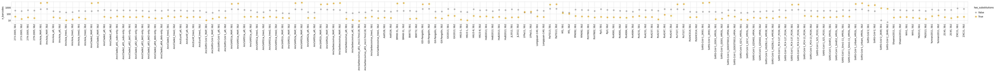
    


Print most common non-primary targets with mutations (useful for debugging):


```python
display(HTML(
    consensus
    .query('target != @mutated_targets')
    .query('has_substitutions')
    .groupby(['target', 'library', 'substitutions'])
    .aggregate(n_barcodes=pd.NamedAgg('barcode', 'count'))
    .reset_index()
    .sort_values('n_barcodes', ascending=False)
    .head(n=20)
    .to_html(index=False)
    ))
```


<table border="1" class="dataframe">
  <thead>
    <tr style="text-align: right;">
      <th>target</th>
      <th>library</th>
      <th>substitutions</th>
      <th>n_barcodes</th>
    </tr>
  </thead>
  <tbody>
    <tr>
      <td>LYRa11</td>
      <td>lib2</td>
      <td>G64A</td>
      <td>119</td>
    </tr>
    <tr>
      <td>LYRa11</td>
      <td>lib1</td>
      <td>G64A</td>
      <td>106</td>
    </tr>
    <tr>
      <td>Rf1</td>
      <td>lib1</td>
      <td>T506A</td>
      <td>77</td>
    </tr>
    <tr>
      <td>Rf1</td>
      <td>lib2</td>
      <td>T506A</td>
      <td>54</td>
    </tr>
    <tr>
      <td>Rs4247</td>
      <td>lib1</td>
      <td>T48C</td>
      <td>9</td>
    </tr>
    <tr>
      <td>HKU3-1</td>
      <td>lib1</td>
      <td>T179G</td>
      <td>7</td>
    </tr>
    <tr>
      <td>GX2013</td>
      <td>lib1</td>
      <td>G78T</td>
      <td>7</td>
    </tr>
    <tr>
      <td>273-2005</td>
      <td>lib1</td>
      <td>G522T</td>
      <td>7</td>
    </tr>
    <tr>
      <td>AncSARS1a_tree1</td>
      <td>lib1</td>
      <td>C207T</td>
      <td>6</td>
    </tr>
    <tr>
      <td>AncClade2_tree2</td>
      <td>lib1</td>
      <td>T186A</td>
      <td>6</td>
    </tr>
    <tr>
      <td>JL2012</td>
      <td>lib1</td>
      <td>C200T</td>
      <td>6</td>
    </tr>
    <tr>
      <td>279-2005</td>
      <td>lib1</td>
      <td>C494A</td>
      <td>5</td>
    </tr>
    <tr>
      <td>YN2013</td>
      <td>lib1</td>
      <td>G68A</td>
      <td>5</td>
    </tr>
    <tr>
      <td>AncClade2_alt2_del1-only</td>
      <td>lib1</td>
      <td>G241T</td>
      <td>5</td>
    </tr>
    <tr>
      <td>AncEurAf_alt</td>
      <td>lib1</td>
      <td>C602T</td>
      <td>5</td>
    </tr>
    <tr>
      <td>Rs4084</td>
      <td>lib2</td>
      <td>C582T</td>
      <td>5</td>
    </tr>
    <tr>
      <td>SARS-CoV-1_GD03T0013_HP04</td>
      <td>lib1</td>
      <td>C564A</td>
      <td>5</td>
    </tr>
    <tr>
      <td>HeB2013</td>
      <td>lib1</td>
      <td>G193T</td>
      <td>5</td>
    </tr>
    <tr>
      <td>HuB2013</td>
      <td>lib1</td>
      <td>C77T</td>
      <td>5</td>
    </tr>
    <tr>
      <td>AncAsia_tree1</td>
      <td>lib1</td>
      <td>A6T</td>
      <td>4</td>
    </tr>
  </tbody>
</table>


Remove the non-primary targets with any substitutions:


```python
print(f"Culling the {len(consensus)} barcodes to remove mutated non-primary targets")

consensus = consensus.query('(target == @mutated_targets) or (has_substitutions == False)')

print(f"Retained {len(consensus)} barcodes after culling")
```

    Culling the 91494 barcodes to remove mutated non-primary targets
    Retained 89092 barcodes after culling


Are there any barcodes in the same library that are shared across targets?
If so, we need to get rid of those as they will be confounded in barcode parsing:


```python
dup_barcodes = (
    consensus
    .groupby(['library', 'barcode'])
    .size()
    .rename('duplicate_count')
    .reset_index()
    .query('duplicate_count > 1')
    )

print('Here are duplicated barcodes:')
display(HTML(dup_barcodes.head().to_html(index=False)))

print(f"\nRemoving the {len(dup_barcodes)} duplicated barcodes."
      f"Started with {len(consensus)} barcodes:")
consensus = (
    consensus
    .merge(dup_barcodes, on=['library', 'barcode'], how='outer')
    .query('duplicate_count.isnull()', engine='python')
    )
print(f"After removing duplicates, there are {len(consensus)} barcodes.")
```

    Here are duplicated barcodes:


<table border="1" class="dataframe">
  <thead>
    <tr style="text-align: right;">
      <th>library</th>
      <th>barcode</th>
      <th>duplicate_count</th>
    </tr>
  </thead>
  <tbody>
    <tr>
      <td>lib1</td>
      <td>AAAAACGATAAAATTC</td>
      <td>2</td>
    </tr>
    <tr>
      <td>lib1</td>
      <td>AAAATGTGCTTTGGGA</td>
      <td>2</td>
    </tr>
    <tr>
      <td>lib1</td>
      <td>AAACTATCAAGCTGCC</td>
      <td>2</td>
    </tr>
    <tr>
      <td>lib1</td>
      <td>AAACTGCGGAAACGCG</td>
      <td>2</td>
    </tr>
    <tr>
      <td>lib1</td>
      <td>AAATAAGTACAATTTT</td>
      <td>2</td>
    </tr>
  </tbody>
</table>


    
    Removing the 197 duplicated barcodes.Started with 89092 barcodes:
    After removing duplicates, there are 88698 barcodes.


Below we write the retained consensus sequences to a CSV file that links the nucleotide mutations to the barcodes:


```python
print(f"Writing nucleotide variants to {config['nt_variant_table_file']}")
      
(consensus
 [['target', 'library', 'barcode', 'substitutions', 'variant_call_support']]
 .to_csv(config['nt_variant_table_file'], index=False)
 )
      
print('Here are the first few lines of this file:')
display(HTML(
    pd.read_csv(config['nt_variant_table_file'], na_filter=None)
    .head()
    .to_html(index=False)
    ))
```

    Writing nucleotide variants to results/variants/nucleotide_variant_table.csv
    Here are the first few lines of this file:


<table border="1" class="dataframe">
  <thead>
    <tr style="text-align: right;">
      <th>target</th>
      <th>library</th>
      <th>barcode</th>
      <th>substitutions</th>
      <th>variant_call_support</th>
    </tr>
  </thead>
  <tbody>
    <tr>
      <td>AncSarbecovirus_MAP</td>
      <td>lib1</td>
      <td>AAAAAAAAAACAAAGG</td>
      <td>T508A C509T T510G</td>
      <td>1</td>
    </tr>
    <tr>
      <td>SARS-CoV-2_2649</td>
      <td>lib1</td>
      <td>AAAAAAAAAACATGGC</td>
      <td>T490C C491A T492C</td>
      <td>1</td>
    </tr>
    <tr>
      <td>AncSARS1a_tree1</td>
      <td>lib1</td>
      <td>AAAAAAAAAGTGAAAG</td>
      <td></td>
      <td>1</td>
    </tr>
    <tr>
      <td>ZXC21</td>
      <td>lib1</td>
      <td>AAAAAAAAAGTTACTA</td>
      <td></td>
      <td>2</td>
    </tr>
    <tr>
      <td>AncSarbecovirus_MAP</td>
      <td>lib1</td>
      <td>AAAAAAAAATATTACA</td>
      <td>T464A A465T</td>
      <td>1</td>
    </tr>
  </tbody>
</table>


What happened to the barcodes that we "dropped" because we could not construct a reliable consensus?
The `dropped` data frame from [alignparse.consensus.simple_mutconsensus](https://jbloomlab.github.io/alignparse/alignparse.consensus.html?highlight=simple_mutconsensus#alignparse.consensus.simple_mutconsensus) has this information:


```python
display(HTML(dropped.head().to_html(index=False)))
```


<table border="1" class="dataframe">
  <thead>
    <tr style="text-align: right;">
      <th>library</th>
      <th>barcode</th>
      <th>target</th>
      <th>drop_reason</th>
      <th>nseqs</th>
    </tr>
  </thead>
  <tbody>
    <tr>
      <td>lib1</td>
      <td>AAAACAAAATATATCA</td>
      <td>AncSARS1a_MAP</td>
      <td>subs diff too large</td>
      <td>2</td>
    </tr>
    <tr>
      <td>lib1</td>
      <td>AAAACAAATATGAGCA</td>
      <td>SARS-CoV-1_Urbani_HP03L</td>
      <td>subs diff too large</td>
      <td>4</td>
    </tr>
    <tr>
      <td>lib1</td>
      <td>AAAACGGACAAATCAG</td>
      <td>Rs7327</td>
      <td>subs diff too large</td>
      <td>3</td>
    </tr>
    <tr>
      <td>lib1</td>
      <td>AAAATAAATTGGCGCG</td>
      <td>SARS-CoV-1_2693</td>
      <td>subs diff too large</td>
      <td>2</td>
    </tr>
    <tr>
      <td>lib1</td>
      <td>AAAATGAATCAATAAC</td>
      <td>SARS-CoV-2_2649</td>
      <td>subs diff too large</td>
      <td>3</td>
    </tr>
  </tbody>
</table>


Summarize the information in this data frame on dropped barcodes with the plot below.
This plot shows several things.
First, we see that the total number of barcodes dropped is modest (just a few thousand per library) relative to the total number of barcodes per library (seen above to be on the order of hundreds of thousands).
Second, the main reason that barcodes are dropped is that there are CCSs within the same barcode with suspiciously large numbers of mutations relative to the consensus---which we use as a filter to discard the entire barcode as it could indicate strand exchange or some other issue.
In any case, the modest number of dropped barcodes indicates that there probably isn't much of a need to worry: 


```python
max_nseqs = 8  # plot together all barcodes with >= this many sequences

_ = (
 ggplot(
    dropped.assign(nseqs=lambda x: numpy.clip(x['nseqs'], None, max_nseqs)),
    aes('nseqs')) + 
 geom_bar() + 
 scale_x_continuous(limits=(1, None)) +
 xlab('number of sequences for barcode') +
 ylab('number of barcodes') +
 facet_grid('library ~ drop_reason') +
 theme(figure_size=(10, 1.5 * nlibs),
       panel_grid_major_x=element_blank(),
       )
 ).draw()
```


    
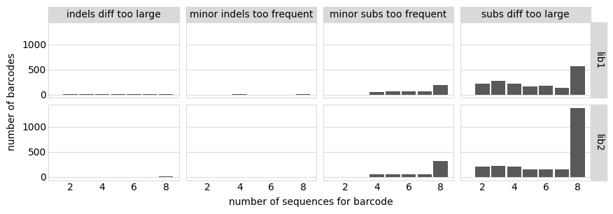
    

